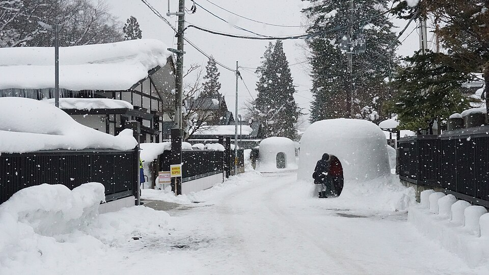
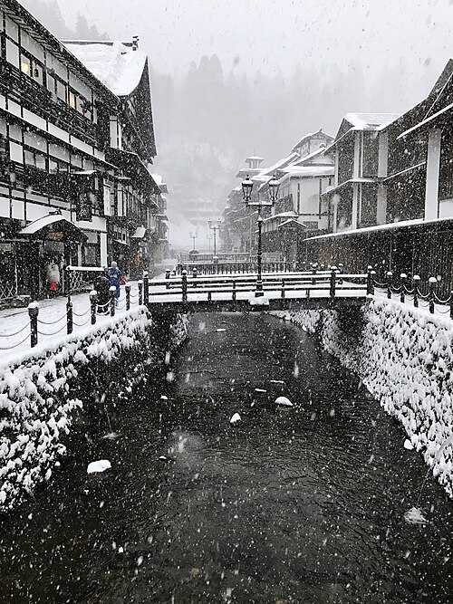
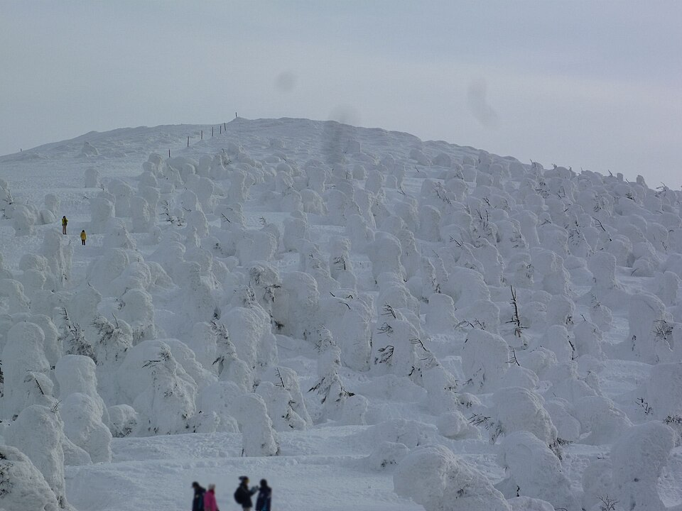

## Reference

- [ ] [[Index Zao]]：以下日期與移動方向依原索引；沒有留下的航班、車次、住宿和實際造訪景點都標為待補。
- [ ] **日期待確認**：原索引在「02.22 Sat 藏王滑雪團」後又列「02.22 Sun 藏王 > 仙台」，後續日期與星期也不一致。此看板保留原日期。
- [ ] **圖片說明**：下方 Wikimedia Commons 圖片僅作景點示意，拍攝年份不是這趟旅程；作者、授權與原檔連結列在本欄末尾。
- [ ] **圖片來源**：[橫手雪屋祭](https://commons.wikimedia.org/wiki/File:Yokote_Kamakura_Festival_2019.jpg)（掬茶，2019，CC BY-SA 4.0）、[銀山溫泉](https://commons.wikimedia.org/wiki/File:Ginzan_Onsen_%2832165662644%29.jpg)（bryan...，2017，CC BY-SA 2.0）、[藏王樹冰](https://commons.wikimedia.org/wiki/File:Mt.Zao%28Mt.Jizo%29_Juhyo.JPG)（Suz-b，2014，CC BY-SA 3.0）；圖片未修改。


## 02.14 台北 > 仙台

- [ ] **抵達仙台**：TPE > SDJ（原索引）。航班號、起降時間及航廈待補。
- [ ] **仙台機場 → 市區**：確認抵達後的交通方式、末班車及住宿位置；原索引未記錄訂位資訊。
- [ ] **隔日轉往橫手**：雪屋祭舉辦地在秋田縣橫手市。先確認仙台到橫手的車次與住宿點，避免把「秋田」誤認為秋田市。[日本國家旅遊局：橫手雪屋祭](https://www.japan.travel/en/spot/443/)


## 02.15 仙台 > 秋田

- [ ] **仙台 → 秋田縣橫手**：原索引只記移動方向；車次、轉乘站、到站時間待補。雪屋祭主要會場在橫手市區，橫手站可作步行起點。[日本國家旅遊局：交通與會場](https://www.japan.travel/en/spot/443/)
- [ ] **橫手雪屋祭・かまくら**：索引記為「雪屋祭」。雪屋中供奉水神，來訪者可進入雪屋體驗甘酒與年糕；傳統活動日期為 2 月 15、16 日。[橫手市官方介紹](https://www.city.yokote.lg.jp/kanko/1001533/1009113/1009117.html)
  
- [ ] **晚間會場**：橫手市役所周邊、羽黑町武家屋敷通等是雪屋祭觀賞區；當年實際走訪路線待補。[橫手市官方介紹](https://www.city.yokote.lg.jp/kanko/1001533/1009113/1009117.html)


## 02.16 秋田

- [ ] **橫手雪屋祭第二天**：原索引只記「秋田：雪屋祭」。可補上實際走過的會場、照片及當日活動時間。[日本國家旅遊局：橫手雪屋祭](https://www.japan.travel/en/spot/443/)
- [ ] **迷你雪屋**：橫手的雪屋祭也有成排點燈的小雪屋；是否造訪待確認。[日本國家旅遊局：橫手雪屋祭](https://www.japan.travel/en/spot/443/)
- [ ] **梵天競賽（參考候選）**：橫手市觀光協會記載 2 月 16 日在市役所前舉行梵天競賽，隔日奉納到旭岡山神社；原索引沒有寫到競賽，是否參加待確認。[橫手市觀光協會：梵天](https://www.yokotekamakura.com/event/3-4/)


## 02.17 旭岡山神社 > 銀山溫泉

- [ ] **旭岡山神社梵天奉納祭**：原索引明列此活動。橫手市官方介紹指出，隊伍抬著裝飾的梵天行經市區，前往旭岡山神社奉納；實際集合點與抵達時間待補。[橫手市官方介紹](https://www.city.yokote.lg.jp/kanko/1001533/1009113/1009117.html)
- [ ] **橫手 → 銀山溫泉**：原索引只記目的地。銀山溫泉位於山形縣尾花澤市；搭公共運輸可由大石田站轉乘巴士，當年車次與住宿接駁待補。[日本國家旅遊局：銀山溫泉](https://www.japan.travel/en/spot/1798/)
- [ ] **銀山溫泉街**：沿銀山川兩側的木造旅館與瓦斯燈是主要街景；若有夜景照片，可放回此卡。[銀山溫泉官方網站](https://www.ginzanonsen.jp/)
  


## 02.18 銀山 > 新潟

- [ ] **離開銀山溫泉**：確認旅館退房、接駁或巴士到大石田站的時間；原索引沒有車次。[銀山溫泉官方交通頁](https://www.ginzanonsen.jp/access/)
- [ ] **大石田／山形 → 新潟**：這段跨縣移動的轉乘路線與抵達時間待補；不要把今日的時刻表當作 2020 年搭乘紀錄。
- [ ] **新潟市區（參考候選）**：萬代橋跨越信濃川，是新潟市的地標；若抵達後有空檔，可對照照片確認是否曾走訪。[新潟縣觀光官方資料](https://niigata-kankou.or.jp/spot/15353)


## 02.19 新潟 > 福島

- [ ] **新潟 → 福島**：原索引只有兩地名稱；車種、轉乘點、車次和時間待補。
- [ ] **新潟市區（參考候選）**：Pier Bandai 是可逛海鮮與在地特產的市場；是否曾造訪待確認。[新潟縣觀光官方資料](https://niigata-kankou.or.jp/spot/10111)
- [ ] **抵達福島**：確認住宿在福島市或縣內其他地點；原索引的「福島」未細分城市。


## 02.20 福島 > 仙台

- [ ] **福島 → 仙台**：原索引記為移動日，交通方式與出發時間待補。
- [ ] **飯坂溫泉（參考候選）**：若住宿或停留在福島市，飯坂線可通往飯坂溫泉；舊堀切邸有庭園、足湯與手湯。是否去過待確認。[福島市觀光資料](https://www.f-kankou.jp/en/discover/historicsites/490/)
- [ ] **仙台住宿**：確認接下來前往藏王的集合地點與隔日交通；原索引沒有住宿資訊。


## 02.21 仙台 > 藏王

- [ ] **仙台 → 藏王**：原索引沒有註明是山形縣藏王溫泉還是宮城縣一側；後一天的滑雪團及樹冰資料先以山形藏王溫泉為參考，實際地點與接駁待確認。
- [ ] **雪場準備**：確認滑雪團集合點、裝備租借、雪票與保險是否已含在團費；團名及訂單待補。
- [ ] **藏王溫泉（參考候選）**：如果住在山形藏王溫泉區，可在滑雪前後安排泡湯；實際住宿與泡湯地點待確認。[藏王纜車官方網站](https://www.zaoropeway.co.jp/winter/en.php)


## 02.22 藏王滑雪團

- [ ] **藏王滑雪團**：原索引唯一已記錄的當日主活動。教練、上課時間、集合點、雪具與雪票內容待補。
- [ ] **雪場動線**：先核對團體使用的雪道與纜車；藏王纜車官網有雪道資訊。當日是否前往樹冰區待確認。[藏王纜車官方網站](https://www.zaoropeway.co.jp/winter/en.php)
- [ ] **樹冰（參考候選）**：藏王地藏山頂一帶可觀賞樹冰；若只是觀景，纜車票種與滑雪用票不同。是否觀賞、當日天候及纜車營運情況待確認。[藏王纜車票種說明](https://www.zaoropeway.co.jp/winter/ticket_en.php)
  


## 02.22 藏王 > 仙台（日期待確認）

- [ ] **藏王 → 仙台**：保留原索引的第二筆 02.22；因同日另有滑雪團，實際移動日期與交通方式待確認。
- [ ] **行李與裝備**：確認滑雪團結束後的取件、退租與返回仙台的安排；目前沒有訂位紀錄。


## 02.23 仙台（日期待確認）

- [ ] **仙台自由活動**：原索引只寫「仙台」，沒有景點或時段；實際行程待補。
- [ ] **仙台城跡（參考候選）**：青葉城遺址可俯瞰市區，伊達政宗騎馬像是主要地標；是否造訪待確認。[仙台官方觀光資訊](https://www.sentabi.jp/spots/60?lang=en)
- [ ] **瑞鳳殿（參考候選）**：伊達政宗的靈廟；若照片或票根有線索，可再補進實際行程。[仙台官方觀光資訊](https://www.sentabi.jp/marugotopass/)


## 02.24 仙台（日期待確認）

- [ ] **仙台自由活動**：原索引只寫「仙台」，與前一欄一樣保留空間補實際地點。
- [ ] **補照片與記錄**：可將當天照片、餐廳、交通票券或購物地點放在這欄，以區分兩天仙台行程。
- [ ] **回程準備**：確認 SDJ 出發航班、機場交通與行李規定；原索引未提供細節。


## 02.25 仙台 > 台北（日期待確認）

- [ ] **返台**：SDJ > TPE（原索引）。航班號、起降時間、航廈及轉機資訊待補。
- [ ] **日期核對**：原索引此筆標為 Wed，但 2020 年 02.25 是 Tue；保留原日期，等票券或照片確認。


%% kanban:settings
```
{"kanban-plugin":"board","list-collapse":[false,false,false,false,false,false,false,false,false,false,false,false,false,false]}
```
%%
