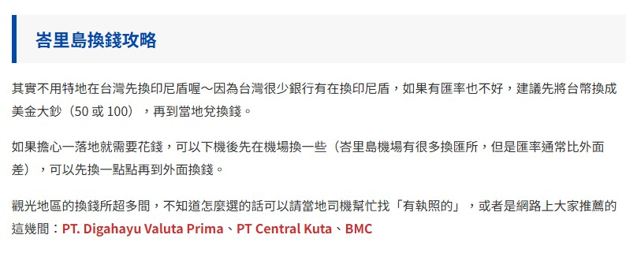

---

kanban-plugin: board
title: Day by day
tags:
  - Backpacker
  - Asia/Indonesia
sidebar_position: 10

---

## Refs

- [ ] 


## 07.03 TPE > SUB

- [ ] 
	
	__01:05__ TPE > SUB
	訂單編號: E9I4UZ
	#Booking
- [ ] __TPE > SIN__ 
	- __TR 897__ Scoot B787-8 - 4小時 30分
	- Taipei Taoyuan Intl Airport (TPE) Terminal 1
	- 2025年 07月 03日 01:30 HRS
	- Singapore Changi Airport (SIN) Terminal 1
	- 2025年 07月 03日 06:00 HRS
- [ ] __停留時間: 2小時 15分__
- [ ] __SIN -> SUB__
	- __TR 262__ Scoot A320 - 2小時 20分
	- Surabaya Juanda Intl Airport (SUB) Terminal 2
	- 2025年 07月 03日 08:15 HRS	
	- Singapore Changi Airport (SIN) Terminal 1
	- 2025年 07月 03日 09:35 HRS


## 07.03 Sub

- [ ] 泗水老街
	
	- [[One day in SUB]]
	- [[Cafe in SUB]]


## 07.04 Sub > Sewu

- [ ] 六福村
- [ ] BROMO 火山


## 07.05 Sewu > Ijen

- [ ] Sewu Waterfall


## 07.06 Ijen > Ubo, Bali

- [ ] Ijen
- [ ] Magical forester


## 07.07 Ubo

- [ ] ATV
- [ ] Ubo


## 07.08 Ubo > Kuta

- [ ] 神木
- [ ] 神聖瀑布？


## 07.09 Penida

- [ ] 天使浴池
- [ ] 精靈沙灘
- [ ] 斷崖公路


## 07.10 Kuta > Komodo

- [ ] 科莫多龍生態公園
- [ ] 蝙蝠日落


## 07.11 Komodo

- [ ] 浮潛：小鯊魚
- [ ] 浮淺：海龜


## 07.12 LBJ > KUL

- [ ] 


## 07.13 KUL > TPE

- [ ] __KUL > TPE__
	
	AirAsia D7 0378
	09:25 表定： 09:25
	吉隆坡國際機場 T2
	->
	13:56 表定： 14:25
	台北 台灣桃園國際機場 T1


%% kanban:settings
```
{"kanban-plugin":"board","list-collapse":[false,false,false,false,false,false,false,false,false,false,false,false,false]}
```
%%