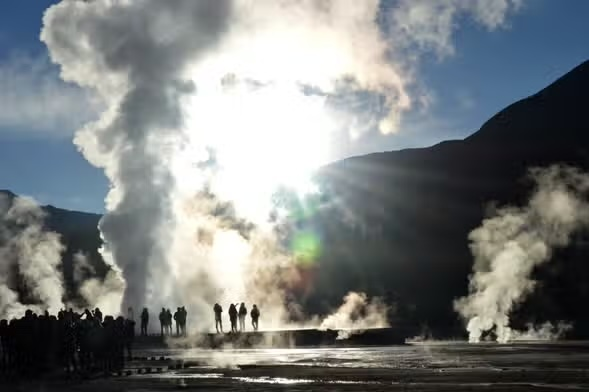

---

title: Day by day
image: https://lh3.googleusercontent.com/pw/AL9nZEUA9Ifvd5Z8SXDWkeVB6AC4MPGwnXaL6kBXNPoXwOQQ2jOcZ1Jw_0p8TKK8C3ZX0e67_FOY15eDrm7aaXSQJcKtoUzC80SAQEHsaBy6qS2AqNNs5VUFNXBKm439y_1wkvmDl-PnL8ReojnIumNlEvOXBg=w800-no?authuser=0
tags:
  - Backpacker
  - Index
  - Chile
sidebar_position: 11
date_created: 2025-09-27
date_updated: 2025-10-13
kanban-plugin: board

---

## Refs


## 09.26 TPE > SCL

- [ ] 23:50 TPE > LAX
	
	- 航班1： CI-0008 ( 波音 777-300ER)
	- 航空公司： 中華航空
	- 出發地點： 台北, 台北桃園國際機場 (TPE) 航廈 2
	- 出發時間： 2025-09-26 23:50 (+8)
	- 抵達地點： 洛杉磯, 洛杉磯國際機場 (LAX) 航廈 B
	- 抵達時間： 2025-09-26 20:45 (-8)
	- 飛行時間： **12 時 55 分**
- [ ] 02:01 LAX > PTY
	
	- 航班2： CM-0473 ( 波音 737 MAX 9)
	- 航空公司： 巴拿馬航空
	- 出發地點： 洛杉磯, 洛杉磯國際機場 (LAX) 航廈 B
	- 出發時間： 2025-09-27 02:01 (-8)
	- 抵達地點： 巴拿馬城, 土庫曼國際機場 (PTY) 航廈 0
	- 抵達時間： 2025-09-27 10:35 (-5)
	- 飛行時間： **5 時 34 分**
- [ ] 11:48 PTY > SCL
	
	- 航班3： CM-0395 ( 波音 737 MAX 9)
	- 航空公司： 巴拿馬航空
	- 出發地點： 巴拿馬城, 土庫曼國際機場 (PTY) 航廈 0
	- 出發時間： 2025-09-27 11:48 (-5)
	- 抵達地點： 聖地牙哥, 智利聖地牙哥國際機場 (SCL) 航廈 0
	- 抵達時間： 2025-09-27 20:20 (-4)
	- 飛行時間： **7 時 32 分**


## 09.28 SCL > PNT

- [ ] 09:31 SCL > PNT
	- Santiago - PuertoNatales
	- Departure: Sun, Sep 28, 2025
	- From: Santiago International Airport
	- To: Puerto Natales Teniente Julio Gallardo Airport
	- Departure: 09:31
	- Arrival: 14:01
	- Flight: **LA269** LATAM Airlines
	- Airline: Airbus A320


## 09.29 ~ 10.01 PNT

- [ ] [[巴塔哥尼亞 Patagonia]]
	
	
- [ ] [[百內國家公園 Torres del Paine National Park]]
- [ ] [[百內三塔 Torres del Paine]]
	
	
- [ ] [[米洛頓洞穴 Cueva del Milodón]]
- [ ] [[納塔萊斯港 Puerto Natales]]
- [ ] [[唱片行餐廳 La Disqueria Restaurant]]
- [ ] [[巴塔哥尼亞黑羊店 Patagonia Black Lamb]]


## 10.01 PNT > CJC

- [ ] 14.03 PNT > SCL
	- PNR: **QRASJJ**
	- From: PUERTO NATALES, CHILE (PNT)
	- 01/oct/2025 2:03pm
	- To: SANTIAGO SCL, CHILE (SCL)
	- 01/oct/2025 6:28pm
	- **H2 422** SKY AIRLINE
- [ ] 20:31 SCL > CJC
	- PNR **WYEXMP**
	- From: SCL
	- Departure: 8:31 PM
	- To: CJC, Calama
	- Arrival: 10:39PM
	- **LA384** LATAM AIRLINES


## 10.01 ~ 10.04 卡拉馬沙漠

- [ ] [[阿塔卡馬沙漠 Atacama Desert]]
- [ ] [[月亮谷 Valle de la Luna]]
- [ ] [[塔蒂奧間歇泉 Tatio Geyser]]
	
	
- [ ] [[普里塔馬河 Rio Puritama]]
- [ ] [[Adobe Restaurant]]


## 10.04 CJC > SCL

- [ ] 11:00 CJC > SCL
	- PNR **WYEXMP**
	- From: CJC, Calama
	- Departure: 11:00
	- To: SCL
	- Arrival: 13:01
	- **LA143** LATAM AIRLINES


## 10.05 ~ 10.10 Santiago de Chile

- [ ] [[聖地牙哥中央市場 Central Market of Santiago]]
- [ ] [[聖地牙哥海鮮大餐 Donde Blanca]]
- [ ] [[聖地亞哥都主教座堂 Catedral Metropolitana de Santiago de Chile]]
- [ ] [[聖地牙哥武器廣場 Plaza de Armas of Santiago de Chile]]
- [ ] [[聖地牙哥天空觀景台 Santiago Sky Costanera]]


## 10.07 Tour de Maipo

- [ ] [[麥波河 Rio Maipo]]
- [ ] [[奇林卡農場 Campo La Quirinca]]
- [ ] [[聖艾瑪酒莊 Viña Santa Ema]]
- [ ] [[大地酒莊 Viña TerraMater]]
- [ ] [[溫德拉加酒莊 Undurraga]]
- [ ] [[麥波峽谷 Cajón del Maipo]]


## 10.08 Valparaiso

- [ ] [[瓦爾帕萊索 Viña del Mar]]
- [ ] [[瓦爾帕萊索港 Valparaiso]]


## 10.11 SCL > TPE

- [ ] 04:47 SCL > PTY
	
	- 航班1： CM-0396 ( 波音 737-800)
	- 航空公司： 巴拿馬航空
	- 航空公司PNR： **AD2NRV**
	- 出發地點： 聖地牙哥, 智利聖地牙哥國際機場 (SCL) 航廈 0
	- 出發時間： 2025-10-11 04:47 (-4)
	- 抵達地點： 巴拿馬城, 土庫曼國際機場 (PTY) 航廈 0
	- 抵達時間： 2025-10-11 09:39 (-5)
	- 飛行時間： **5 時 52 分**
- [ ] 11:56 PTY > LAX
	
	- 航班2： CM-0472 ( 波音 737 MAX 9)
	- 航空公司： 巴拿馬航空
	- 航空公司PNR： **AD2NRV**
	- 出發地點： 巴拿馬城, 土庫曼國際機場 (PTY) 航廈 0
	- 出發時間： 2025-10-11 11:56 (-5)
	- 抵達地點： 洛杉磯, 洛杉磯國際機場 (LAX) 航廈 B
	- 抵達時間： 2025-10-11 16:46 (-8)
	- 飛行時間： **7 時 50 分**
- [ ] 00:05 LAX > TPE
	
	- 航班3： CI-0007 ( 波音 777-300ER)
	- 航空公司： 中華航空
	- 航空公司PNR： **F9K23G**
	- 出發地點： 洛杉磯, 洛杉磯國際機場 (LAX) 航廈 B
	- 出發時間： 2025-10-12 00:05 (-8)
	- 抵達地點： 台北, 台北桃園國際機場 (TPE) 航廈 2
	- 抵達時間： 2025-10-13 05:10 (+8)
	- 飛行時間： 13 時 5 分


%% kanban:settings
```
{"kanban-plugin":"board","list-collapse":[false,false,false,false,false,false,false,false,null,null,false]}
```
%%