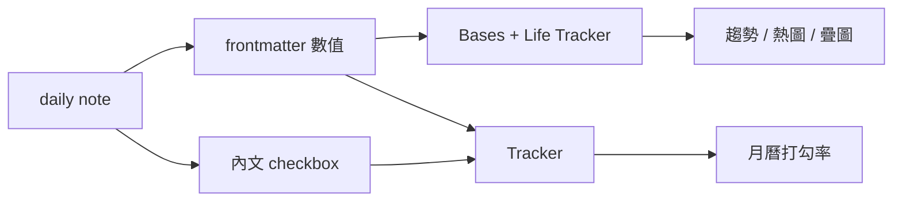

# 用 Obsidian 做量化自我

> 記錄的成本很低，**看懂記錄**的成本才高。

daily note 的模板裡加幾個 frontmatter 欄位，三年下來累積了 900 多篇。
資料一直在長，但我從來沒真正看過它們的趨勢 —— 因為負責畫圖的那半邊，壞了很久我都不知道。

這篇記錄我怎麼把它重建成一個真的會打開的儀表板。

## 起點：一個沒人發現壞掉的圖表

原本的儀表板是 Obsidian Tracker 的 code block，長這樣：

```yaml
searchType: frontmatter
searchTarget: steps, PAIearned, PAIcaculated
```

問題是模板裡的欄位名是 `pai_earned` / `pai_caculated`（snake_case）。
全 vault 找不到任何一個 `PAIearned` —— 這張圖從寫下的那天起就是空的，
而空圖表和「我最近沒運動」看起來一模一樣，所以沒人會去懷疑它。

**教訓：查詢用的欄位名要和模板同源。** 只要靠人手打兩次，早晚會對不起來。

## 資料長什麼樣

daily note 的 frontmatter 由 Templater 在建檔時產生，欄位都是預設值，
當天有變動才手改 —— 也就是「填表阻力盡量低」：

| 欄位 | 型別 | 意義 |
|---|---|---|
| `steps` | number | 步數 |
| `pai_earned` | number | 當日 PAI |
| `pai_caculated` | number | 累計 PAI |
| `10usd` | checkbox | 每日儲蓄 |
| `sleep_at` / `wake_up_at` | `HH:MM` 文字 | 入睡／起床時間 |
| `reading` | number | 閱讀量 |

另外一半的追蹤在**內文**，是每天的例行 checkbox：`cleanup Inbox`、`news surfing`、`workout`。

這個「frontmatter 數值 + 內文 checkbox」的雙層結構，是後面所有選擇的原因。

## 為什麼不是一個插件就能解決

盤點的時候發現，市面上的工具剛好沿著這條線分成兩邊：



- **Life Tracker**（Bases view）吃 frontmatter 屬性、Bases formula 與檔案 metadata，
  但**不會讀筆記內文**
- **Tracker** 兩邊都吃，包含 `searchType: task.done`

所以結論是混合：數值那半交給 Bases + Life Tracker，例行打勾率那半留給 Tracker。
硬要統一的話，得把例行事項改寫成 frontmatter 的 checkbox 欄位 ——
未來的資料可以，但過去 900 多篇的歷史沒辦法憑空補回來，除非寫腳本回填內文的 `- [x]`。

**教訓：先確認工具的資料來源邊界，再決定要不要統一。** 不是所有重複都值得消除。

## 為什麼選 Bases 路線

換掉 Tracker 的理由不是它死了 —— 相反，它 2026 年還在更新。
選 Life Tracker 是因為兩件事：

1. **方向跟官方一致**。Bases 是 Obsidian 核心功能，儀表板長在核心資料層上，
   比長在第三方 code block 上更不容易哪天沒人維護
2. **疊圖看相關性**。單看步數、單看睡眠時數都只是「有沒有做」；
   把兩條疊在一起才會出現「睡不夠的那週步數也掉了」這種只有交叉才看得到的東西

順帶一提，同類的還有 Heatmap Tracker（直接讀 frontmatter、有插入指令）
和 Tracker+（原版的 fork，語法相容），路線不同但都可以考慮。

## 三個踩坑

### 1. 檔名日期格式，內建的抓不到

Life Tracker 要知道每篇筆記代表哪一天。我的 daily note 檔名是 `2026-08-17-Monday`，
而它內建的 daily 格式是 `^(\d{4})-(\d{2})-(\d{2})$` —— **完全比對**，
後面多了星期就整個 miss。

它的自訂 pattern 不吃 moment 格式字串，而是 `{{date}}` / `{{year}}` / `{{month}}` /
`{{day}}` / `{{week}}` / `{{quarter}}` 這組 token，加上 `*` 當通配。所以答案是：

```
{{date}}-*
```

**教訓：「設定裡填檔名格式」聽起來像填 `YYYY-MM-DD-dddd`，但每個插件的 DSL 都不一樣。**
填完一定要回頭確認它真的比對到了幾篇。

### 2. Date anchor 千萬不要用 `date_created`

「哪一天」還有第二個來源：frontmatter 的 `date_created`（Templater 自動填）。
直覺上這比檔名可靠，實際上完全相反 ——

比對 937 篇之後：**有 184 篇（20%）的 `date_created` 與檔名日期不同。**
因為我常在前一晚就把隔天的筆記開好，或隔天早上才補寫。

而 Life Tracker 的 anchor 優先序裡，property 是最高的（0），會直接壓過檔名。
設下去等於有五分之一的資料點被標到錯誤的日期，而且圖表照樣畫得出來，你不會發現。

**教訓：「建檔時間」不等於「這筆資料屬於哪一天」。** 對 daily note 來說，檔名才是主鍵。

### 3. 跨午夜的時間，不能直接畫

`sleep_at: 23:30` 是文字，得先轉成數字。單純拆成小時 + 分鐘會在跨午夜時炸掉：
`23:30` 是 23.5，但 `01:30` 是 1.5 —— 畫在同一條線上，睡得更晚反而變成低點。

作法是把凌晨往後推一天，再算差值：

```
sleep_hour  = if(小時 < 12, 小時 + 24, 小時) + 分鐘 / 60
wake_hour   = 小時 + 分鐘 / 60
sleep_hours = 24 + wake_hour - sleep_hour
```

驗算三種情況：`23:30 → 04:30` = 5.0h、`24:30 → 04:30` = 4.0h、`01:30 → 05:30` = 4.0h。
（是的，我的資料裡真的有 `24:30` 這種寫法，人手記錄一定會有這些邊角。）

**教訓：時間欄位在轉數值前，先把所有實際出現過的值掃一遍。**
我原本想用字串分割取第一段，掃過才確認 900 多筆全是零補位的 `HH:MM`，
`slice()` 才安全 —— 如果有人某天寫成 `4:30`，整條公式就歪了。

## 減法比加法重要

重建時順手砍掉兩個欄位：

- `writing`：261 篇有值，**全部是 0**
- `andromoney`：545 篇，其中 446 是 false

還有一個待決定的：`reading` 有 904 篇，其中 **903 篇是 0**。

這些欄位的共同點是「當初覺得應該追蹤」，然後從沒真的填過。
它們留在模板裡不只是雜訊 —— 每天看到一個永遠是 0 的欄位，會稀釋掉其他欄位的可信度。

**教訓：追蹤欄位要定期做減法。** 一個欄位如果三個月都是預設值，它記錄的是
「我以為我在意這件事」，不是資料。

## 現在的樣子

- **資料層**：daily note frontmatter（Templater 產生預設值）
- **查詢層**：一個 Bases `base` block，filter 是「在 `_journaling` 底下」+「有 `steps` 這個屬性」，
  三個 formula 把 `HH:MM` 轉成小時數
- **呈現層**：Life Tracker 的 Dashboard（bar / line / area / heatmap）+ Grid（補漏填的資料），
  再加原版 Tracker 的月曆熱圖看例行打勾率

實際的 base 設定與圖表卡片放在 `lifehacker/HABIT-TRACKING.md`（沒有發佈，
因為 Bases 的互動圖表在靜態網站上不會渲染，而且那是個人資料）。

## 回頭看

三年來真正的問題從來不是「要不要記錄」，而是：

1. 記錄的欄位和查詢的欄位**不同源** → 圖表悄悄壞掉
2. 「哪一天」這個看似理所當然的欄位，**有多個來源而且會互相矛盾**
3. 大部分欄位其實**沒人在看** → 該做的是刪掉，不是再加一張圖

工具換了幾輪，但這三件事跟工具沒什麼關係。
