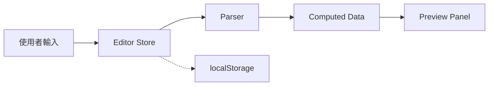

# Dual Layout 設計模式 - AI Prompt 參考

> 本文件整理「左編輯、右預覽」雙欄佈局的設計模式與實作細節，供有類似需求的前端專案參考使用。

---

## 設計概述

### 適用場景

| 應用類型 | 左欄（編輯區） | 右欄（預覽區） |
|----------|----------------|----------------|
| **Markdown 編輯器** | 純文字/富文字 | 即時預覽 |
| **專案管理工具** | 任務定義 | 甘特圖/看板 |
| **程式碼編輯器** | 原始碼 | 輸出結果 |
| **設計工具** | 屬性面板 | 畫布預覽 |
| **資料轉換器** | 輸入資料 | 轉換結果 |

### 核心特性

1. **可調整寬度**：拖曳分隔線調整左右比例
2. **可收縮展開**：一鍵收合任一側面板
3. **最小寬度限制**：確保面板不會太小
4. **狀態記憶**：收合前的寬度可恢復
5. **響應式設計**：適應不同螢幕尺寸

### 佈局原則

> **重要**：本設計模式 **不使用全域 Top Nav Bar**。

- 編輯區和預覽區各自擁有獨立的 **Panel Header**
- 控制元件（按鈕、切換、工具）放置在各面板頂部
- 避免橫跨兩區的全域導覽列，最大化內容空間
- 左欄標題位置可放置 **Logo | Workspace 選單**

---

## 架構設計

### 元件層級

```
App.vue
├── SplitPane.vue          # 核心分割元件
│   ├── slot[left]         # 左側插槽
│   │   └── EditorPanel.vue
│   │       └── TextEditor.vue / TableEditor.vue
│   └── slot[right]        # 右側插槽
│       └── PreviewPanel.vue
│           └── PreviewContent.vue
└── GlobalDialogs          # 全域對話框
```

### 資料流



---

## 核心元件

### 1. SplitPane.vue

**功能**：可拖曳、可收縮的雙欄佈局容器

```vue
<SplitPane 
    :initial-ratio="0.35" 
    :min-left="320" 
    :min-right="400"
>
    <template #left>
        <EditorPanel />
    </template>
    <template #right>
        <PreviewPanel />
    </template>
</SplitPane>
```

**Props**

| Prop | 類型 | 預設 | 說明 |
|------|------|------|------|
| `initialRatio` | number | 0.5 | 左側初始寬度比例 (0-1) |
| `minLeft` | number | 300 | 左側最小寬度 (px) |
| `minRight` | number | 300 | 右側最小寬度 (px) |

**關鍵實作**

```typescript
// State
const leftWidth = ref(50)           // 百分比
const lastLeftWidth = ref(50)       // 收合前快照
const isDragging = ref(false)
const collapsed = ref<'left' | 'right' | 'none'>('none')

// 拖曳處理
function onMouseMove(e: MouseEvent) {
    if (!isDragging.value) return
    const newWidth = e.clientX - containerRect.left
    // 套用最小寬度限制
    leftWidth.value = clamp(newWidth, minLeft, maxWidth) / containerWidth * 100
}

// 收合/展開
function toggleLeft() {
    if (collapsed.value === 'left') {
        leftWidth.value = lastLeftWidth.value  // 恢復
        collapsed.value = 'none'
    } else {
        lastLeftWidth.value = leftWidth.value  // 快照
        leftWidth.value = 0
        collapsed.value = 'left'
    }
}
```

**CSS 重點**

```css
.split-pane-container {
    display: flex;
    width: 100%;
    height: 100%;
    overflow: hidden;
}

.split-pane-left,
.split-pane-right {
    height: 100%;
    transition: width 0.3s cubic-bezier(0.25, 0.8, 0.25, 1);
}

.split-pane-resizer {
    width: 12px;
    cursor: col-resize;
    position: relative;
}

.resizer-line {
    width: 2px;
    background: var(--color-border);
    transition: all var(--transition-fast);
}

.split-pane-resizer:hover .resizer-line {
    background: var(--color-accent);
    width: 4px;
}
```

### 2. Panel Header 佈局設計

**左欄 (EditorPanel) Header 結構**

```
+------------------------------------------+
| [Logo/Workspace 選單▼]  | [切換] [分享] |
+------------------------------------------+
```

- `header-left`: Logo + Workspace 下拉選單（顯示當前專案名）
- `header-right`: 編輯模式切換、分享按鈕

**右欄 (PreviewPanel) Header 結構**

```
+------------------------------------------+
| [專案] [人力]  | [縮放] [匯出] [主題] |
+------------------------------------------+
```

- `header-left`: 預覽模式切換
- `header-right`: 工具按鈕（縮放、匯出、主題切換）

**Header + Content 結構**

```vue
<template>
    <div class="panel">
        <div class="panel-header">
            <div class="header-left">
                <WorkspaceDropdown />  <!-- 或標題/切換 -->
            </div>
            <div class="header-right">
                <!-- 工具按鈕 -->
            </div>
        </div>
        <div class="panel-content">
            <!-- 主要內容 -->
        </div>
    </div>
</template>
```

**全域 Panel 樣式** (main.css)

```css
.panel {
    display: flex;
    flex-direction: column;
    height: 100%;
    background: var(--color-bg-secondary);
    border-radius: var(--radius-lg);
    overflow: hidden;
    box-shadow: var(--shadow-panel);
}

.panel-header {
    display: flex;
    align-items: center;
    justify-content: space-between;
    padding: var(--spacing-sm) var(--spacing-md);
    background: var(--glass-bg);
    backdrop-filter: blur(var(--glass-blur));
    border-bottom: 1px solid var(--glass-border);
}

.panel-content {
    flex: 1;
    overflow: auto;
    padding: var(--spacing-md);
}
```

### 3. WorkspaceDropdown (多專案選單)

**功能**：在左欄 Header 顯示 Logo + 專案名稱，點擊展開下拉選單管理多專案

```
🐕 專案名稱 ▾
┌──────────────────────┐
│ ✓ 專案 A             │
│   專案 B         🗑️  │
│   專案 C  🔗 🔄  🗑️  │ ← Gist 連結專案
├──────────────────────┤
│ ➕ 新增專案            │
└──────────────────────┘
```

**功能項目**：
- 顯示當前專案名稱（含 Logo）
- 專案列表快速切換
- 新增/刪除專案
- Gist 連結專案顯示 🔗 標記 + 🔄 Refresh 按鈕

**關鍵實作**：

```vue
<template>
    <div class="workspace-dropdown" v-click-outside="close">
        <button class="dropdown-toggle" @click="toggle">
            <span class="brand-logo">🐕 {{ currentName }}</span>
            <span class="arrow">▾</span>
        </button>
        <div v-if="isOpen" class="dropdown-menu">
            <div v-for="ws in workspaces" :key="ws.id" 
                 class="workspace-item"
                 @click="select(ws.id)">
                {{ ws.name }}
            </div>
            <button class="new-btn" @click="create">
                ➕ 新增專案
            </button>
        </div>
    </div>
</template>
```

---

## 設計系統

### CSS 變數架構

```css
:root {
    /* 背景層級 */
    --color-bg-primary: #0f172a;    /* 最底層 */
    --color-bg-secondary: #1e293b;  /* 面板 */
    --color-bg-tertiary: #334155;   /* 元素 */
    --color-bg-hover: #475569;      /* 互動 */

    /* Glassmorphism */
    --glass-bg: rgba(30, 41, 59, 0.8);
    --glass-border: rgba(255, 255, 255, 0.1);
    --glass-blur: 12px;

    /* 文字層級 */
    --color-text-primary: #f1f5f9;
    --color-text-secondary: #94a3b8;
    --color-text-muted: #64748b;

    /* 強調色 */
    --color-accent: #3b82f6;
    --color-accent-glow: rgba(59, 130, 246, 0.4);

    /* 過渡動畫 */
    --transition-fast: 150ms cubic-bezier(0.4, 0, 0.2, 1);
    --transition-normal: 250ms cubic-bezier(0.4, 0, 0.2, 1);
}

/* Light Theme */
[data-theme="light"] {
    --color-bg-primary: #f8fafc;
    --color-bg-secondary: #ffffff;
    /* ... */
}
```

### 主題切換實作

```typescript
// App.vue
const isDarkMode = ref(true)

function toggleTheme() {
    isDarkMode.value = !isDarkMode.value
    document.documentElement.setAttribute(
        'data-theme', 
        isDarkMode.value ? 'dark' : 'light'
    )
    localStorage.setItem('theme', isDarkMode.value ? 'dark' : 'light')
}

onMounted(() => {
    const saved = localStorage.getItem('theme')
    if (saved === 'light') {
        isDarkMode.value = false
        document.documentElement.setAttribute('data-theme', 'light')
    }
})
```

---

## 效能優化

### 1. Debounce 編輯器輸入

```typescript
// TextEditor.vue
import { useDebounceFn } from '@vueuse/core'

const localText = ref('')
const debouncedUpdate = useDebounceFn((value: string) => {
    store.updateText(value)
}, 300)

function onInput(event: Event) {
    localText.value = (event.target as HTMLTextAreaElement).value
    debouncedUpdate(localText.value)
}
```

### 2. Throttle 持久化

```typescript
// store.ts
import { throttle } from 'lodash-es'

const persist = throttle(() => {
    localStorage.setItem(KEY, JSON.stringify(state))
}, 1000, { leading: true, trailing: true })
```

### 3. 分離即時顯示與持久化

- 本地狀態 (localText)：即時響應輸入
- Store 狀態 (rawText)：延遲更新
- localStorage：throttle 寫入

---

## 建議套件

| 套件 | 用途 |
|------|------|
| `@vueuse/core` | debounce/throttle/響應式工具 |
| `lodash-es` | throttle (tree-shakable) |
| `pinia` | 狀態管理 |

---

## 檔案結構

```
src/
├── assets/
│   └── main.css              # 設計系統 & 全域樣式
├── components/
│   ├── SplitPane.vue         # 核心分割元件
│   ├── EditorPanel.vue       # 左側編輯區容器
│   ├── PreviewPanel.vue      # 右側預覽區容器
│   ├── WorkspaceDropdown.vue # Logo + 多專案選單
│   ├── TextEditor.vue        # 文字編輯器
│   ├── ConfirmDialog.vue     # 通用確認對話框
│   ├── ConflictDialog.vue    # 衝突處理對話框
│   └── PreviewContent.vue    # 預覽內容
├── stores/
│   ├── editorStore.ts        # 編輯器狀態
│   └── workspaceStore.ts     # 多工作區管理
├── utils/
│   ├── parser.ts             # 內容解析
│   └── sharing.ts            # 分享連結
└── App.vue                   # 主應用 (組合 SplitPane)
```

---

## 延伸模式

### 垂直分割

將 `flex-direction` 改為 `column`，`col-resize` 改為 `row-resize`

### 多欄分割

巢狀 SplitPane 實現三欄或更多

### 響應式行為

```css
@media (max-width: 768px) {
    .split-pane-container {
        flex-direction: column;
    }
}
```

---

## BorderCollie 參考實作

本設計來自 [BorderCollie](https://github.com/kywk/border-collie) 專案，一個現代化的專案管理甘特圖工具。

**關鍵檔案參考**：
- `src/components/SplitPane.vue` - 完整可拖曳分割元件
- `src/assets/main.css` - 完整設計系統
- `src/App.vue` - 整合範例
