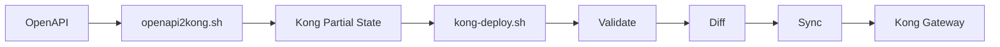

# Kong decK：OpenAPI APIOps 轉換與部署腳本

前兩篇已建立兩個核心概念：

1. [[Kong decK OpenAPI to Gateway Service]]：OpenAPI 轉 Kong Routes，掛到既有 Service 與 namespace。
2. [[Kong decK Selective Sync and Tag Ownership]]：用 `select_tags` 與 `default_lookup_tags` 建立 ownership boundary。

本文把流程收斂成兩支工具：

```text
openapi2kong.sh
kong-deploy.sh
```

設計原則是：

> Converter 不碰 Gateway；Deployer 不碰 OpenAPI。

這樣能清楚切開「產生 desired state」與「修改 Gateway」兩個責任。

## 整體流程



## `openapi2kong.sh`

介面：

```bash
openapi2kong.sh \
  --spec <openapi.yaml|json> \
  --service <gateway-service> \
  --tag <ownership-tag> \
  --path <mount-path>
```

建議額外指定：

```bash
--service-lookup-tag <tag>
```

### POS 範例

```bash
./openapi2kong.sh \
  --spec ./pos/qas/openapi.json \
  --service MASA \
  --tag pos \
  --path /pos \
  --service-lookup-tag masa-service
```

預期輸出：

```text
pos/qas/pos-kong.yaml
```

內容核心：

```yaml
_format_version: "3.0"

_info:
  select_tags:
    - pos

  default_lookup_tags:
    services:
      - masa-service

routes:
  - ...
    service:
      name: MASA
    tags:
      - pos
```

### Script 主要步驟

```text
1. 檢查 deck / yq
2. 驗證 OpenAPI 路徑
3. deck file openapi2kong
4. deck file namespace
5. 移除 generated Service
6. Routes 綁定 existing Service
7. 寫入 select_tags
8. 寫入 default_lookup_tags
9. local structural validation
```

## 為什麼 Converter 不直接 sync

如果 `openapi2kong.sh` 最後直接做：

```bash
deck gateway sync
```

一個轉換錯誤就可能直接變成 Gateway delete/update。

比較安全：

```text
Generate
  ↓
Review state
  ↓
Validate
  ↓
Diff
  ↓
Approval
  ↓
Sync
```

因此 deploy 是另一支 script。

## `kong-deploy.sh`

介面：

```bash
kong-deploy.sh \
  --state <kong-state.yaml> \
  --workspace <workspace>
```

預設只做：

```text
validate
→ diff
```

**不修改 Gateway。**

只有明確加：

```bash
--apply
```

才執行：

```bash
deck gateway sync
```

## Preview Mode

```bash
./kong-deploy.sh \
  --state ./pos/qas/pos-kong.yaml \
  --workspace QAS \
  --expect-tag pos
```

這個模式適合：

- 開發者本機。
- Merge Request review。
- Pipeline validation stage。

## Interactive Deploy

```bash
./kong-deploy.sh \
  --state ./pos/qas/pos-kong.yaml \
  --workspace QAS \
  --expect-tag pos \
  --apply
```

真正 sync 前要求再次輸入 Workspace 名稱：

```text
You are about to SYNC state into workspace 'QAS'.

Type the workspace name 'QAS' to continue:
```

這可以降低在 terminal 手滑的機率。

## CI/CD Deploy

```bash
./kong-deploy.sh \
  --state ./pos/qas/pos-kong.yaml \
  --workspace QAS \
  --expect-tag pos \
  --apply \
  --yes
```

`--yes` 只應出現在受控 CI/CD job。

## `--expect-tag`

部署前確認 state 真的是預期 ownership：

```bash
--expect-tag pos
```

會驗證：

```yaml
_info:
  select_tags:
    - pos
```

如果 state 是：

```yaml
_info:
  select_tags:
    - crm
```

則直接 fail。

這個檢查可以避免：

```text
POS job
↓
拿錯 crm-kong.yaml
↓
直接 sync
```

## Unscoped State 預設拒絕

如果 state 沒有：

```yaml
_info:
  select_tags:
```

部署腳本應該拒絕：

```text
ERROR: state has no _info.select_tags
```

只有真的要做 full-workspace reconciliation 時，才明確：

```bash
--allow-unscoped
```

這個 flag 應該視為高風險操作。

## Connection Configuration

建議使用 decK environment variables：

```bash
export DECK_KONG_ADDR="https://kong-admin.example.com:8444"
export DECK_KONG_ADMIN_TOKEN="$KONG_TOKEN"
export DECK_CA_CERT_FILE="/etc/pki/kong-ca.pem"
```

再：

```bash
./kong-deploy.sh \
  --state pos-kong.yaml \
  --workspace QAS \
  --expect-tag pos
```

不建議：

```bash
deck ... --kong-admin-token plaintext-token
```

因為 token 可能出現在：

- shell history
- process list
- CI job log

認證與 Workspace RBAC 見 [[Kong decK RBAC and Workspace Service Accounts]]。

## TLS

正式環境應使用受信任 CA：

```bash
export DECK_CA_CERT_FILE=/path/to/ca.pem
```

測試環境必要時才：

```bash
--tls-skip-verify
```

不要把 `--tls-skip-verify` 當作正常 production configuration。

## 建議加入 `--skip-workspace-crud`

如果 Workspace 由平台管理員預先建立：

```text
SIT
QAS
PROD
```

deployment account 不需要建立 Workspace。

因此 decK 可加：

```bash
--skip-workspace-crud
```

責任就更清楚：

```text
Platform Admin
└── Workspace lifecycle

APIOps Service Account
└── API configuration inside Workspace
```

## GitLab CI 範例

```yaml
stages:
  - generate
  - validate
  - deploy

generate:qas:
  stage: generate
  script:
    - ./openapi2kong.sh
      --spec pos/qas/openapi.json
      --service MASA
      --tag pos
      --path /pos
      --service-lookup-tag masa-service
  artifacts:
    paths:
      - pos/qas/pos-kong.yaml

validate:qas:
  stage: validate
  script:
    - export DECK_KONG_ADDR="$KONG_QAS_ADDR"
    - export DECK_KONG_ADMIN_TOKEN="$KONG_QAS_TOKEN"
    - ./kong-deploy.sh
      --state pos/qas/pos-kong.yaml
      --workspace QAS
      --expect-tag pos

deploy:qas:
  stage: deploy
  when: manual
  script:
    - export DECK_KONG_ADDR="$KONG_QAS_ADDR"
    - export DECK_KONG_ADMIN_TOKEN="$KONG_QAS_TOKEN"
    - ./kong-deploy.sh
      --state pos/qas/pos-kong.yaml
      --workspace QAS
      --expect-tag pos
      --apply
      --yes
```

## Environment Separation

建議 credential 依環境完全分開：

```text
KONG_SIT_ADDR
KONG_SIT_TOKEN

KONG_QAS_ADDR
KONG_QAS_TOKEN

KONG_PROD_ADDR
KONG_PROD_TOKEN
```

不要讓一個 token 可以同時部署所有環境。

詳細 RBAC 架構見 [[Kong decK RBAC and Workspace Service Accounts]]。

## Repository 是否要 commit generated state

有兩種策略。

### 只 commit OpenAPI

```text
OpenAPI = source of truth
generated YAML = pipeline artifact
```

優點：

- repository 乾淨。
- 不會有 generated file drift。

缺點：

- MR 不容易直接 review 最後 Kong state。

### OpenAPI 與 Kong state 都 commit

```text
openapi.json
pos-kong.yaml
```

優點：

- 可以 review route name、regex、plugin、tag。
- production deployment artifact 有明確版本。

缺點：

- 要確保每次 OpenAPI 修改後重新 generate。

對高治理需求環境，我偏向至少在 release pipeline 保留 generated state artifact，即使不長期 commit，也應該能追溯。

## 最終工作流

```text
Developer
  ↓
OpenAPI change
  ↓
Generate Kong partial state
  ↓
Git diff / MR review
  ↓
Gateway validate
  ↓
Gateway diff
  ↓
Manual approval
  ↓
Selective sync
  ↓
Audit
```

## 相關文章

- [[Kong decK OpenAPI to Gateway Service]]
- [[Kong decK Selective Sync and Tag Ownership]]
- [[Kong decK RBAC and Workspace Service Accounts]]

## References

- [decK Gateway commands](https://developer.konghq.com/deck/gateway/)
- [deck gateway validate](https://developer.konghq.com/deck/gateway/validate/)
- [deck gateway diff](https://developer.konghq.com/deck/gateway/diff/)
- [deck gateway sync](https://developer.konghq.com/deck/gateway/sync/)
