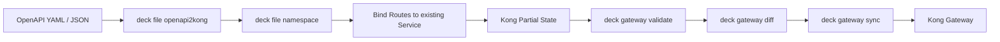

# Kong decK：從 OpenAPI 匯入既有 Gateway Service

OpenAPI 很適合描述 API contract，但在 Kong Gateway 的實際部署中，通常還有另一層 deployment concern：Gateway Service 已經存在、Route 要掛在特定 namespace 下，而且每一組 API 需要有自己的 ownership boundary。

本文整理一套可重複使用的流程：

```text
OpenAPI
  ↓
deck file openapi2kong
  ↓
Kong declarative config
  ↓
deck file namespace
  ↓
重新綁定既有 Gateway Service
  ↓
產生可供 diff / sync 的 partial state
```

這個做法特別適合多個 OpenAPI 共用同一個 Gateway Service，例如：

```text
MASA Gateway Service
├── /pos/*
├── /crm/*
└── /erp/*
```

相關文章：

- [[Kong decK Selective Sync and Tag Ownership]]
- [[Kong decK APIOps Deployment Scripts]]
- [[Kong decK RBAC and Workspace Service Accounts]]

## `openapi2kong` 做了什麼

最基本的轉換命令：

```bash
deck file openapi2kong \
  --spec openapi.yaml \
  --output-file kong.yaml
```

`openapi2kong` 會依 OpenAPI 內容產生 Kong declarative config。一般情況下：

- `servers` 會轉成 Gateway Service。
- 每個 `operationId` 會轉成 Route。
- 可透過 `x-kong-*` extension 加入 Kong-specific 設定。
- 預設會替 entity 產生穩定 ID，方便後續 update 而不是 delete + recreate。

如果希望產生的 entity 都帶同一組 tag，可直接：

```bash
deck file openapi2kong \
  --spec openapi.yaml \
  --output-file kong.yaml \
  --select-tag pos
```

產生的 Service、Route 等 entity 會帶：

```yaml
tags:
  - pos
```

OpenAPI 本身也可以使用：

```yaml
x-kong-tags:
  - pos
```

但在 APIOps 流程中，我偏好把 ownership tag 留在 deployment pipeline，讓 API contract 與部署 topology 保持一定程度的解耦。

## 問題一：我不是要建立新的 Service

`openapi2kong` 的預設行為會根據 OpenAPI 建立 Service，例如：

```yaml
services:
  - name: openapi-definition
    host: localhost
    routes:
      - name: get-customer
        paths:
          - /customers
```

但實際環境可能已經有：

```text
Gateway Service: MASA
```

而需求只是：

```text
OpenAPI Routes
      ↓
MASA
```

此時不應讓 OpenAPI 產生的 Service 設定去覆蓋既有 `MASA` 的 host、port、protocol、timeout 等設定。

比較安全的做法是：

1. 先用 `openapi2kong` 產生完整 state。
2. 在 Route 與 generated Service 關係仍存在時做 namespace。
3. 最後只保留 Routes。
4. 把每個 Route 的 `service` 改成 reference 既有 `MASA`。

最後的 partial state 類似：

```yaml
_format_version: "3.0"

_info:
  select_tags:
    - pos

routes:
  - name: get-customer
    paths:
      - /pos/customers
    service:
      name: MASA
    tags:
      - pos
```

這樣 declarative file 不管理 `MASA` Service 本身，只管理屬於 POS 的 Routes。

## 問題二：如何統一掛到 `/pos`

不要手工改每一個 Route path。decK 提供：

```bash
deck file namespace \
  --path-prefix=/pos \
  --state=kong.yaml \
  --output-file=kong-ns.yaml
```

例如原本 OpenAPI：

```yaml
paths:
  /customers:
    get:
      operationId: getCustomers

  /customers/{id}:
    get:
      operationId: getCustomer
```

經過 namespace 後，Gateway 對外會是：

```text
/pos/customers
/pos/customers/{id}
```

### Namespace 對 upstream 是透明的

`deck file namespace` 的重點不是單純把字串加在 path 前面，而是讓新增的 namespace 對 backend 透明。

例如：

```text
Client
GET /pos/customers/123
        │
        ▼
      Kong
        │
        ▼
Backend
GET /customers/123
```

decK 會依 Route / Service 狀態選擇適當方式移除 prefix：

1. 如果 Route 已經 `strip_path: true`，利用 Route stripping。
2. 若 Service path 可以處理，調整 Service path。
3. 必要時加入 `pre-function` plugin 移除 namespace。

因此 namespace 最好在「還保有 generated Service 關係」時執行，再把 Routes 改掛到既有 Service。

## 完整轉換流程

假設：

```text
OpenAPI         : openapi.json
Gateway Service : MASA
Ownership Tag   : pos
External Path   : /pos
```

第一步：OpenAPI → Kong state。

```bash
deck file openapi2kong \
  --spec openapi.json \
  --output-file generated.yaml \
  --select-tag pos
```

第二步：加入 `/pos` namespace。

```bash
deck file namespace \
  --path-prefix=/pos \
  --state=generated.yaml \
  --output-file=namespaced.yaml
```

第三步：把 Routes 改掛既有 Service。

以下以 `yq v4` 示意：

```bash
export TARGET_SERVICE="MASA"
export OWNERSHIP_TAG="pos"

yq '
  . as $doc |
  {
    "_format_version": ($doc._format_version // "3.0"),
    "_info": {
      "select_tags": [strenv(OWNERSHIP_TAG)]
    },
    "routes": [
      $doc.services[].routes[] |
      .service = {"name": strenv(TARGET_SERVICE)}
    ]
  }
' namespaced.yaml > pos-kong.yaml
```

如果 Service 是 shared entity，還應搭配 `default_lookup_tags`，這會在下一篇 [[Kong decK Selective Sync and Tag Ownership]] 詳細說明。

## 為什麼不要直接用 OpenAPI 改 Service upstream

假設 `MASA` 同時承載：

```text
MASA
├── POS
├── CRM
└── ERP
```

若把 OpenAPI root-level Service plugin 或 upstream properties 直接寫回 MASA，影響面可能超出 POS。

因此一個比較乾淨的責任邊界是：

```text
Workspace Admin
└── Gateway Service
    ├── host
    ├── port
    ├── protocol
    ├── timeout
    └── shared policy

API owner / APIOps
└── OpenAPI
    └── Routes
        ├── paths
        ├── methods
        └── route-level plugins
```

## Service-level Plugin 要特別小心

如果 POS OpenAPI 產生的 Service-level plugin 被套到共享 `MASA` Service，可能同時影響 CRM、ERP。

實務上建議：

- Service-level policy 由 Gateway 管理端維護。
- OpenAPI 主要描述 contract。
- Route-specific policy 才由 OpenAPI 或 APIOps layer 管理。

## 建議的目錄模型

```text
openapi/
├── openapi2kong.sh
├── kong-deploy.sh
├── pos/
│   ├── sit/
│   ├── qas/
│   │   ├── openapi.json
│   │   └── pos-kong.yaml
│   └── prod/
├── crm/
│   └── ...
└── erp/
    └── ...
```

## APIOps Pipeline



真正的 deployment safety 不在 `openapi2kong`，而是在 partial state 的 ownership boundary。下一篇會處理 `select_tags`、`default_lookup_tags` 與 selective sync。

## 相關文章

- 下一篇：[[Kong decK Selective Sync and Tag Ownership]]
- 實作腳本：[[Kong decK APIOps Deployment Scripts]]
- 權限與 Service Account：[[Kong decK RBAC and Workspace Service Accounts]]

## References

- [deck file openapi2kong](https://developer.konghq.com/deck/file/openapi2kong/)
- [deck file namespace](https://developer.konghq.com/deck/file/manipulation/namespace/)
- [decK Gateway commands](https://developer.konghq.com/deck/gateway/)
