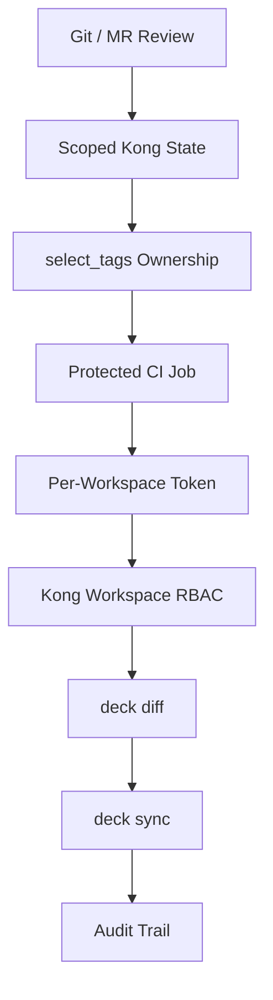

# Kong decK：RBAC、Workspace 與 Service Account 設計

很多人第一次使用 decK 時會直接：

```bash
deck \
  --headers "Kong-Admin-Token:<token>" \
  gateway sync ...
```

容易誤以為：

> `Kong-Admin-Token` 一定等於 Super Admin。

其實不是。

`Kong-Admin-Token` 是 Admin API 認證 Header 名稱；真正可以做什麼，是由該 identity 的 RBAC permission 決定。

因此 decK 完全可以使用：

- 個人的 RBAC token。
- Workspace Admin token。
- 專門給 CI/CD 的 Service Account。
- SSO / OIDC session cookie。

這也是 [[Kong decK APIOps Deployment Scripts]] 在正式環境中應採用的方式。

## 不要共用 Super Admin Token

最不建議：

```text
Cow
Andy
Ken
GitLab SIT
GitLab QAS
GitLab PROD
      │
      └── 共用同一個 kong_admin token
```

問題：

- Audit 無法區分操作者。
- Token 外洩影響所有 Workspace。
- CI 設定錯誤可能直接碰 PROD。
- 無法做到 least privilege。
- Token rotation 影響所有使用者與 pipeline。

## 建議 Identity Model

```text
Kong Gateway
│
├── Human Identity
│   ├── Cow
│   ├── Andy
│   └── Ken
│
└── Automation Identity
    ├── deck-sit
    ├── deck-qas
    └── deck-prod
```

每個 identity 都有自己的 permission。

## Human Account

人工操作應使用個人 identity：

```text
Corporate SSO / LDAP / OIDC
          ↓
      Kong Admin
          ↓
         RBAC
```

這樣 Audit Trail 可以知道：

```text
Cow changed Route A
Andy changed Plugin B
```

而不是所有變更都顯示為：

```text
kong_admin
```

## 個人 RBAC Token

如果 Kong Admin user 啟用了 RBAC token，可用自己的 token：

```bash
export DECK_KONG_ADDR="https://kong-admin.example.com:8444"
export DECK_KONG_ADMIN_TOKEN="$MY_KONG_TOKEN"
```

再：

```bash
deck gateway diff \
  pos-kong.yaml \
  --workspace QAS
```

雖然環境變數名稱叫：

```text
DECK_KONG_ADMIN_TOKEN
```

token 本身並不一定是 Super Admin。

它可以只是：

```text
QAS Workspace Developer
```

## SSO Session

如果組織使用 Kong Manager + OIDC / SSO，也可以讓 decK 使用登入 session cookie。

概念：

```text
User
  ↓
SSO Login
  ↓
Kong /auth
  ↓
Session Cookie
  ↓
decK
  ↓
Admin API
```

這適合人工操作，因為 identity lifecycle 可以由企業 IdP 管理。

CI/CD 則仍建議使用 non-human Service Account。

## 一個 Workspace 一個 Service Account

建議：

```text
deck-sit
  └── SIT only

deck-qas
  └── QAS only

deck-prod
  └── PROD only
```

這比：

```text
deck-ci
  ├── SIT
  ├── QAS
  └── PROD
```

更安全。

即使 pipeline 寫錯：

```bash
QAS_TOKEN + --workspace PROD
```

Kong RBAC 仍應拒絕。

也就是：

```text
CLI workspace parameter
        +
server-side RBAC
```

兩層一起保護。

## Workspace 是 Server-side Security Boundary

`--workspace QAS` 本身不是安全控制。

它只是告訴 decK：

```text
我要操作 QAS
```

真正安全控制是：

```text
deck-qas token
只能操作 QAS
```

因此：

```text
QAS token + --workspace QAS  → OK
QAS token + --workspace PROD → Forbidden
```

這才是可靠的權限模型。

## Service Account 權限

一開始可以先給某個 Workspace 內較完整的 API deploy 權限，再逐步縮小。

原因是 decK 在 diff / sync 時不只呼叫：

```text
/routes
/services
/plugins
```

還可能讀：

- Gateway version。
- schema。
- plugin schema。
- Workspace resource。
- foreign-key entity。

因此如果一開始只猜：

```text
Routes CRUD 應該就夠
```

很容易在 diff 階段遇到 403。

建議用 verbose log 觀察實際呼叫：

```bash
deck gateway diff \
  pos-kong.yaml \
  --workspace QAS \
  --verbose 1
```

再逐步收斂 Role。

## 不讓 Deployment Account 建 Workspace

Workspace lifecycle 應由平台 Admin 管理：

```text
Admin
├── create SIT
├── create QAS
└── create PROD
```

APIOps account 只管理 Workspace 內 API。

因此建議 decK 使用：

```bash
--skip-workspace-crud
```

這可避免 deployment account 嘗試建立不存在的 Workspace。

責任模型：

```text
Platform Admin
└── Workspace lifecycle

Workspace Admin
└── Service / shared policy

APIOps Service Account
└── Route / API deployment
```

## CI Credential

GitLab CI Variable：

```text
KONG_SIT_ADDR
KONG_SIT_TOKEN

KONG_QAS_ADDR
KONG_QAS_TOKEN

KONG_PROD_ADDR
KONG_PROD_TOKEN
```

並搭配：

- Masked variable。
- Protected variable。
- PROD token 只在 protected branch / protected environment 可取得。

QAS Job：

```bash
export DECK_KONG_ADDR="$KONG_QAS_ADDR"
export DECK_KONG_ADMIN_TOKEN="$KONG_QAS_TOKEN"

./kong-deploy.sh \
  --state pos/qas/pos-kong.yaml \
  --workspace QAS \
  --expect-tag pos \
  --apply \
  --yes
```

PROD Job：

```bash
export DECK_KONG_ADDR="$KONG_PROD_ADDR"
export DECK_KONG_ADMIN_TOKEN="$KONG_PROD_TOKEN"

./kong-deploy.sh \
  --state pos/prod/pos-kong.yaml \
  --workspace PROD \
  --expect-tag pos \
  --apply \
  --yes
```

## Secret 不應寫進 Script

不要：

```bash
TOKEN="my-secret-token"
```

也不要 commit：

```text
.deck.yaml
```

如果其中含 plaintext credential。

建議：

```text
Local
→ password manager / environment variable / secure config

CI
→ GitLab masked protected variable

Production
→ secret manager / Vault / OpenBao
```

## TLS

正式環境應驗證 Kong Admin API TLS：

```bash
export DECK_CA_CERT_FILE=/etc/pki/kong-ca.pem
```

而不是長期：

```bash
--tls-skip-verify
```

後者只適合測試或臨時診斷。

## 推薦 Role Matrix

| Identity | Workspace | 建議用途 |
|---|---|---|
| Super Admin | Global | RBAC、Workspace、平台管理 |
| Workspace Admin | 指定 Workspace | Service、shared policy、Consumer |
| Developer | 指定 Workspace | Route、route plugin |
| Viewer | 指定 Workspace | Read only |
| Auditor | 跨 Workspace read only | Audit |
| `deck-sit` | SIT | CI/CD deploy |
| `deck-qas` | QAS | CI/CD deploy |
| `deck-prod` | PROD | CI/CD deploy |

CI account 不應等同 Super Admin。

## Defense in Depth

整個 APIOps security boundary 應該有多層：



任一層出錯，都還有下一層可以降低風險。

## 與 Selective Sync 的關係

[[Kong decK Selective Sync and Tag Ownership]] 解決的是：

> 哪些 entity 屬於這份 state？

RBAC 解決的是：

> 這個 identity 能操作哪些 Workspace / resource？

兩者不是替代關係，而是互補：

```text
select_tags
= desired-state boundary

RBAC
= authorization boundary
```

所以安全的 QAS deployment 應該同時具備：

```text
state.select_tags = pos
service lookup tag = masa-service
token = deck-qas
RBAC = QAS only
workspace = QAS
```

## 相關文章

- [[Kong decK OpenAPI to Gateway Service]]
- [[Kong decK Selective Sync and Tag Ownership]]
- [[Kong decK APIOps Deployment Scripts]]

## References

- [Kong Gateway RBAC](https://developer.konghq.com/gateway/entities/rbac/)
- [decK Gateway RBAC](https://developer.konghq.com/deck/gateway/rbac/)
- [decK Gateway configuration](https://developer.konghq.com/deck/gateway/configuration/)
