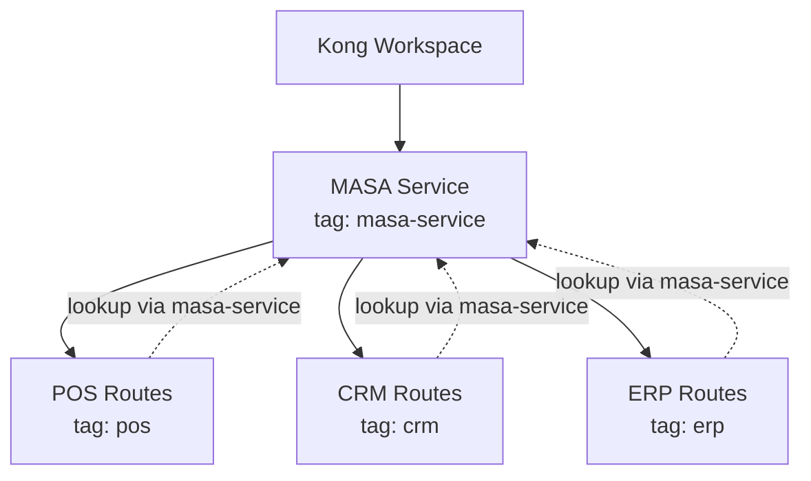

# Kong decK：Selective Sync、Tag Ownership 與 Partial Configuration

`deck gateway sync` 很強大，但它的語意也非常直接：**讓 Gateway 狀態符合 declarative state**。

因此如果把一份只包含部分 API 的 YAML 當成整個 Workspace 的 desired state，缺少的 entity 可能被視為應該刪除。

這也是 partial configuration 最重要的問題：**這份 state 到底擁有哪些 entity？**

上一篇 [[Kong decK OpenAPI to Gateway Service]] 已經把 OpenAPI 轉成只包含 Routes 的 state。本文進一步處理：

- `select_tags`
- ownership tag
- `default_lookup_tags`
- shared Gateway Service
- safe selective sync

## `--select-tag` 有兩種不同語意

### `openapi2kong --select-tag`

```bash
deck file openapi2kong \
  --spec openapi.yaml \
  --select-tag pos \
  --output-file generated.yaml
```

這裡的 `--select-tag pos` 是：

> 把 `pos` tag 加到產生的 entity。

例如：

```yaml
tags:
  - pos
```

### `gateway sync --select-tag`

```bash
deck gateway sync kong.yaml \
  --workspace QAS \
  --select-tag pos
```

這裡的 `--select-tag pos` 是：

> 只把符合 `pos` tag 的 entity 納入 sync scope。

這兩個參數名稱相同，但責任不同。

## 建議把 ownership scope 寫進 state

比起每次 CLI 手動加：

```bash
--select-tag pos
```

更推薦讓 state 自己描述 scope：

```yaml
_format_version: "3.0"

_info:
  select_tags:
    - pos
```

然後：

```bash
deck gateway diff pos-kong.yaml --workspace QAS
deck gateway sync pos-kong.yaml --workspace QAS
```

這樣 Git review 時，可以直接看到這份檔案的 ownership boundary。

## 最常見的誤用

假設 Workspace 中有三套 CRM API：

```text
CRM
├── Customer API
├── Contract API
└── Agent API
```

如果全部只用同一個：

```text
tag = CRM
```

而 `customer.yaml` 裡只包含 Customer API，卻執行：

```bash
deck gateway sync customer.yaml \
  --select-tag CRM
```

decK 會把 `CRM` 視為管理範圍。

Contract、Agent entity 如果存在於 Gateway、但不在 desired state 中，就可能被判定為應刪除。

## 分類 Tag 與 Ownership Tag 分開

比較好的策略是：

```text
Business Tag     : CRM
Ownership Tag    : CRM-CUSTOMER
```

例如：

```yaml
tags:
  - CRM
  - CRM-CUSTOMER
```

而 state：

```yaml
_info:
  select_tags:
    - CRM
    - CRM-CUSTOMER
```

多個 select tag 是 AND：

```text
CRM AND CRM-CUSTOMER
```

因此：

```text
CRM + CRM-CUSTOMER
CRM + CRM-CONTRACT
CRM + CRM-AGENT
```

可以在同一 Workspace 中安全分開管理。

如果你的 API 粒度本身就是一個 `pos` project，也可以簡化成單一 ownership tag：

```yaml
_info:
  select_tags:
    - pos
```

## Shared Gateway Service 的問題

假設：

```text
MASA Gateway Service
├── /pos/*
├── /crm/*
└── /erp/*
```

`MASA` 是 shared entity，不應該屬於 POS。

錯誤設計：

```yaml
services:
  - name: MASA
    tags:
      - pos
```

這等於讓 POS deployment 擁有整個 MASA Service。

更合理的是：

```text
MASA Service
tag = masa-service

POS Routes
tag = pos
```

POS state 只管理 Routes：

```yaml
_info:
  select_tags:
    - pos

routes:
  - name: get-customer
    tags:
      - pos
    service:
      name: MASA
```

但此時 Route 有 foreign key 指向 state 外部的 `MASA`。

這就需要 `default_lookup_tags`。

## `default_lookup_tags`

```yaml
_info:
  select_tags:
    - pos

  default_lookup_tags:
    services:
      - masa-service
```

意思是：

```text
要管理的 entity:
  tag = pos

如果需要 lookup 外部 Service:
  tag = masa-service
```

因此 ownership 與 dependency 被分開：

```text
POS state
│
├── owns
│   └── Routes tagged pos
│
└── references
    └── Service tagged masa-service
```

這是 shared service scenario 最重要的設計。

## 最終 partial state

```yaml
_format_version: "3.0"

_info:
  select_tags:
    - pos

  default_lookup_tags:
    services:
      - masa-service

routes:
  - name: get-agent-info
    methods:
      - GET
    paths:
      - ~/pos/agent-info$
    tags:
      - pos
    service:
      name: MASA
```

在這個 state 中：

- `pos` 是 deployment ownership。
- `masa-service` 只用來找到 shared Service。
- `MASA` 不由 POS state 管理。
- `sync` 可以新增、修改、刪除 POS Route。
- CRM / ERP Route 不在 scope。

## Diff 一定要先跑

部署前：

```bash
deck gateway validate \
  pos-kong.yaml \
  --workspace QAS
```

再：

```bash
deck gateway diff \
  pos-kong.yaml \
  --workspace QAS
```

確認預期：

```text
CREATE  新 POS Route
UPDATE  已修改 POS Route
DELETE  OpenAPI 中已移除的 POS Route
```

而不應看到：

```text
DELETE CRM Route
DELETE ERP Route
UPDATE MASA Service
```

如果看到後者，ownership boundary 就有問題。

## `apply` 與 `sync`

`deck gateway apply` 比較接近：

```text
有寫到的 entity → create / update
沒寫到的 entity → 不主動刪
```

`deck gateway sync` 則是：

```text
desired state 與 Gateway reconciliation
```

所以要實現真正的「OpenAPI 移除 endpoint → Kong Route 也刪除」，通常需要 `sync`。

但也正因為 `sync` 有 delete 語意，所以：

> `sync` 必須和 ownership scope 綁在一起。

## 建議規則

### Rule 1：每份可獨立 deploy 的 state 都要有 ownership tag

```yaml
_info:
  select_tags:
    - pos
```

### Rule 2：Shared entity 不使用 API ownership tag

例如：

```text
MASA Service → masa-service
POS Routes   → pos
```

### Rule 3：Shared foreign key 用 `default_lookup_tags`

```yaml
default_lookup_tags:
  services:
    - masa-service
```

### Rule 4：CI 一定先 diff

```text
validate
→ diff
→ approval
→ sync
```

### Rule 5：不接受 unscoped partial state

如果 state 沒有：

```yaml
_info:
  select_tags:
```

部署工具應預設拒絕執行。

這個安全機制已放進下一篇 [[Kong decK APIOps Deployment Scripts]] 的部署腳本設計中。

## Ownership Model



## 下一步

有了清楚的 ownership boundary，接下來就可以把流程自動化：

```text
OpenAPI
→ generate state
→ validate
→ diff
→ sync
```

見：

- [[Kong decK APIOps Deployment Scripts]]
- [[Kong decK RBAC and Workspace Service Accounts]]

## References

- [decK tags and partial configuration](https://developer.konghq.com/deck/gateway/tags/)
- [deck gateway sync](https://developer.konghq.com/deck/gateway/sync/)
- [deck gateway diff](https://developer.konghq.com/deck/gateway/diff/)
