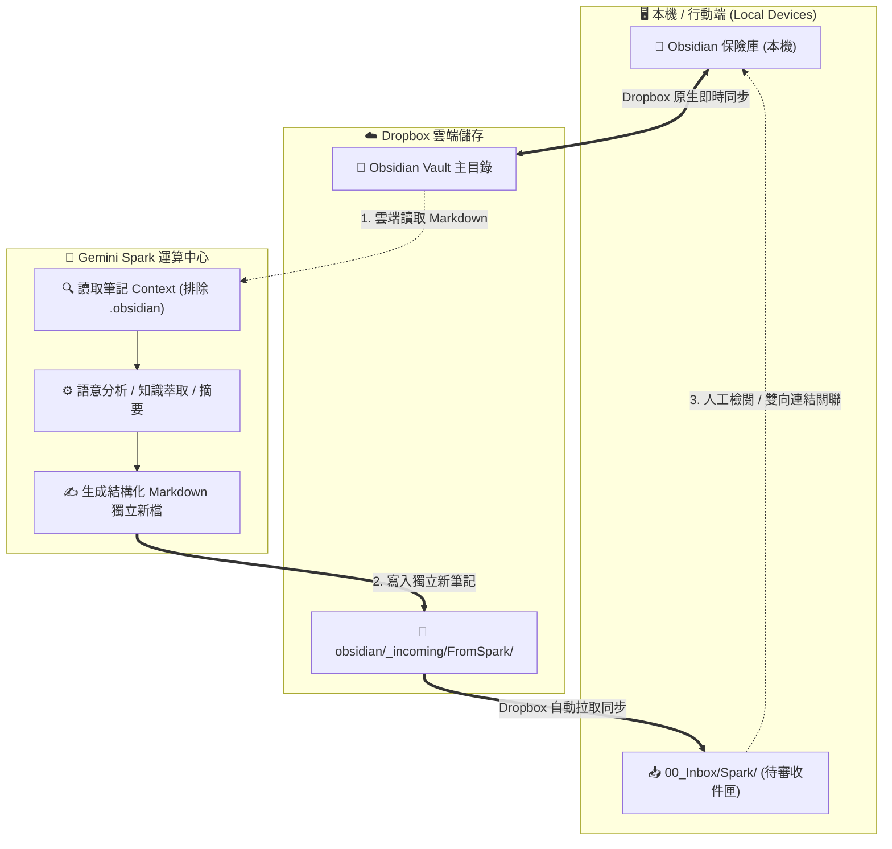

# Spark 與 Obsidian 保險庫整合架構決策與同步方案

> 💡 **情境脈絡**：探討本機已使用 Dropbox 進行多裝置同步的前提下，如何讓 Gemini Spark 存取與處理 Obsidian 筆記，並在避免雙向覆寫衝突與檔案鎖定的情況下完成讀寫閉環。

## 1. 架構演進與方案評估

| 方案架構 | 同步機制 | 衝突風險 | 維護成本 / 本機負擔 | 適用場景與評估 |
| :--- | :--- | :--- | :--- | :--- |
| **方案 A：Google Drive 雙向同步** | 本機 Vault 直接掛載 Google Drive 電腦版同步 | **高**（若與 Dropbox 重疊易引發 Race Condition 與衝突副本） | 中等（需常駐 Google Drive 客戶端） | 僅適用於未啟用其他雲端同步的單一環境；不建議與既有 Dropbox 疊加。 |
| **方案 B：讀寫分離本機鏡像 (rsync/rclone)** | 保留 Dropbox 為主要 Vault；本機透過腳本單向推播至 GDrive，再將 Spark 輸出拉回 `00_Inbox` | **零風險**（讀寫路徑實體隔離，採單向鏡像） | 中等（需於本機配置排程腳本或常駐服務） | 適用於主要在單一開發機作業，且 Spark 僅能串接 Google Drive 時的過渡方案。 |
| **方案 C：雲端直連整合 (Dropbox API / Connector)** | Spark 直接透過雲端介面讀取 Dropbox Vault，並將產出獨立寫入專屬收件匣目錄 | **零風險**（雲端直連、目錄隔離、無本機排程負擔） | **極低**（完全免本機維護，跨裝置即時生效） | **最佳架構**。在 Spark 已授權連接 Dropbox 時最為理想純粹。 |

### 核心架構原則
1. **避免多重同步引擎衝突**：嚴禁在同一本機資料夾同時掛載多個即時雙向同步服務（如 Dropbox + Google Drive），避免檔案鎖定衝突。
2. **CQRS 讀寫分離原則**：將「知識讀取檢索」與「AI 成果寫入」切分路徑，AI 一律輸出獨立新檔至專屬收件匣（Inbox），避免 In-place 覆寫導致版本覆蓋。

## 2. 核心架構與資料流向 (Visual Diagram)

## 3. 實踐原則與最佳實踐

1. **嚴禁就地覆寫（No In-place Overwrite）**：
    - Spark 生成內容時一律建立獨立命名新檔（例如 `YYYY-MM-DD-主題.md`），不直接修改原始筆記，防止與本機編輯產生同步衝突。
        
2. **排除系統設定雜訊**：
    - 檢索與讀取時主動排除 `.obsidian/`（外掛、設定檔）與 `.trash/`，節省 Token 並提升語意檢索精準度。
        
3. **保留人工審核邊界（Human-in-the-loop）**：
    - AI 產出的筆記統一先降落於 `obsidian/_incoming/FromSpark/`，由使用者透過雙向連結（`[[筆記名稱]]`）與標籤歸檔至核心知識庫。
        
4. **標準化元數據結構**：
    - 所有產出檔案均配備標準 YAML Frontmatter，便於透過 Obsidian Dataview 插件進行自動化彙整與狀態追蹤。
        

## 4. 行動清單 (Action Items)

- [ ] 在 Dropbox 的 Obsidian 保險庫中確認或建立接收目錄 `obsidian/_incoming/FromSpark/` #todo
- [ ] 於 Spark 專案或工作流程中設定檢索範圍，確認排除 `.obsidian` 與 `.trash` 資料夾 #todo
- [ ] 在 Obsidian 中配置 Dataview 查詢區塊，監控收件匣最新動態 #todo
- [ ] 測試 Spark 產出之 Markdown 檔案在 Obsidian 中的 Mermaid 圖表渲染與雙向連結相容性 #todo
