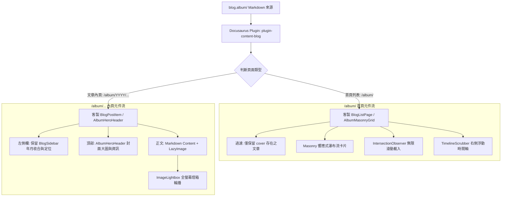

# Album 相簿部落格：技術架構與實作計畫

接續 [[01 Album Blog 概念發想與決策記錄|概念發想與決策記錄]]，本文從前端工程與 Docusaurus 系統架構出發，詳述 **Album 相簿部落格** 的元件劃分、資料流、核心演算法及逐步落地的實作計畫。

---

## 系統架構與資料流（System Architecture）

在 Docusaurus 的架構下，Album 實例將作為第三個獨立的部落格外掛實例運行：



### 1. Docusaurus 配置整合點
* **`site.config.js`**：在 `blogConfig` 陣列加入相簿實例：
  ```javascript
  {
    id: 'album',
    routeBasePath: 'album',
    path: 'blog.album',
  }
  ```
* **`docusaurus.config.ts`**：
  - 自動透過 `blogConfig.map` 註冊 `@docusaurus/plugin-content-blog` 實例。
  - 在 `@easyops-cn/docusaurus-search-local` 的 `blogDir` 與 `blogRouteBasePath` 中同步納入 `blog.album`。
  - 在 `navbar.items` 的 `life` 與 `news` 之間新增 `{ to: '/album', label: 'album', position: 'left' }`。
  - 在 `footer.links` 的「筆記頻道」加入 `{ label: 'Photo Album', to: '/album' }`。

---

## Frontmatter 規範與 Markdown 範本

每篇相簿文章放置於 `blog.album/YYYY/` 下，採用統一的 frontmatter 結構：

```yaml
---
title: 2026 夏季長野上高地健行紀錄
date: 2026-07-20
cover: https://images.unsplash.com/photo-1506744038136-46273834b3fb?q=80&w=1600
cover_caption: 清晨大正池的水面倒影與遠方穗高連峰
location: 日本・長野縣上高地
album_series: 2026 日本北阿爾卑斯漫行
tags:
  - 日本
  - 健行
  - 自然
authors: kywk
---

# 2026 夏季長野上高地健行紀錄

這裡是相簿的引言或第一段描述...

<!--truncate-->


健行沿途穿過梓川森林步道...


```

---

## 核心技術與客製元件設計

### 1. Pinterest 響應式瀑布流 (`AlbumMasonryGrid`)
* **排版技術**：
  - 採用純 CSS `column-count` 或動態 CSS Grid 分欄（桌機 3～4 欄、平板 2 欄、手機 1～2 欄），搭配 `break-inside: avoid` 防止卡片中斷。
* **卡片內容與過濾**：
  - 資料來源過濾：`items.filter(post => Boolean(post.metadata.frontMatter.cover))`。
  - 卡片呈現：封面圖、文章標題、拍攝日期、地點標籤（Pill badge）。
* **防止版面跳動（CLS 防範）**：
  - 封面卡片提供最小預設高度與骨架屏（Skeleton）漸層動畫，待圖片載入完成後淡入顯示。
* **無限捲動（Infinite Scroll）**：
  - 元件底部設置隱形哨兵節點（`<div ref={sentinelRef} />`）。
  - 使用 `IntersectionObserver` 監聽。當讀者滾動至距離底部 300px 時，自動從全量列表中多渲染下一批（例如每次 12 篇），實現平滑無縫加載。

### 2. Google Photos 右側浮動時間軸 (`TimelineScrubber`)
* **視覺呈現**：
  - 位於視窗右側外緣（`position: fixed; right: 1.5rem; top: 50%; transform: translateY(-50%)`）。
  - 平時以極簡的細刻度線呈現；當頁面發生滾動時，自動浮現並高亮當前時間標籤（如 `2026年 7月`）。
* **滾動聯動演算法**：
  - 在卡片渲染時標記 `data-year` 與 `data-month`。
  - 監聽視窗捲動，計算目前視窗中央（Viewport Center）所對應卡片的年份與月份，即時更新時間軸指針。
  - 點擊時間軸上的特定年份按鈕時，透過 `element.scrollIntoView({ behavior: 'smooth' })` 平滑捲動至該年份的第一張相片。

### 3. 首頁版面策略與側邊欄判斷
* 在 Docusaurus 的 `BlogLayout` 或自訂首頁包裝中，判斷目前路由是否為 `/album/`（或相簿列表頁）：
  - **首頁列表頁**：關閉左側欄，讓 `<main>` 獲得 `col--12` 全寬，完全交由瀑布流支配。
  - **文章內頁**：恢復標準配置，展示左側雙層年月收合欄（沿用先前建立的 `BlogSidebarContent` 元件），讀者可輕鬆穿梭切換各篇相簿。

### 4. 文章內頁相簿 Hero Header (`AlbumHeroHeader`)
* 位於文章全文最前端：
  - 大尺寸封面視覺（滿版寬度或等比置中美圖）。
  - 下方呈現資訊列：
    - 📍 `location` 地點徽章
    - 📁 `album_series` 系列主題徽章
    - 📅 拍攝/發布日期
    - 📝 `cover_caption` 詩意題詞或照片說明

### 5. 全域照片 Lazy-loading 與全螢幕 Lightbox (`ImageLightbox`)
* **自動圖片優化**：
  - 透過自訂 MDX 圖片元件（`img` 覆寫）或 React DOM Hook，為內文所有 `` 自動注入 `loading="lazy"`、`decoding="async"`。
* **Lightbox 燈箱互動**：
  - 點擊任意照片，開啟全螢幕半透明遮罩燈箱。
  - 收集文章內所有圖片清單，支援鍵盤 `←` / `→` 切換前後張、點擊遮罩或按 `ESC` 鍵關閉。
  - 底部顯示照片序號（如 `3 / 12`）與圖片說明（alt / title）。

---

## 分階段實作計畫（Implementation Milestones）

```mermaid
gantt
    title Album 相簿部落格實作藍圖
    dateFormat  X
    axisFormat  Day %d
    section Phase 1: 基礎接線
    site.config 與 docusaurus.config 多實例配置 :0, 1
    Navbar 與 Footer 連結整合 :0, 1
    section Phase 2: 首頁瀑布流
    全寬首頁與 Pinterest Masonry 元件開發 :1, 3
    IntersectionObserver 無限滾動載入 :2, 4
    section Phase 3: 時間軸
    Google Photos 右側時間軸 Scrubber 實作 :3, 5
    滾動位置即時高亮與點擊跳轉 :4, 6
    section Phase 4: 內頁體驗
    AlbumHeroHeader 封面資訊區塊 :5, 7
    內文照片 Lazy-load 與 Lightbox 燈箱元件 :6, 8
    section Phase 5: 驗收與發布
    建立 blog.album 範例文章與視覺校調 :7, 9
    typecheck、build 與響應式檢驗 :8, 10
```



### 階段詳細任務清單

* [x] **Phase 1：環境與實例接線**
  - [x] 在 `site.config.js` 註冊 `album` blog 實例。
  - [x] 在 `docusaurus.config.ts` 的搜尋插件配置加入 `blog.album`。
  - [x] 更新 `themeConfig.navbar` 與 `footer`，在 `life` 與 `news` 間加入 `album`。
  - [x] 建立 `blog.album/` 基礎目錄與示範文章。
* [x] **Phase 2：首頁全寬瀑布流與無限捲動**
  - [x] 判斷相簿首頁移除左側欄，使用 `col--12`。
  - [x] 撰寫 `AlbumMasonryGrid` 元件與 CSS Module，實作響應式分欄。
  - [x] 實作純圖版型（無干擾視覺）與 Mouse Hover 浮層資訊。
  - [x] 實作 `IntersectionObserver` 進行分批動態加載。
* [x] **Phase 3：Google Photos 式右側浮動時間軸**
  - [x] 開發 `TimelineScrubber` 元件，定位於右側固定懸浮。
  - [x] 綁定滾動事件計算可視文章年份/月份，即時浮現目前日期標籤。
  - [x] 實作點擊年份平滑錨點捲動。
* [x] **Phase 4：文章內頁封面與相片燈箱**
  - [x] 開發 `AlbumHeroHeader`，展示 `cover`、`location`、`album_series`、`cover_caption`。
  - [x] 實作輕量原生 `ImageLightbox`，接管文章相片點擊放大與左右輪播。
  - [x] 嚴格排除作者大頭貼（Avatar Exclusion），確保燈箱專注於相簿照片。
  - [x] 確保內頁相片全數啟用 `loading="lazy"` 與防跑版佔位。
* [x] **Phase 5：範例驗證與構建檢查**
  - [x] 撰寫 10 篇示範相簿文章（多張相片、完整 Frontmatter、多種長寬比）。
  - [x] 執行 `npm run typecheck`。
  - [x] 執行 `npm run build` 確認 SSG 靜態導出與無破裂連結。
  - [x] 檢視桌機、平板、手機各尺寸之響應式顯示效果。

---

## 驗收標準與完工狀況

1. **視覺體驗**：
   - 首頁呈現純粹、美觀的 Pinterest 瀑布流，無左側欄干擾。
   - 僅有設定 `cover` 的文章會出現在首頁，排版無破圖或空白佔位。
2. **滾動與時間感知**：
   - 滾動流暢，無卡頓，無限滾動自然加載新卡片。
   - 右側時間軸如 Google Photos 般在滾動時優雅浮現，指示精確且支援點擊跳轉。
3. **內頁相片體驗**：
   - 頂部 Hero 資訊完整對應 Frontmatter。
   - 點擊內文任一張相片皆能無縫開啟 Lightbox 大圖輪播，且完全排除作者大頭照。
   - 左側側欄正確展示年月收合與當前文章高亮定位。
4. **工程品質**：
   - `npm run typecheck` 零錯誤。
   - `npm run build` 成功建置，無 SSR/SSG 水合衝突。

👉 接續閱讀完工成果與架構評估：[[03 Album Blog 完工成果與架構插件化評估|Album 相簿部落格：完工成果與獨立插件化架構評估]]
