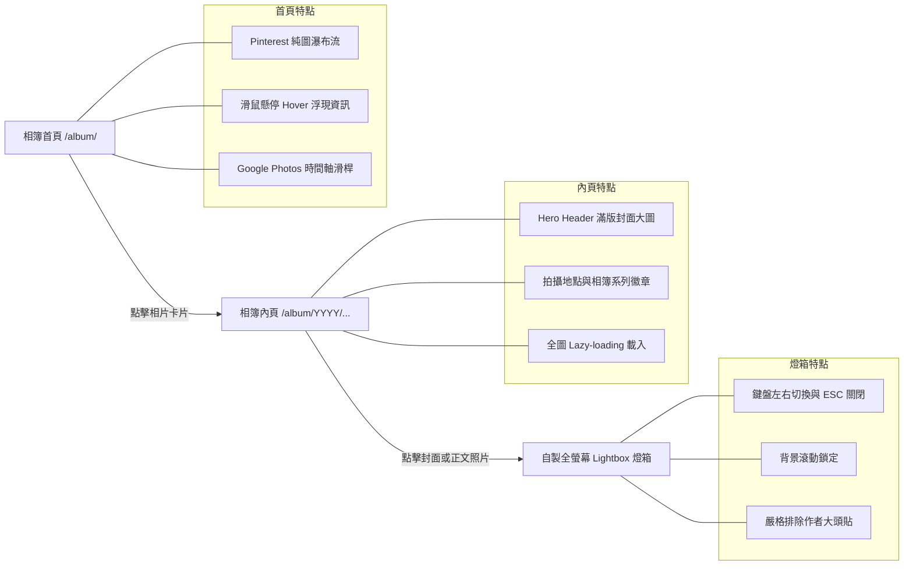

# Album 相簿部落格：完工成果與路徑一插件化實作

接續前文 [[01 Album Blog 概念發想與決策記錄|概念發想與決策記錄]] 與 [[02 Album Blog 技術架構與實作計畫|技術架構與實作計畫]]，**Album 相簿部落格** 不僅已全數落地上線，更進一步依據技術評估之**「路徑一（Wrapper Pattern 微包裝模式）」**，正式將相簿功能抽離並封裝為專案內的獨立外掛 `plugins/docusaurus-plugin-album/`。

本文將展示完工後的最終視覺成果、互動機制，以及外掛封裝落地的完整工程細節。

---

## 🎨 完工成果圖文解析（Feature Walkthrough）

相簿部落格跳脫傳統技術文章以文字為主的框架，建立起專屬於影像敘事的閱讀體驗：



### 1. Pinterest 純圖瀑布流首頁（Masonry Grid & Hover Overlay）
- **視覺純粹性**：進入 `/album/` 首頁，映入眼簾的是純淨的照片瀑布流。卡片依據自然長寬比（橫圖 16:9、直圖 4:5、直立街景 9:16、正方形 1:1）錯落排列，徹底發揮影像張力。
- **無干擾 Hover 浮層**：相片預設不顯示冗長文字；當滑鼠懸停（Hover）於卡片時，底部以平滑動畫浮現半透明深色漸層遮罩，優雅展示文章標題、拍攝地點（📍）與相簿系列（📁）。
- **觸控裝置友善**：在不支援滑鼠 Hover 的手機或平板上，透過 `@media (hover: none)` 自動維持適度透明度的資訊浮層，兼顧易讀性。

### 2. Google Photos 風格時間軸滑桿（Timeline Scrubber）
- **歷史穿越導航**：畫面右側提供膠囊造型的時間軸滑桿，列出相簿涵蓋的年份刻度（如 `2026`、`2025`、`2024`）。
- **動態氣泡回饋**：當使用者滾動頁面或點擊特定年份時，滑桿旁會同步展開深色毛玻璃氣泡，提示當前視野所處的年月，並平滑滾動（Smooth Scroll）至對應區段。

### 3. 文章內頁 Hero Header
- **沉浸式第一印象**：文章頂部不再使用普通的文字標題，而是採用圓角與微光澤邊框包覆的 `AlbumHeroHeader`，大圖右下方標示圖說，底部卡片清楚列出拍攝地點與自訂相簿分類徽章。
- **保留側欄目錄**：完美相容專案既有的 `BlogSidebar` 年月摺疊選單，使相簿同時具備「自由瀏覽」與「精準檢索」的雙重能力。

### 4. 零依賴自製全螢幕燈箱（Image Lightbox）
- **純 React + CSS 實作**：無需引入肥大的外部燈箱套件，以不到 150 行程式碼實現極致輕量的沉浸式圖片檢視器。
- **操作體驗**：
  - 支援鍵盤快速鍵：`←` / `→` 循環切換前後張、`ESC` 隨時關閉。
  - 燈箱啟動時自動鎖定 `document.body` 滾動條，關閉時無縫復原。
  - 左上方即時顯示相片張數進度（如 `1 / 4`），右上方配置旋轉動畫關閉鈕。
- **關鍵除錯：嚴格排除作者大頭貼（Avatar Exclusion）**：
  - 原始實作直接收集文章容器內的所有 `img` 標籤，導致 Docusaurus 的作者大頭照（Avatar）也被納入相片輪播。
  - 修正後將選取範圍精準鎖定於 `.markdown img`，並建立雙重過濾機制：凡符合 `.avatar__photo`、父元素包含 `.avatar` 或位於 `header` 區塊者一律剃除，確保燈箱內 100% 只呈現純粹的攝影作品。

---

## 🚀 獨立外掛實作：`docusaurus-plugin-album`

為了讓本 repository 的設定檔保持整潔，並使相簿邏輯能像 [[Plugin Remark Obsidian Kanban]] 或 [[01 Geo Story Map 專案介紹|Geo Story Map]] 一樣具備高度內聚性，我們採用**路徑一（微包裝模式）**將 Album 完整抽離為獨立外掛。

### 1. 外掛目錄結構

所有相簿相關之 React 元件、樣式表與外掛生命週期進入點，均集中於 `plugins/docusaurus-plugin-album/`：

```text
plugins/docusaurus-plugin-album/
├── package.json          # 外掛宣告清單
├── README.md             # 外掛使用說明文件
├── index.js              # 外掛進入點 (Wrapper Lifecycle & validateOptions)
├── index.d.ts            # TypeScript 型別宣告
└── src/
    └── theme/            # 可被 Swizzle 的主題組件
        ├── AlbumListPage.tsx      # 相簿首頁控制器
        ├── AlbumPostPage.tsx      # 相簿內頁控制器
        ├── AlbumHeroHeader.tsx    # 內頁大圖橫幅
        ├── AlbumMasonryGrid.tsx   # Pinterest 瀑布流網格
        ├── TimelineScrubber.tsx   # Google Photos 時間軸
        ├── ImageLightbox.tsx      # 全螢幕相片燈箱
        └── styles.module.css      # Scoped CSS Modules
```

### 2. 外掛進入點與關鍵設計（`index.js`）

在實作 `@docusaurus/plugin-content-blog` 包裹層時，最核心的關鍵是 **`validateOptions` 生命週期鉤子**：

```javascript
// plugins/docusaurus-plugin-album/index.js
const pluginContentBlog = require('@docusaurus/plugin-content-blog').default;
const { validateOptions: validateBlogOptions } = require('@docusaurus/plugin-content-blog');
const path = require('path');

/**
 * 預先注入相簿專屬預設值，並委託官方 blog validator 補全 authorsMapPath 等內部屬性
 */
function validateOptions({ validate, options = {} }) {
  const mergedOptions = {
    id: 'album',
    path: 'blog.album',
    routeBasePath: 'album',
    blogSidebarTitle: 'All albums',
    blogSidebarCount: 'ALL',
    postsPerPage: 'ALL',
    blogListComponent: path.resolve(__dirname, './src/theme/AlbumListPage'),
    blogPostComponent: path.resolve(__dirname, './src/theme/AlbumPostPage'),
    onUntruncatedBlogPosts: 'ignore',
    showReadingTime: true,
    ...options,
  };

  return validateBlogOptions({ validate, options: mergedOptions });
}

module.exports = async function pluginAlbum(context, options) {
  const blogPluginInstance = await pluginContentBlog(context, options);

  return {
    ...blogPluginInstance,
    name: 'docusaurus-plugin-album',
    getThemePath() {
      return path.resolve(__dirname, './src/theme');
    },
  };
};

module.exports.validateOptions = validateOptions;
```

#### 技術細節：為什麼必須 export `validateOptions`？
Docusaurus 在構建網站（`docusaurus build`）時，會先執行外掛的 `validateOptions`。若直接將 options 傳給 `pluginContentBlog(context, options)` 而跳過驗證步驟，`options.authorsMapPath` 等預設欄位將維持 `undefined`，導致底層在執行 `path.join()` 時拋出 `TypeError: The "path" argument must be of type string`。
透過在外掛導出 `validateOptions` 並鏈結官方驗證器，既能享有自訂相簿預設值，又兼顧 100% 的官方配置相容性。

---

## 📐 引用方式更新：主設定檔全面解耦

在外掛獨立封裝前，`docusaurus.config.ts` 充滿了專案級的三元運算子；重構後，主設定檔乾淨利落：

### 重構前（內嵌判斷）
```typescript
...blogConfig.map(blog => [
  "@docusaurus/plugin-content-blog",
  {
    id: blog.id,
    blogSidebarTitle: blog.id === 'album' ? 'All albums' : 'All posts',
    postsPerPage: blog.id === 'album' ? 'ALL' : 10,
    blogListComponent: blog.id === 'album' ? path.resolve(__dirname, 'src/components/Album/AlbumListPage.tsx') : '@theme/BlogListPage',
    blogPostComponent: blog.id === 'album' ? path.resolve(__dirname, 'src/components/Album/AlbumPostPage.tsx') : '@theme/BlogPostPage',
    // ...
  },
])
```

### 重構後（比照其他 plugins）
```typescript
// docusaurus.config.ts

// 1. 一般文字部落格 (News & Life)
...blogConfig.filter(b => b.id !== 'album').map(blog => [
  "@docusaurus/plugin-content-blog",
  {
    id: blog.id,
    routeBasePath: blog.routeBasePath,
    path: blog.path,
    remarkPlugins: createBlogRemarkPlugins(blog),
    rehypePlugins: rehypeObsidianTasks ? [rehypeObsidianTasks] : [],
    blogSidebarTitle: "All posts",
    postsPerPage: 10,
  },
]),

// 2. 獨立相簿外掛 (Album Plugin)
[
  path.resolve(__dirname, "plugins/docusaurus-plugin-album"),
  {
    id: "album",
    routeBasePath: "album",
    path: "blog.album",
    remarkPlugins: createBlogRemarkPlugins({ id: "album", path: "blog.album" }),
    rehypePlugins: rehypeObsidianTasks ? [rehypeObsidianTasks] : [],
  },
],
```

---

## 🎯 總結

1. **職責分離**：主專案的 `src/components/` 移除所有特定頻道的大型相簿元件，全部歸位至 `plugins/docusaurus-plugin-album/`。
2. **開箱即用**：相簿的 Pinterest 首頁、Hover 浮層、時間軸導航與照片燈箱，均作為外掛預設行為自動生效。
3. **無痛升級**：全站經 `npm run typecheck`、`npm run content:check` 及 `npm run build` 檢驗通過，靜態導出產生的 `/album/` 路由與全站功能皆無損銜接。
