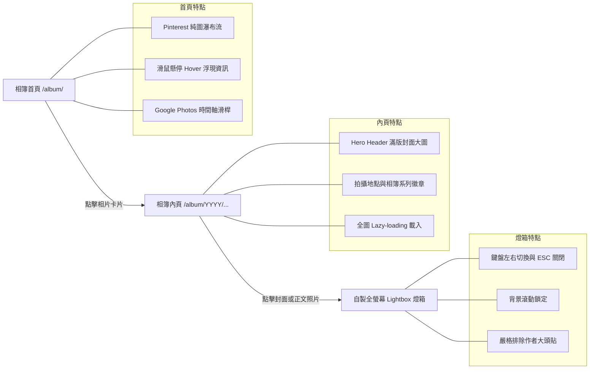
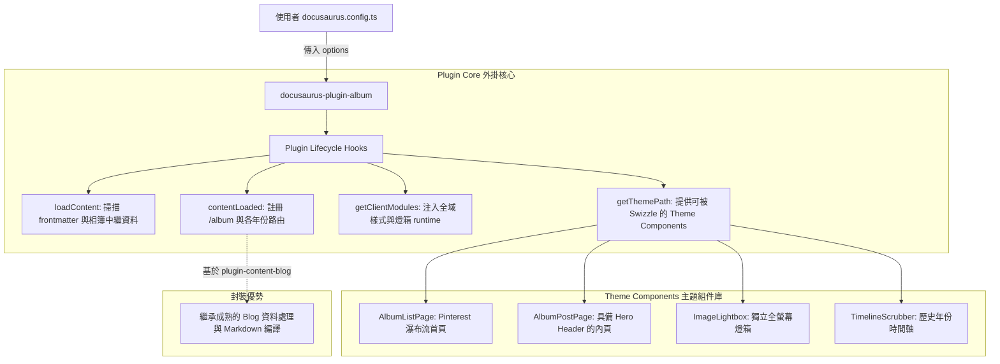

# Album 相簿部落格：完工成果與獨立插件化架構評估

接續前文 [[01 Album Blog 概念發想與決策記錄|概念發想與決策記錄]] 與 [[02 Album Blog 技術架構與實作計畫|技術架構與實作計畫]]，**Album 相簿部落格** 已全數落地上線。本文將展示完工後的最終視覺成果與互動機制，並針對**「Album 是否能封裝為獨立的 Docusaurus 插件」**進行深入的系統架構與技術可行性評估。

---

## 🎨 完工成果圖文解析（Feature Walkthrough）

相簿部落格跳脫傳統技術文章以文字為主的框架，建立起專屬於影像敘事的閱讀體驗：



### 1. Pinterest 純圖瀑布流首頁（Masonry Grid & Hover Overlay）
- **視覺純粹性**：進入 `/album/` 首頁，映入眼簾的是純淨的照片瀑布流。卡片依據自然長寬比（橫圖 16:9、直圖 4:5、直立街景 9:16、正方形 1:1）錯落排列，徹底發揮影像張力。
- **無干擾 Hover 浮層**：相片預設不顯示冗長文字；當滑鼠懸停（Hover）於卡片時，底部以平滑動畫浮現半透明深色漸層遮罩，優雅展示文章標題、拍攝地點（📍）與相簿系列（📁）。
- **觸控裝置友善**：在不支援滑鼠 Hover 的手機或平板上，透過 `@media (hover: none)` 自動維持適度透明度的資訊浮層，兼顧易讀性。

### 2. Google Photos 風格時間軸滑桿（Timeline Scrubber）
- **歷史穿越導航**：畫面右側提供膠囊造型的時間軸滑桿，列出相簿涵蓋的年份刻度（如 `2026`、`2025`、`2024`）。
- **動態氣泡回饋**：當使用者滾動頁面或點擊特定年份時，滑桿旁會同步展開深色毛玻璃氣泡，提示當前視野所處的年月，並平滑滾動（Smooth Scroll）至對應區段。

### 3. 文章內頁 Hero Header
- **沉浸式第一印象**：文章頂部不再使用普通的文字標題，而是採用圓角與微光澤邊框包覆的 `AlbumHeroHeader`，大圖右下方標示圖說，底部卡片清楚列出拍攝地點與自訂相簿分類徽章。
- **保留側欄目錄**：完美相容專案既有的 `BlogSidebar` 年月摺疊選單，使相簿同時具備「自由瀏覽」與「精準檢索」的雙重能力。

### 4. 零依賴自製全螢幕燈箱（Image Lightbox）
- **純 React + CSS 實作**：無需引入肥大的外部燈箱套件，以不到 150 行程式碼實現極致輕量的沉浸式圖片檢視器。
- **操作體驗**：
  - 支援鍵盤快速鍵：`←` / `→` 循環切換前後張、`ESC` 隨時關閉。
  - 燈箱啟動時自動鎖定 `document.body` 滾動條，關閉時無縫復原。
  - 左上方即時顯示相片張數進度（如 `1 / 4`），右上方配置旋轉動畫關閉鈕。
- **關鍵除錯：嚴格排除作者大頭貼（Avatar Exclusion）**：
  - 原始實作直接收集文章容器內的所有 `img` 標籤，導致 Docusaurus 的作者大頭照（Avatar）也被納入相片輪播。
  - 修正後將選取範圍精準鎖定於 `.markdown img`，並建立雙重過濾機制：凡符合 `.avatar__photo`、父元素包含 `.avatar` 或位於 `header` 區塊者一律剃除，確保燈箱內 100% 只呈現純粹的攝影作品。

---

## 🚀 專題探討：Album 是否能寫成獨立的 Docusaurus 插件？

答案是：**完全可以，而且在架構擴充性與社群複用性上，這是一個極佳的重構方向！**

### 目前實作 vs 獨立插件之對比

| 維度 | 目前專案內實作（In-vault / In-site） | 獨立 Docusaurus 插件（`docusaurus-plugin-album`） |
| :--- | :--- | :--- |
| **整合方式** | 依賴 `site.config.js` 與 `docusaurus.config.ts` 手動配置多實例與路徑解析 | 只需在 `docusaurus.config.ts` 的 `plugins` 陣列加入一列套件設定 |
| **元件位置** | `src/components/Album/`，與站台程式碼混在一起 | 封裝在獨立的 npm 套件或 monorepo 的 `plugins/` 目錄內 |
| **可複用性** | 僅限於本站使用，其他專案需手動複製貼上所有檔案 | 任何 Docusaurus 網站只要 `npm install` 即可一鍵獲得相簿功能 |
| **升級維護** | 專案依賴升級時需手動測試與修復 | 插件獨立進行單元測試、型別檢查與版本語意化釋出（SemVer） |
| **主題客製** | 直接修改原檔 | 支援 Docusaurus 官方的 `swizzle` 機制，允許使用者覆寫特定子元件 |

---

## 🏗️ 獨立插件架構設計方案（Plugin Architecture Design）

若將 Album 正式抽離為獨立套件 `docusaurus-plugin-album`，推薦採用 **Wrapper 封裝模式**，其整體架構如下：



### 1. 插件介面與宣告設計（`pluginOptions`）

獨立外掛應提供清晰的型別與預設設定：

```typescript
export interface AlbumPluginOptions {
  /** 相簿文章來源資料夾，預設 'blog.album' */
  path?: string;
  /** 網站路由基礎路徑，預設 'album' */
  routeBasePath?: string;
  /** 側欄標題，預設 'All albums' */
  sidebarTitle?: string;
  /** 每頁相片數或無限滾動配置，預設 'ALL' */
  postsPerPage?: number | 'ALL';
  /** 是否啟用內建的 Image Lightbox 燈箱，預設 true */
  lightbox?: boolean;
  /** 是否啟用 Google Photos 風格的時間軸滑桿，預設 true */
  timelineScrubber?: boolean;
  /** 瀑布流欄數配置（依視窗寬度響應式設定） */
  columns?: {
    mobile?: number;   // 預設 1
    tablet?: number;   // 預設 2
    desktop?: number;  // 預設 3
    wide?: number;     // 預設 4
  };
}
```

### 2. 核心生命週期（Plugin Lifecycle Methods）

在插件進入點 `index.ts` 中實作標準的 Docusaurus Plugin API：

1. **`getThemePath()`**：
   - 指向插件內建的 `theme/` 資料夾。
   - 包含 `AlbumListPage`、`AlbumPostPage`、`AlbumHeroHeader` 等元件。使用者若想微調卡片外觀，只要執行 `npm run swizzle docusaurus-plugin-album AlbumCard --wrap` 即可輕鬆客製，無需改動插件核心。
2. **`getClientModules()`**：
   - 自動載入燈箱互動與核心 CSS（避免使用者手動在 `custom.css` 引入）。
3. **`configureWebpack()`**：
   - 設定 CSS Modules 與 Alias，確保各元件的樣式與相依性完全自給自足，絕不污染宿主網站的全域樣式。

### 3. 與 `@docusaurus/plugin-content-blog` 的共存策略

在實作上有兩種可行路徑：
- **路徑一（微包裝模式，推薦）**：插件本體直接調用 `@docusaurus/plugin-content-blog` 的 factory 函式，自動配置好 `blogListComponent` 與 `blogPostComponent` 並注入預設值。宿主網站完全感覺不到底層是 blog plugin，只當它是全新的相簿功能。
- **路徑二（純主題外掛模式 Theme Plugin）**：只發布 `docusaurus-theme-album`，使用者依然在 `docusaurus.config.ts` 宣告 `@docusaurus/plugin-content-blog`，但組件直接指定 `require.resolve('docusaurus-theme-album/AlbumListPage')`。這種方式最輕量，但使用者配置步驟稍多一道。

---

## 🎯 結論與展望

1. **功能驗證完備**：從 Pinterest 瀑布流、Hover 遮罩、Google Photos 時間軸到無污染的相片燈箱，目前在站內已穩定運作且與全站各頻道（Backpacker、Geo Story Map、Lifehacker）和平共存。
2. **具備高度開源潛力**：相簿部落格的邏輯（以影像為主、長寬自適應、時間軸索引）在現代靜態網站與技術寫作者之間具有高度吸引力。將其打包為 `docusaurus-plugin-album`，不僅能讓本 repository 的配置保持極致精簡，也能作為回饋 Docusaurus 社群的亮點開源專案。
