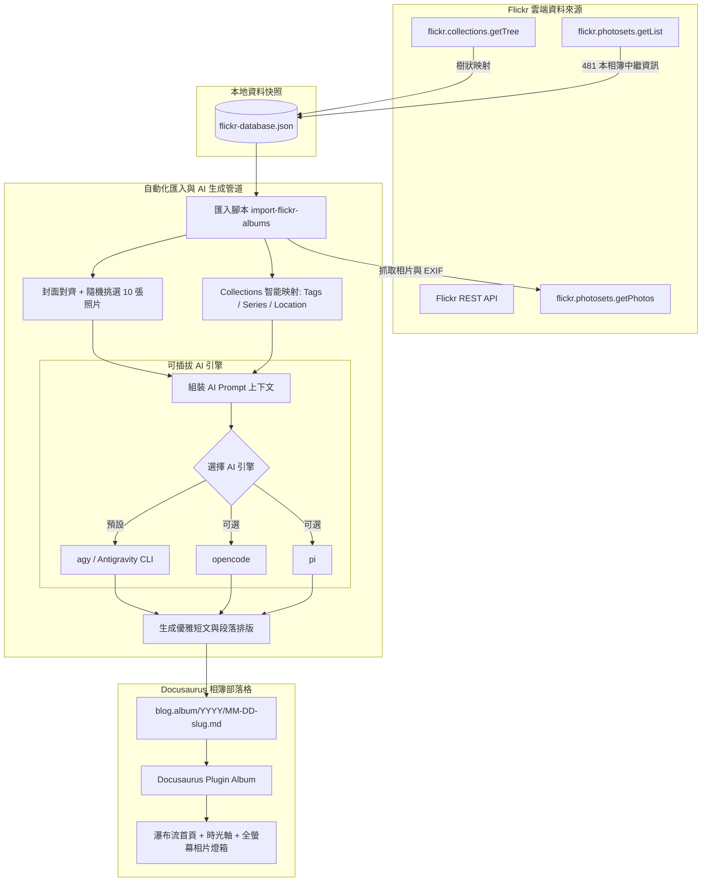

# Album 相簿部落格：Flickr 歷史相簿匯入與 AI 自動化整合方案

在完成 [[01 Album Blog 概念發想與決策記錄|概念發想]]、[[02 Album Blog 技術架構與實作計畫|技術架構]] 與 [[03 Album Blog 完工成果與架構插件化評估|獨立插件化落地]] 後，**Album 相簿部落格** 已具備完整的 Pinterest 瀑布流、Google Photos 時光軸滑桿與全螢幕相片燈箱等強大展示能力。

緊接著的核心任務，是如何將作者在 Flickr 上封存的多年攝影資產（涵蓋 **481 本相簿**、橫跨 2005 至今的 10 大分類樹 Collections），以最優雅、保真且自動化的方式遷移匯入為 `blog.album` 文章。

本文整理了此次遷移整合的需求訪談摘要、核心架構決策、離線資料庫建立方式，以及未來調度外部 AI 生成內文的工程實作方案。

---

## 📌 需求背景與現況分析

1. **封存的歷史攝影資產**：
   - 因 Flickr 近年經歷易主與多輪改版，目前作者帳號已無法登入，未來亦**不會再有新相簿或照片更新**。
   - 這批資料是一組**永久靜態且珍貴的攝影紀錄庫**，非常適合作為部落格的永久相簿內容。
2. **直連外鏈可用性**：
   - 經技術探勘與實測，Flickr 的照片靜態伺服器（`live.staticflickr.com`）支援外連。透過公開 API Key 可直接取得高清直連網址（如長邊 1024px 的 `url_l` 或 800px 的 `url_c`），兼具燈箱展示質感與網頁載入效能。
3. **資料量與組織結構**：
   - **相簿總量**：共 481 本相簿。
   - **分類體系**：具有完整的 10 大 Collections 階層樹（如 `生活紀錄 / live`、`樂活台灣 / taiwan`、`行萬里路 / trip` 等）以及兩層子分類（各國旅程、各縣市專題、美食類型等）。經比對，全部 481 本相簿均已精確掛載於該樹狀結構中。

---

## 🤝 需求訪談與決策摘要（Decisions Log）

透過需求討論，我們確立了以下關鍵決策：

### 決策 1：分階段驗收（先試跑最近 10 本相簿，調校滿意再撰寫腳本）
* **考量**：481 本相簿若一次性匯入，除需對 Flickr 連續發出數百次相片查詢請求外，一次性產生近 500 篇頁面也會讓初期視覺調校與版面驗收失去焦點。
* **最終決策**：
  - **Phase 1**：先挑選「最近的 10 本相簿」進行試跑匯入，手動與半自動化調整版面、文字風格與標籤對應。
  - **Phase 2**：待這 10 篇相簿在相簿首頁（瀑布流/時間軸）與文章內頁的視覺效果完全符合期望後，再將整個流程提煉為自動化腳本。

### 決策 2：保留現有 10 篇測試示範文章
* **現況**：目前 `blog.album/` 下有 10 篇開發階段建立的示範文章（涵蓋 2024～2026 年、使用 Unsplash 示意圖）。
* **最終決策**：**暫予保留**，不作破壞性刪除，確保現有測試相簿在調整階段依然能提供版面豐富度。

### 決策 3：以真實拍攝日期（`datetaken`）為時間軸基準
* **考量**：相簿部落格右側配有 Google Photos 風格的 `TimelineScrubber`（時光軸滑桿）。如果使用匯入當下的日期或 Flickr 相簿建立日期，會失去真實攝影的時間感。
* **最終決策**：
  - 文章日期（`date`）優先讀取相片 EXIF 的**實際拍攝日期（`datetaken`）**；
  - 若相片缺少拍攝日期，則解析相簿標題中的日期標記（例如 `京都 夢 (17.12.07)` 識別為 `2017-12-07`）；
  - 目錄結構維持依年份分層：`blog.album/YYYY/MM-DD-slug.md`。

### 決策 4：建立本地永久資料庫（Flickr Snapshot DB）
* **考量**：Flickr 不會再更新，每次執行腳本都打 Flickr API 既浪費頻寬又有被限流風險。
* **最終決策**：
  - 於本地建立一份 `scripts/data/flickr-database.json`。
  - 一次性爬梳全量 481 本相簿的 ID、標題、相片數量、Primary 封面 URL 以及其所屬的 Collections 樹狀映射路徑。
  - 後續所有批次匯入腳本直接從該 JSON 資料庫讀取，極速且穩定。

### 決策 5：可插拔 AI 引擎調度（Pluggable AI Orchestration）
* **考量**：相簿內文需包含富有質感的情境導言、引言以及適當的照片區塊小標。若全手寫 481 篇耗時費力，需仰賴 AI 批次生成。
* **最終決策**：
  - 腳本需具備調度外部 CLI AI 工具的能力，將相簿中繼資料（標題、分類、地點、挑選之相片標題/說明）組合成 Prompt。
  - **預設引擎**：本機已安裝之 `agy`（Google Antigravity CLI）。
  - **相容擴充**：保留可抽換介面，支援切換為 `opencode` 或 `pi`。

---

## 🏛 系統架構與資料流設計

整體相簿遷移與生成系統架構如下圖所示：



---

## 🏷 Collections 與 Frontmatter 智能映射規則

藉由完整解析 Flickr 的 Collections 樹狀層級，我們能精準將階層轉換為部落格標準欄位：

| 欄位 | 來源與對應規則 | 範例 |
|---|---|---|
| `title` | 原相簿標題（過濾多餘括弧或保留原味） | `京都 夢 (17.12.07)`、`Mt. Tsurugi Dake` |
| `date` | 相片拍攝日期（`datetaken`）或標題日期 | `2017-12-07`、`2015-07-29` |
| `cover` | Flickr 相簿設定之 `primary` 封面直連 URL（`url_l` 1024px） | `https://live.staticflickr.com/..._b.jpg` |
| `cover_caption` | 相簿引言、系列標題或照片說明 | `京都初冬・和服與古都漫步留影` |
| `location` | 從二級 Collection（如縣市、地名）或相簿標題推導 | `日本・京都`、`台灣・屏東`、`日本・富山劍岳` |
| `album_series` | 對應 Collections 之特定旅程或專題子名稱 | `Kensai around`、`Mt. Tsurugi Dake`、`山上的孩子` |
| `tags` | 一級分類中文 + 地點標籤 + 相片 Flickr tags | `[旅行, 日本, 京都, 人像]`、`[登山, 台灣, 屏東]` |
| `authors` | 固定預設為站長 ID | `kywk` |

### 內文排版規範
1. **封面一致**：Frontmatter `cover` 與 Flickr 首頁封面完全一致，並在首頁 Masonry 瀑布流展示。
2. **截斷標籤**：導言段落後統一放置 `<!--truncate-->`，供日後摘要提取使用。
3. **相片挑選**：排除封面圖後，隨機或依序挑選 **10 張以內** 高畫質相片（長邊 1024px，`url_l`），以標準 Markdown 圖片語法 `` 排版。
4. **文末來源**：在文末附上原相簿之 Flickr 連結，保留數位足跡的源頭。

---

## 🧠 知識庫 RAG 檢索與雙向互連機制（Vault RAG & Bi-directional Links）

為了讓自動生成的相簿不只是孤立的照片集合，系統設計了 **Vault 文章 RAG 檢索機制**：

### 1. 文章 RAG 資料庫 (`scripts/data/vault-articles-index.json`)
- 透過 `scripts/build-vault-index.py` 掃描公開筆記目錄（`backpacker/`、`lifehacker/`、`blog.life/`），共建立 **1,018 篇公開筆記的索引庫**。
- 索引內容包含：檔案路徑、Wiki-link 引用基名（`base_name`）、文章標題、拍攝/發表日期、標籤、Flickr Set/Photo ID，以及清洗後的純文字內容摘要。

### 2. 相似度評分與 Prompt 上下文注入
- 當處理相簿時（例如 `Mt.Fuji marathon, 2014`），比對引擎依據 Flickr Set/Photo 命中、Collections 系列名稱（如 `Mt.Fuji marathon` 對應 `backpacker/1411 Mt Fuji Marathon/`）與標題關鍵字，自動找出最相關的 1~3 篇筆記（如 `Index Fujisan Marathon`、`141126 Halo Nikko`、`Note Lodge Tokyo 2014`）。
- 比對到的文章資訊會以 **【作者知識庫關聯文章 (Vault Context)】** 形式直接注入給外部 AI（`agy` / `opencode` / `pi`）的 Prompt 中，讓 AI 能夠理解當時的旅程脈絡與作者口吻，產出更貼近真實記憶的導言。

### 3. 全站雙向 Wiki-Link 解析確認
- 依據 `scripts/content-links.js` 與 `docusaurus.config.ts` 中的 `createContentLinkIndex`，全站所有部落格實例（`blog.album`、`blog.life`、`blog.news`）與文件頻道（`backpacker`、`lifehacker`、`moco`）的路由均由 `remark-slug-normalizer` 統一推導。
- **解析實測完全通暢**：
  - 相簿連至文件：`[[Index Fujisan Marathon]]` ➜ `/backpacker/1411-mt-fuji-marathon/index-fujisan-marathon/`
  - 相簿連至健行：`[[150322_mt-peitawu]]` ➜ `/lifehacker/mount/150322-mt-peitawu/`
  - 文件反向回連相簿：`[[03-21-beidawu-mountain]]` ➜ `/album/2015/03/21/beidawu-mountain/`
- 腳本支援 `--update-reciprocal` 參數，可在生成相簿的同時，自動於關聯的旅行/生活筆記文末寫入相應的相簿回連，實現真正緊密的 Obsidian 知識圖譜網絡。

---

## 🚀 先行試跑：最近 10 本相簿清單（Pilot 10）

在撰寫全量自動化腳本前，首批試跑的 10 本相簿包含以下豐富多樣的主題：

| # | 拍攝日期 | 相簿名稱 | 照片數 | 所屬 Collections / 系列 |
|---|---|---|---|---|
| 1 | `2017-12-07` | **京都 夢 (17.12.07)** | 180 | 行萬里路 / trip (`Kensai around`)、南顏織影 (`親友留影`) |
| 2 | `2015-07-29` | **Mt. Tsurugi Dake** | 4 | 行萬里路 / trip (`Mt. Tsurugi Dake`) |
| 3 | `2015-03-21` | **聖境．北大武 (15.03.22)** | 24 | 樂活台灣 / taiwan (`山上的孩子`、`屏東`) |
| 4 | `2014-12-26` | **FlashMob HK** | 29 | 生活紀錄 / live (`2014 馬．飛騰`) |
| 5 | `2014-11-26` | **Mt.Fuji marathon, 2014** | 28 | 行萬里路 / trip (`Mt.Fuji marathon`) |
| 6 | `2014-12-01` | **Tokyo 銀杏祭** | 2 | 行萬里路 / trip (`Mt.Fuji marathon`) |
| 7 | `2014-11-29` | **富士山．河口湖** | 5 | 行萬里路 / trip (`Mt.Fuji marathon`) |
| 8 | `2014-11-26` | **Nikko 日光 世界遺產** | 22 | 行萬里路 / trip (`Mt.Fuji marathon`) |
| 9 | `2014-11-22` | **越野．能高 (14.11.22)** | 24 | 生活紀錄 (`樂活運動`)、樂活台灣 (`南投`) |
| 10 | `2014-11-06` | **草嶺古道 桃源谷 (14.11.06)** | 59 | 生活紀錄 (`樂活運動`)、樂活台灣 (`山上的孩子`、`宜蘭`) |

---

## 🛠 自動化腳本實作與指令（Script Implementation & CLI）

本整合方案之自動化工具與知識庫檢索系統已正式實作落地：

* **RAG 索引建置腳本**：[`scripts/build-vault-index.py`](file:///Users/kywk/obsidian/scripts/build-vault-index.py)（掃描公開筆記庫，產出 `scripts/data/vault-articles-index.json`）
* **相簿匯入與 AI 生成腳本**：[`scripts/import-flickr-albums.py`](file:///Users/kywk/obsidian/scripts/import-flickr-albums.py)（核心匯入、相片挑選、Prompt 上下文注入與雙向連結回寫）

### 常用 CLI 執行指令

```bash
# 1. 重新建置全站知識庫文章 RAG 索引
python3 scripts/build-vault-index.py

# 2. 乾跑預覽（測試比對關聯文章與挑選相片，不寫入檔案）
python3 scripts/import-flickr-albums.py --limit 5 --dry-run

# 3. 匯入最新 10 本相簿並調度 agy 產生內文與雙向回寫
python3 scripts/import-flickr-albums.py --limit 10 --engine agy --update-reciprocal

# 4. 指定 Collections 系列（如富士山馬拉松旅程）匯入
python3 scripts/import-flickr-albums.py --series "Mt.Fuji marathon"

# 5. 切換 AI 生成引擎（支援 opencode 或 pi）
python3 scripts/import-flickr-albums.py --limit 3 --engine opencode
python3 scripts/import-flickr-albums.py --limit 3 --engine pi
```

> 📖 **深入專題解析**：
> 關於 RAG 相似度計分機制、AI 提示詞工程（Prompt Injection）、跨實例 Wiki-link 路由解析修復與雙向回寫細節，請參閱獨立技術專文：
> 👉 **[[05 Album Blog 全自動化相簿匯入與 RAG 提示詞工程|05 Album Blog 全自動化相簿匯入與 RAG 提示詞工程]]**

---

## 🎯 結語

本方案透過「本地離線快照 + 智能 Collections 階層映射 + 先行 10 本調校 + 可插拔 AI 引擎」的多層設計，既妥善保存了作者珍貴且不再變動的 Flickr 歷史攝影資產，又極大化降低手動維護成本。

首批 10 本相簿已順利建置於 `blog.album/`，並與 `backpacker/`、`lifehacker/` 相關文章無縫雙向互連，歡迎前往相簿首頁體驗極致的視覺流暢感！
