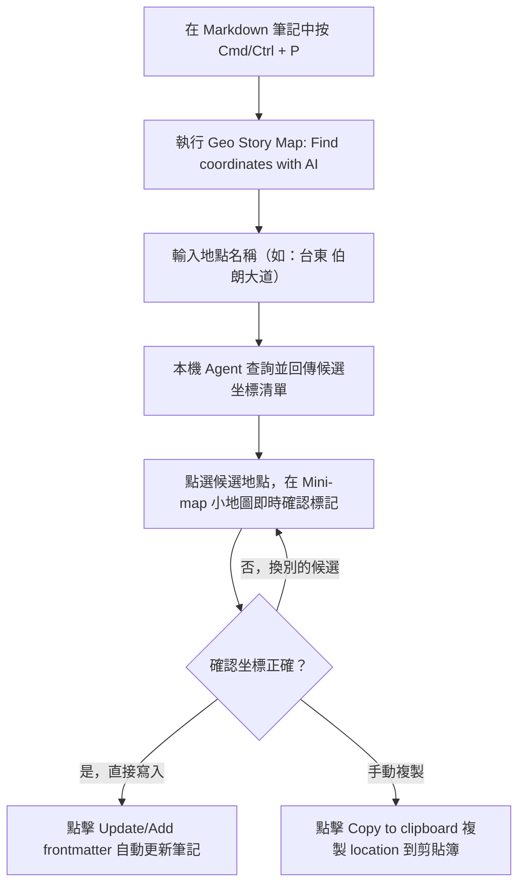

# Geo Story Map 本機 AI 坐標查找設定

記錄旅遊心得、踏青路線或城市漫步時，最繁瑣的步驟往往是查詢地點經緯度：必須切換到外部地圖網站、手動搜尋地名、右鍵複製坐標，再切回 Obsidian 貼入 frontmatter。

Geo Story Map 桌面版內建了 **「Find coordinates with AI」** 指令，透過本機已安裝的 CLI Agent 自動解析地名並取得坐標，並在彈出式互動小地圖上讓你親自驗證，確認無誤後一鍵寫入筆記。

## 本機 Agent 設計原則

1. **純本機執行（Device-local）**：外掛本身不內建任何收費服務或專屬 API Key，而是直接介接你在電腦終端機中已經設定並登入的模型 CLI 工具（如 Codex、Claude Code、OpenCode、pi 等）。
2. **嚴格隱私防護**：外掛在執行查詢時，**僅傳送使用者在對話框中輸入的「地點名稱」**，絕對不會讀取、掃描或上傳 Vault 內的任何其他筆記內容或個人資訊。
3. **裝置專屬儲存**：Agent 的路徑與參數儲存在 Obsidian 桌面版的本機儲存空間（Local Storage）中，不會寫入 Vault 筆記或被同步到其他裝置，避免跨平台或不同作業系統環境間發生路徑衝突。
4. **人工在環驗證（Human-in-the-loop）**：大語言模型建議的坐標僅供參考。外掛提供即時的小地圖預覽，讓你在寫入前親眼確認位置，徹底消除 AI 幻覺帶來的坐標誤差。

## 設定本機 Agent

### 步驟一：確認終端機 CLI 運作正常

請先確認電腦上已安裝並登入至少一款受支援的 CLI 工具。常見的內建支援工具包括：
- `codex`
- `claude`（Claude Code）
- `opencode`
- `pi`

請在系統終端機中單獨執行該指令，確認其能正常連線模型並具備可用額度。

### 步驟二：外掛設定面板

1. 開啟 Obsidian「設定 → Geo Story Map」。
2. 向下捲動至 **Local agents**（本機代理人）區塊。
3. 系統會自動掃描環境變數 `PATH` 尋找可用工具：
   - 若狀態顯示 **Detected**（已偵測），代表路徑正確。
   - 若未自動偵測到，請在「Executable path」欄位填入該工具的絕對路徑（例如 macOS/Linux 下的 `/usr/local/bin/claude` 或 Windows 下的完整 `.exe` 路徑）。注意此欄位僅填寫執行檔本身，不要附帶參數。
4. 在「Default agent」下拉選單中挑選要使用的預設工具。
5. 點擊該 Agent 旁的 **Test**（測試）按鈕：
   - 外掛會發送一組無害的測試地名，驗證 CLI 是否能成功啟動、模型連線是否通暢，以及輸出的 JSON 格式是否符合坐標規格。
   - 看到成功提示後，即代表設定完成。

> [!WARNING]
> 偵測到執行檔只代表檔案存在，不代表模型已登入。務必點擊 **Test** 通過測試，才算完成設定。

## 日常操作流程



### 1. 觸發指令
在任何開啟的 Markdown 筆記中（無論是空白新筆記或已寫滿文章的筆記），開啟命令面板（`Cmd/Ctrl + P`），搜尋並執行：

```text
Geo Story Map: Find coordinates with AI
```

### 2. 輸入地點名稱
在彈出的搜尋框中輸入地名。支援繁體中文、英文或當地語言地名：
- 中文範例：`花蓮 七星潭`、`台北市 象山親山步道`
- 國外景點：`智利 聖地牙哥 武器廣場`、`Mont Saint-Michel`

### 3. 查看候選結果與小地圖驗證
按下 Enter 後，本機 Agent 會在數秒內回傳多筆可能的候選地點：
- 列表中會列出地名全稱、經緯度坐標與說明。
- 點選任一候選地點時，右側（或上方）的 OpenStreetMap 互動小地圖會立即平滑移動至該坐標，並放置紅色標記。
- 你可以放大或縮小地圖，確認該標記是否精確落在目標景點或建築物上。

### 4. 寫入筆記 Frontmatter
確認無誤後，點選 **Update/Add frontmatter** 按鈕：
- 外掛會自動檢查目前筆記的 frontmatter。
- 若原本沒有 `location` 欄位，會自動新增：
  ```yaml
  location: [24.0083, 121.6322]
  ```
- 若原本已有舊坐標，則會自動更新為選定坐標，完全不破壞筆記中的其他 frontmatter 屬性與內文。

若你只是想把坐標用在其他地方，亦可點選 **Copy to clipboard**，將 `location: [lat, lng]` 字串複製到剪貼簿。

## 常見問題與排查

### 為什麼點擊 Test 出現逾時（Timeout）？
1. 請確認該 CLI 工具在終端機中是否需要手動輸入帳號密碼或二次驗證。外掛是在背景以非互動模式調用 CLI，若 CLI 等待終端機使用者輸入，就會導致外掛等待超時。
2. 請勿隨意刪除外掛預設填入的引數（Arguments）。內建參數包含非互動式（non-interactive / headless）旗標與格式化輸出指定，移除可能會破壞協定溝通。

### 能否使用自訂的模型或 CLI？
可以。在 Local agents 設定清單最下方，你可以新增自訂 Agent：
- 指定執行檔名稱或路徑。
- 撰寫引數樣板，外掛會將查詢的地名填入樣板並執行。
- 自訂 CLI 必須能接收地名提示詞，並以標準 JSON 格式輸出包含 `lat`、`lng`、`name` 的陣列。

## 延伸閱讀

- [[01 Geo Story Map 專案介紹]]
- [[02 Geo Story Map 安裝與故事筆記語法]]
- [[03 Geo Story Map 地圖主題與卡片閱讀版型]]
- [[05 Docusaurus 全螢幕地圖整合與切換設定]]
