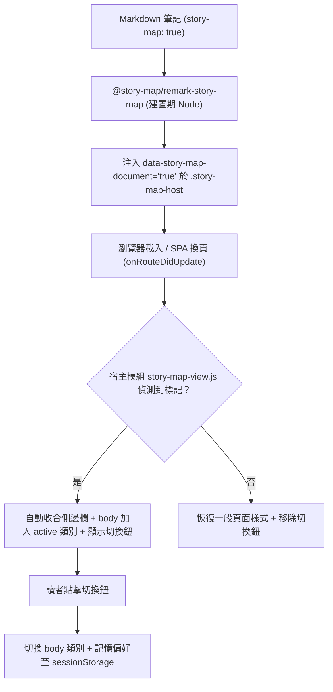

# Docusaurus 全螢幕地圖整合與切換設定

在 Obsidian 中，當你開啟帶有 `story-map: true` 的檔案時，外掛會以獨立的工作區分頁呈現全尺寸互動地圖，並能隨時透過「Open as Markdown」切換回原始筆記。

當我們要將相同的 Vault 內容透過 Docusaurus 發佈為靜態網站時，也能實現完全相同的體驗：**文件開啟時自動進入全螢幕沉浸式地圖、自動收合側邊欄，並提供一個常駐的浮動切換鈕，讓讀者能在「地圖故事檢視」與「Markdown 原始筆記」之間無縫切換**。

這篇文章將完整說明這套全螢幕架構的設計原理與具體配置方式。

## 核心設計理念：為什麼全螢幕屬於 Host-Owned？

在 `@story-map/remark-story-map` 套件的設計中，**並沒有提供類似 `fullPage: true` 的通用套件選項**。這是刻意維持的架構邊界（Architecture Boundary）：

| 全螢幕視圖所需的能力 | 為什麼必須由站台宿主端（Host）實作？ |
| --- | --- |
| 隱藏頁面既有元素（`.theme-doc-toc-desktop`、`.pagination-nav`、`.theme-doc-breadcrumbs`、頁尾等） | 這些 class 屬於 Docusaurus 主題的內部結構，在不同版本間可能變動，通用套件不應耦合特定主題 DOM。 |
| 控制文件側邊欄收合（`collapseSidebarButton`、`docSidebarContainerHidden`） | 側邊欄屬於 Docusaurus 的文件版面功能，並非 StoryMap 渲染器自身的概念。 |
| CSS 版面變數（`--ifm-navbar-height`、`--doc-sidebar-hidden-width`） | 屬於 Infima 設計系統專用變數，通用套件不應硬編碼特定 CSS 變數名稱。 |
| SPA 生命週期監聽與檢視偏好記憶（`onRouteDidUpdate` + `sessionStorage`） | 屬於站台端的路由導覽行為與個別網站的 UX 偏好。 |

通用套件 `@story-map/remark-story-map` 的職責非常單純：在建置期解析語法並輸出帶有中繼資料的 `.story-map-host` 容器；而「如何呈現為全螢幕」以及「如何與站台主題互動」，則完全由站台層（Host）的客戶端模組與 CSS 掌控。

## 運作機制與建置標記

全螢幕整合的運作流程如下：



1. **建置期標記**：當 Markdown frontmatter 含有 `story-map: true` 時，`@story-map/remark-story-map` 會自動在輸出的 `.story-map-host` 根元素蓋上 `data-story-map-document="true"` 屬性。
2. **瀏覽器端同步**：站台客戶端模組（`story-map-view.js`）在頁面渲染時檢查此屬性。若存在，預設啟動全螢幕模式：
   - 在 `body` 加上 `story-map-view-active` class。
   - 自動點擊 Docusaurus 的收合按鈕摺疊側邊欄。
   - 插入一個懸浮切換按鈕（`.story-map-toggle`）。
3. **偏好記憶**：讀者點擊按鈕切換回 Markdown 檢視時，模組會將該路徑的選擇記錄在瀏覽器的 `sessionStorage` 中，重新整理或回上一頁時保留讀者的閱讀偏好。
4. **SPA 換頁還原**：使用者跳轉到一般文件時，模組自動還原側邊欄並移除切換按鈕，絕不干擾非故事地圖的正常文章。

## 完整接線設定步驟

以下為將全螢幕功能引入 Docusaurus 網站的完整設定流程：

### 步驟一：安裝依賴

在 Docusaurus 網站專案目錄中安裝套件：

```bash
pnpm add @story-map/remark-story-map react@^19 react-dom@^19
```

> [!IMPORTANT]
> `@story-map/react-story-map` 宣告 Peer Dependencies 為 React 19。若你的 Docusaurus 站台仍處於舊版 React，請先確認版本相容性。

### 步驟二：配置 docusaurus.config.ts

在 `docusaurus.config.ts` 中註冊 Remark 插件，並串接站台現有的筆記路由解析器：

```typescript
import remarkStoryMap from '@story-map/remark-story-map';
import { createContentLinkIndex } from './scripts/content-links.js';

// 使用站台既有的 content-links 索引，直接取得公開路由
const contentLinkIndex = createContentLinkIndex({
  root: process.cwd(),
  docsConfig: [/* 既有 docs 設定 */],
  blogConfig: [/* 既有 blog 設定 */],
});

const storyMapOptions = {
  vaultRoot: process.cwd(),
  assetBase: '/vault-assets',
  resolveNoteHref: (vaultRelativePath: string) => {
    const matches = contentLinkIndex.resolve(vaultRelativePath);
    return matches.length === 1 ? matches[0].route : undefined;
  },
};

export default {
  // ... 其他設定
  presets: [
    [
      'classic',
      {
        docs: {
          remarkPlugins: [[remarkStoryMap, storyMapOptions]],
        },
      },
    ],
  ],
  plugins: [
    './plugins/story-map-client', // 步驟三建立的客戶端外掛
  ],
};
```

`resolveNoteHref` 回呼函式讓 `noteDisplay: link` 能直接連往 Docusaurus 發佈後的正式頁面路由，不需要在 StoryMap 套件內重複實作 slug 推導邏輯。

### 步驟三：建立客戶端外掛

建立目錄 `plugins/story-map-client/`，新增 `index.js`：

```javascript
// plugins/story-map-client/index.js
module.exports = function storyMapClientPlugin() {
  return {
    name: 'story-map-client',
    getClientModules() {
      return [
        require.resolve('@story-map/remark-story-map/client'),
        require.resolve('./story-map-view.js'),
      ];
    },
  };
};
```

這裡註冊了兩個模組：
1. 套件自帶的 `@story-map/remark-story-map/client`：負責在瀏覽器端初始化 Leaflet 並掛載 React 渲染器。
2. 站台專屬的 `story-map-view.js`：負責全螢幕視圖切換與 DOM 控制。

### 步驟四：實作 story-map-view.js

在 `plugins/story-map-client/` 目錄下新增 `story-map-view.js`：

```javascript
// plugins/story-map-client/story-map-view.js
const STORAGE_KEY = 'story-map-view-preference';
const ACTIVE_CLASS = 'story-map-view-active';
const TOGGLE_CLASS = 'story-map-toggle';
const DOC_HOST_SELECTOR = '.story-map-host[data-story-map-document="true"]';
const SIDEBAR_HIDDEN_SELECTOR = '[class*="docSidebarContainerHidden"]';
const COLLAPSE_BUTTON_SELECTOR = 'button[class*="collapseSidebarButton"]';
const EXPAND_BUTTON_SELECTOR = 'button[class*="expandButton"]';

// 繁體中文本地化標籤
const LABEL_MAP = '地圖故事檢視';
const LABEL_MARKDOWN = 'Markdown 原始筆記';

let toggleButton = null;
let viewActive = false;
let collapsedByUs = false;

function readPreferences() {
  try {
    return JSON.parse(window.sessionStorage.getItem(STORAGE_KEY) || '{}');
  } catch {
    return {};
  }
}

function isMarkdownPreferred(path) {
  return readPreferences()[path] === 'markdown';
}

function writePreference(path, view) {
  try {
    const preferences = readPreferences();
    preferences[path] = view;
    window.sessionStorage.setItem(STORAGE_KEY, JSON.stringify(preferences));
  } catch {
    // sessionStorage 不可用時靜默略過
  }
}

function isSidebarHidden() {
  return Boolean(document.querySelector(SIDEBAR_HIDDEN_SELECTOR));
}

function collapseSidebar(attempt = 0) {
  if (isSidebarHidden()) {
    collapsedByUs = true;
    return;
  }
  const button = document.querySelector(COLLAPSE_BUTTON_SELECTOR);
  if (button) {
    button.click();
    collapsedByUs = true;
  }
  if (attempt < 5) {
    window.setTimeout(() => collapseSidebar(attempt + 1), 150);
  }
}

function expandSidebar(attempt = 0) {
  if (!isSidebarHidden()) {
    collapsedByUs = false;
    return;
  }
  const button = document.querySelector(EXPAND_BUTTON_SELECTOR);
  if (button) button.click();
  if (attempt < 5) {
    window.setTimeout(() => expandSidebar(attempt + 1), 150);
  }
}

function ensureToggle() {
  if (toggleButton && toggleButton.isConnected) return toggleButton;
  toggleButton = document.querySelector(`.${TOGGLE_CLASS}`);
  if (toggleButton) return toggleButton;

  toggleButton = document.createElement('button');
  toggleButton.type = 'button';
  toggleButton.className = TOGGLE_CLASS;
  toggleButton.addEventListener('click', () => {
    applyView(!document.body.classList.contains(ACTIVE_CLASS), true);
  });
  document.body.appendChild(toggleButton);
  return toggleButton;
}

function updateToggle(active) {
  const button = ensureToggle();
  button.textContent = active ? LABEL_MARKDOWN : LABEL_MAP;
  button.setAttribute('aria-pressed', String(active));
}

function applyView(active, persist) {
  if (active === viewActive) {
    updateToggle(active);
    return;
  }
  viewActive = active;
  document.body.classList.toggle(ACTIVE_CLASS, active);
  updateToggle(active);

  if (active) {
    collapseSidebar();
  } else if (collapsedByUs) {
    expandSidebar();
  }

  if (persist) {
    writePreference(window.location.pathname, active ? 'storymap' : 'markdown');
  }
}

function sync() {
  if (typeof document === 'undefined' || !document.body) return;
  const hosts = document.querySelectorAll(DOC_HOST_SELECTOR);
  if (hosts.length === 0) {
    if (viewActive) applyView(false, false);
    if (toggleButton && toggleButton.isConnected) toggleButton.remove();
    toggleButton = null;
    return;
  }
  ensureToggle();
  applyView(!isMarkdownPreferred(window.location.pathname), false);
}

// 註冊 Docusaurus 客戶端路由生命週期鉤子
export function onRouteDidUpdate() {
  sync();
}

if (typeof document !== 'undefined') {
  if (document.readyState === 'loading') {
    document.addEventListener('DOMContentLoaded', () => sync(), { once: true });
  } else {
    sync();
  }
}
```

### 步驟五：新增全螢幕 CSS 樣式

建立 `src/css/story-map-full-page.css`，並在 `docusaurus.config.ts` 的 `customCss` 中引入：

```css
/* src/css/story-map-full-page.css */

/* 右上角切換按鈕樣式 */
.story-map-toggle {
  position: fixed;
  top: calc(var(--ifm-navbar-height, 3.75rem) + 12px);
  right: 16px;
  z-index: 300;
  display: inline-flex;
  align-items: center;
  padding: 7px 14px;
  border: 1px solid var(--ifm-color-emphasis-300);
  border-radius: 999px;
  background: var(--ifm-background-surface-color);
  color: var(--ifm-font-color-base);
  font-size: 0.85rem;
  font-weight: 600;
  cursor: pointer;
  box-shadow: 0 4px 14px rgba(0, 0, 0, 0.2);
  transition: all 0.2s ease;
}

.story-map-toggle:hover {
  border-color: var(--ifm-color-primary);
  color: var(--ifm-color-primary);
}

/* 全螢幕模式：鎖定頁面捲動 */
body.story-map-view-active {
  overflow: hidden;
}

/* 隱藏文件頁面的其他干擾元素（TOC、導航、頁尾、一般 Markdown） */
body.story-map-view-active .theme-doc-toc-desktop,
body.story-map-view-active .theme-doc-toc-mobile,
body.story-map-view-active .theme-doc-breadcrumbs,
body.story-map-view-active .theme-doc-footer,
body.story-map-view-active .pagination-nav,
body.story-map-view-active [class*="backToTopButton"],
body.story-map-view-active .theme-doc-markdown > :not(.story-map-host) {
  display: none !important;
}

/* 保留側邊欄層級，使收合/展開按鈕依然可點選 */
body.story-map-view-active .theme-doc-sidebar-container {
  position: relative;
  z-index: 100;
}

/* 將地圖主機固定至全視窗（扣除頂部 Navbar） */
body.story-map-view-active .story-map-host[data-story-map-document="true"] {
  position: fixed;
  top: var(--ifm-navbar-height, 3.75rem);
  right: 0;
  bottom: 0;
  left: 0;
  z-index: 50;
  width: auto;
  height: auto;
  margin: 0;
}

body.story-map-view-active .story-map-host[data-story-map-document="true"] .story-map {
  height: 100% !important;
  min-height: 0 !important;
  border: 0 !important;
  border-radius: 0 !important;
}

/* 在寬螢幕下，地圖左側避開側邊欄摺疊後的細軌道（確保側邊欄展開按鈕不被遮擋） */
@media (min-width: 997px) {
  body.story-map-view-active .story-map-host[data-story-map-document="true"] {
    left: var(--doc-sidebar-hidden-width, 30px);
  }
}
```

## 注意事項與維護建議

1. **版本相容性**：上述 CSS 選取器（如 `.theme-doc-toc-desktop`、`.theme-doc-sidebar-container` 等）直接針對 Docusaurus Classic 主題的 DOM 結構。當未來升級 Docusaurus 大版本時，建議確認這些類別名稱是否維持不變。
2. **頂部導覽列（Navbar）**：此方案刻意保留了 Docusaurus 的頂部導航列，讓讀者依然可以使用全站搜尋或切換頁面。若你的設計追求極致無框的純地圖體驗，只需在 CSS 中針對 `body.story-map-view-active .navbar` 加上 `display: none !important;` 並將地圖 `top` 調整為 `0` 即可。

## 延伸閱讀

- [[01 Geo Story Map 專案介紹]]
- [[02 Geo Story Map 安裝與故事筆記語法]]
- [[03 Geo Story Map 地圖主題與卡片閱讀版型]]
- [[04 Geo Story Map 本機 AI 坐標查找設定]]
- [專案架構與全螢幕設計規格文件（docusaurus-full-page.md）](https://github.com/kywk/story-map/blob/main/docs/docusaurus-full-page.md)
