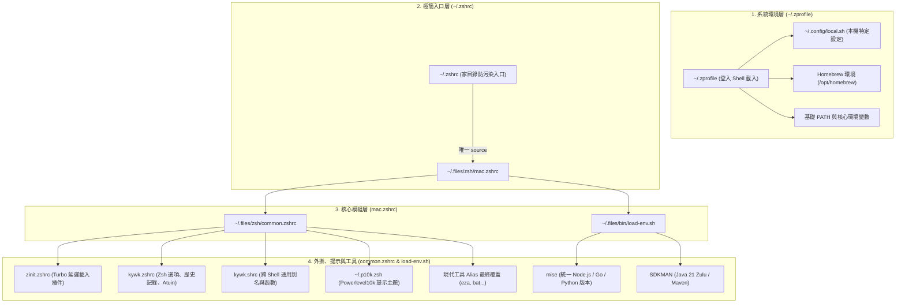

# Awesome CLI Resources

現代命令列開發體驗的基石在於**高效清晰的配置架構**與**現代化 CLI 工具鏈**。本文上半部剖析個人的 `.zshrc` 分層配置架構與設計原則，下半部彙整各類常用現代命令列工具清單與簡介。

---

## 🐚 個人 .zshrc 配置架構

個人 Shell 環境採用基於 [[Dotfiles Management]] 的**模組化分層架構**，徹底擺脫傳統單一巨型 `.zshrc` 難以維護、開機慢、容易被第三方工具破壞的缺點。



### 核心設計理念

1. **防污染隔離（Anti-Pollution）**：
   家目錄的 `~/.zshrc` 與 `~/.zprofile` 僅保留極簡導引。各類第三方 CLI 安裝器（如 Kiro CLI、Antigravity、套件安裝程式）隨意追加的設定均隔離在家目錄，不會污染或破壞受版控的 `~/.files` 專案。
2. **Zinit Turbo 延遲載入**：
   透過 [[Zinit]] 的 `wait lucid` 機制，核心提示符（Powerlevel10k）與補全（fzf-tab、autosuggestions）即開即用，而耗時的語法高亮與重型外掛在背景載入，Shell 啟動時間穩定壓制在 **~300ms** 內。
3. **條件式工具替換（Graceful Degradation）**：
   所有現代工具別名（例如以 `eza` 替換 `ls`、以 `bat` 替換 `cat`）皆先以 `(( $+commands[tool] ))` 或 `command -v` 檢查可用性；未安裝時自動降級為系統原生指令，不留殘留報錯。
4. **統一 Runtime 載入器**：
   由 `bin/load-env.sh` 集中負責 [[mise]]、SDKMAN、direnv 的激活，進入專案目錄自動切換語言版本，杜絕過往各自注入 shell 的混亂現象。

詳細配置細節請參閱 [[Zsh config]] 與 [[Dotfiles Management]]。

---

## 🛠️ 現代 CLI 工具列表與簡介

以下工具均已納入 dotfiles 配置體系，涵蓋日常開發各核心場景：

### 1. 系統監控與檔案檢視

| 工具 | 取代對象 | 常用別名 / 指令 | 簡要說明 |
|---|---|---|---|
| **btop** | `top` / `htop` | `top` | 現代化 TUI 系統監控，美觀直觀地顯示 CPU、記憶體、硬碟、網路與進程。 |
| **eza** | `ls` / `tree` | `ls`, `ll`, `tree` | 取代 `ls`，支援語法彩色高亮、檔案類型圖示、Git 狀態標記與目錄樹狀檢視。 |
| **bat** | `cat` / `less` | `cat`, `less` | 取代 `cat`，內建語法高亮、行號顯示、Git 修改標示與自動分頁功能。 |
| **ripgrep** (`rg`) | `grep` | `rg` | Rust 編寫的極速全文搜尋工具，自動尊重 `.gitignore` 且速度大幅超越 grep。 |
| **fd** | `find` | `fd` | 取代 `find`，語法直觀友善，色彩豐富，預設排除隱藏檔與 `.git`。 |
| **dust** | `du` | `du` | 取代 `du`，以視覺化長條圖直觀呈現資料夾空間佔用比例。 |
| **duf** | `df` | `df` | 取代 `df`，輸出整潔的彩色表格呈現各磁碟分區容量與掛載點。 |
| **procs** | `ps` | `ps` | 取代 `ps`，以彩色表格與樹狀結構顯示進程詳細資源佔用。 |

### 2. 互動式搜尋與終端檔案管理

| 工具 | 深入筆記 | 說明 |
|---|---|---|
| **fzf** | [[fzf]] | 命令列通用模糊搜尋器，深度整合 Shell 命令歷史、檔案瀏覽與 Git 補全。 |
| **Atuin** | [[atuin]] | 現代化 Shell 歷史記錄管理器，提供 SQLite 本地快取、全文模糊搜尋（綁定 `Ctrl-R`）與多機加密同步。 |
| **television** | [[television]] | 以 Rust 開發的現代通用模糊搜尋 TUI，內建檔案、環境變數等多樣資料來源。 |
| **Yazi** | [[yazi]] | 基於 Rust 與 Tokio 的極速非同步終端檔案管理器，內建圖片預覽與非同步任務機制；配置退出時自動 `cd` 至所在目錄（別名 `y`）。 |

### 3. 智慧導航與環境變數

| 工具 | 深入筆記 | 說明 |
|---|---|---|
| **zoxide** | [[zoxide]] | 取代 `cd` 的智慧目錄跳轉工具，依據目錄訪問頻率與權重進行智慧匹配（指令：`z`）。 |
| **direnv** | [[direnv]] | 進入專案目錄時自動載入或卸載環境變數；可結合 gitconfig 實現多專案帳號自動切換（見 [[direnv gitconfig]]）。 |

### 4. Git 與版本控制增強

| 工具 | 深入筆記 | 說明 |
|---|---|---|
| **lazygit** | [[lazygit]] | 功能完整的 Git TUI 終端客戶端，日常 Git 操作的主力介面（別名：`lg`）。 |
| **gitui** | — | Rust 編寫的極速 Git TUI，在百萬行級超大型 Repository 中表現極佳。 |
| **git-delta** | [[Git Delta]] | Git Diff 語法高亮分頁器，支援雙欄（side-by-side）顯示與行內字元變更對比。 |
| **forgit** | — | 基於 fzf 的互動式 Git 輔助工具（`ga`, `glo`, `gd` 互動體驗）。 |

### 5. 統一版本與套件管理

| 工具 | 深入筆記 | 說明 |
|---|---|---|
| **mise** | [[mise]] | 統一開發環境 Runtime 管理器，一套工具接管 Node.js、Go、Python，徹底取代 Volta/NVM/pyenv。 |
| **uv** | [[uv]] | Rust 編寫的極速 Python 套件與環境管理器，秒級解析依賴並取代 pip/poetry/pipenv。 |
| **Homebrew Bundle** | [[Homebrew Bundle]] | 透過 `Brewfile` 宣告管理 macOS 終端工具與 GUI 應用程式，實現一鍵環境同步。 |

### 6. 終端多工與效能測試

| 工具 | 深入筆記 | 說明 |
|---|---|---|
| **Zellij** | [[zellij]] | 現代化終端多工器（tmux 新生代替代），具備直觀的操作提示、浮動視窗與 WebAssembly 外掛系統。 |
| **oha** | [[oha]] | 現代 HTTP 負載壓測工具，在終端即時顯示請求延遲分佈長條圖與統計數據。 |
| **hyperfine** | — | 命令列基準測試工具，具備統計分析與暖身測試功能（別名：`bench`）。 |
| **watchexec** | — | 監控檔案變動並自動執行指定指令，開發自動化必備（別名：`watch`）。 |

### 7. 資料處理、網路與外掛管理

| 工具 | 深入筆記 | 說明 |
|---|---|---|
| **jq** | [[jq]] | 命令列 JSON 處理神器，提供強大的過濾、轉換與提取能力。 |
| **fx** | — | 互動式 JSON 檢視器與終端導航工具（別名：`jv`）。 |
| **xh** | — | 取代 curl 與 httpie 的現代 HTTP 客戶端，自帶高亮與直觀語法（別名：`http`, `https`）。 |
| **Zinit** | [[Zinit]] | 具備 Turbo 延遲載入機制的極速 Zsh 插件管理器（另見 [[Zinit vs Oh My Zsh]] 心得）。 |

---

## 📦 安裝方式

### 使用 dotfiles 一鍵安裝

```bash
# 自動安裝並配置所有現代 CLI 工具與開發環境
cd ~/.files && ./bin/setup-devenv.sh
```

### 使用 Homebrew 批次安裝

```bash
# 僅安裝常用 CLI 工具
brew bundle --file=~/.files/mac/Brewfile-CLI

# 或依類別手動安裝
brew install btop eza bat ripgrep fd zoxide
brew install fzf atuin television yazi direnv jq xh
brew install lazygit gitui git-delta
brew install mise uv zellij oha hyperfine watchexec
```

---

## 🔗 相關資源

- [[Dotfiles Management]] - 跨平台 dotfiles 配置管理系統
- [[Zsh config]] - 模組化 Shell 配置詳解與載入架構
- [[Utilities 2026]] - 2026 年度工具軟體現代化升級記錄
- [[Zinit]] - 高效能 Zsh 插件管理器
- [[Mac DevEnv Setup]] - macOS 開發環境建構
