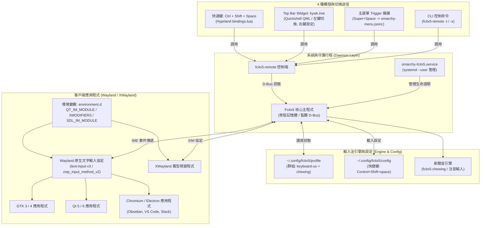
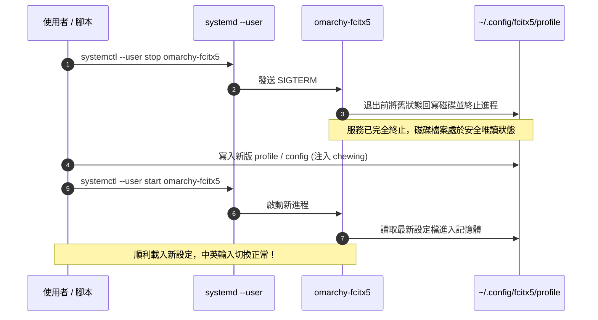

# Omarchy Linux 中文環境與輸入法配置指南

本指南詳細記錄在 **[Omarchy Linux](https://omarchy.org/)**（基於 Arch Linux + Hyprland + Wayland 的現代滾動桌面發行版）環境下，建立完整中文顯示與輸入支援的端到端配置方案。涵蓋系統 CJK 字型安裝、fcitx5 核心架構與 Wayland 環境變數配置、新酷音（Chewing）注音輸入法引擎導入、**修改設定檔時的關鍵防覆寫機制**、4 種高效中英切換途徑（快速鍵、Quickshell Top Bar 外掛、主選單備援、CLI 命令），以及 `kywk.ime` 狀態列插件之結構設計與禁止 Symlink 規範。

> 💡 **系列導讀**：
> - 新機安裝與總覽流程：請參閱 **[[Omarchy Linux Setup Guide|Omarchy Linux 新機建置與快速上手指南]]**
> - 桌面架構與進階客製：請參閱 **[[Omarchy Desktop and System Customization|Omarchy 桌面客製化與設定管理指南]]**
> - macOS 虛擬機部署：請參閱 **[[Mac Install Omarchy VM with UTM|透過 UTM 在 Apple Silicon Mac 安裝 Omarchy]]**

---

## 架構總覽與運作原理

Omarchy 桌面環境預設即整合了現代化的 Wayland Compositor（Hyprland）與 Quickshell 狀態列。在中文輸入方面，Omarchy 採用 **Fcitx5** 作為核心框架：



### 系統分工與核心特點

1. **底層預先就緒**：Omarchy 官方套件已預載 `fcitx5` 核心架構、GTK/Qt 前端支援模組、環境變數定義檔（`environment.d`）以及 systemd 使用者服務單元（`omarchy-fcitx5.service`）。
2. **免自行撰寫 systemd 單元**：系統開機或登入時會自動啟動 `omarchy-fcitx5.service`，使用者無需在 Hyprland `exec-once` 中手動調用 `fcitx5 -d`。
3. **缺漏需補齊之處**：Omarchy 原生**未預載中文字型**與**中文輸入引擎**（如注音 `fcitx5-chewing` 或拼音 `fcitx5-pinyin`），且預設狀態列（Quickshell）缺乏獨立的輸入法切換指示器。

---

## 步驟 1：中文字型整備 (Noto CJK Fonts)

在未安裝中文字型的新系統中，瀏覽中文網頁或開啟中文化軟體時會出現豆腐塊（Tofu Blocks `□`）或缺字破音現象。必須優先安裝 Google Noto CJK 字型與 Emoji 支援。

### 1. 安裝字型套件

使用 `omarchy pkg add` 或以 `pacman` 安裝 Google Noto 繁簡中文及 Emoji 字型：

```bash
# 透過 Omarchy 套件管理器安裝
omarchy pkg add noto-fonts-cjk noto-fonts-emoji noto-fonts

# 或在無互動環境中透過 pacman 安裝
pkexec pacman -S --needed noto-fonts-cjk noto-fonts-emoji noto-fonts
```

- **`noto-fonts-cjk`**：涵蓋繁體中文（TC, Traditional Chinese）、簡體中文（SC）、日文（JP）與韓文（KR）之完整無襯線（Sans）與明體（Serif）字型。
- **`noto-fonts-emoji`**：彩色繪文字支援，保障終端機與桌面 UI 圖示正常渲染。
- **`noto-fonts`**：標準西文字型，確保字重與襯線比例協調。

### 2. 更新系統字型快取

安裝完成後，刷新 Fontconfig 字型索引快取：

```bash
fc-cache -fv
```

### 3. 驗證中文字型安裝狀態

透過 `fc-list` 查詢系統是否已正確辨識繁體中文支援：

```bash
# 查詢繁體中文可用字型
fc-list :lang=zh-tw family | sort -u | head -n 10
```

預期應可見到 `Noto Sans CJK TC` 與 `Noto Serif CJK TC` 等字型家族：

```
Noto Sans CJK TC
Noto Sans Mono CJK TC
Noto Serif CJK TC
```

若需確認系統預設 Sans-serif 字型之匹配：

```bash
fc-match sans-serif
# 輸出範例：NotoSans-Regular.ttf 或 NotoSansCJK-Regular.ttc
```

---

## 步驟 2：Fcitx5 核心架構與 Wayland 環境變數

現代 Linux 桌面同時存在 Wayland 原生客戶端（Qt 5/6、GTK 3/4）、Chromium/Electron 應用程式，以及透過 XWayland 運行的傳統 X11 程式。確保中文能夠正確鍵入並顯示候選字框，關鍵在於全域環境變數的設置。

### 核心環境變數配置對照

Omarchy 在系統層（或使用者層的 `~/.config/environment.d/`）預先配置了針對 Fcitx5 的全域整合變數：

| 環境變數 | 設定值 | 作用範圍與說明 |
|---|---|---|
| `QT_IM_MODULE` | `fcitx` | 支援所有基於 Qt 5 / Qt 6 開發之圖形應用程式（包含 Quickshell、KDE 工具等）。 |
| `XMODIFIERS` | `@im=fcitx` | 支援所有走 X11 / XWayland 協定之傳統客戶端（XIM 機制）。 |
| `SDL_IM_MODULE` | `fcitx` | 支援基於 Simple DirectMedia Layer (SDL2/SDL3) 之遊戲與多媒體框架。 |
| `INPUT_METHOD` | `fcitx` | 提供傳統桌面環境腳本辨識目前主用輸入法框架。 |
| `GLFW_IM_MODULE` | `ibus` / `fcitx` | 部分基於 GLFW 開發之現代終端機或視窗工具支援（如 Kitty / Alacritty / Ghostty 等）。 |

> [!NOTE]
> **關於 `GTK_IM_MODULE` 的現代規範**：  
> 在傳統 X11 環境下常習慣設置 `GTK_IM_MODULE=fcitx`，但在現代 **Wayland + GTK 4** 環境下，GNOME 與 GTK 官方強烈建議**不設定** `GTK_IM_MODULE`（或將其保留為空值），讓 GTK 應用程式原生走 Wayland 的 `text-input-v3` / `zwp_input_method_v2` 協定與 Fcitx5 通訊。強制指定 `GTK_IM_MODULE=fcitx` 反而容易在 Wayland 原生模式下導致游標跟隨失常、視窗崩潰或輸入框無法呼叫的問題。

### 驗證當前 Session 環境變數

可透過以下命令檢查目前桌面 Session 是否已繼承正確的 IME 變數：

```bash
env | grep -E 'IM_MODULE|XMODIFIERS'
```

預期輸出：
```
QT_IM_MODULE=fcitx
XMODIFIERS=@im=fcitx
SDL_IM_MODULE=fcitx
```

### systemd 使用者服務 (`omarchy-fcitx5.service`)

Omarchy 透過 systemd user 實例維護 fcitx5 常駐進程。其服務定義與生命週期受系統統一控管：

```bash
# 檢查服務執行狀態
systemctl --user status omarchy-fcitx5

# 重啟輸入法服務
systemctl --user restart omarchy-fcitx5

# 檢視輸入法日誌輸出
journalctl --user -u omarchy-fcitx5 -b --no-pager | tail -n 20
```

---

## 步驟 3：新酷音引擎安裝與核心設定

### 1. 安裝新酷音與圖形設定工具

安裝繁體中文最具代表性的智慧選字注音引擎 `fcitx5-chewing`，以及圖形化配置介面 `fcitx5-configtool`：

```bash
# 透過 Omarchy CLI
omarchy pkg add fcitx5-chewing fcitx5-configtool

# 或在自動化無交互終端機中使用 pacman
pkexec pacman -S --needed fcitx5-chewing fcitx5-configtool
```

### 2. ⚠️ 關鍵防覆寫機制（先停服務再改檔）

配置 Fcitx5 設定檔時，有一個**極度重要但常被忽略的防坑細節**：

> [!CAUTION]
> **核心運作陷阱：正在運行的 Fcitx5 記憶體寫回機制**  
> Fcitx5 常駐守護行程在啟動時會將 `~/.config/fcitx5/profile` 讀入記憶體快取。當 Fcitx5 正常關閉、重新啟動或系統登出時，行程會**強制將記憶體中的當前狀態刷寫回磁碟**！  
> 如果在服務運行的情況下直接使用編輯器修改 `profile`，當後續重啟服務或重開機時，磁碟上的內容會被記憶體中的舊資料直接覆蓋還原，導致設定看似「神秘失效」。

#### 安全修改的標準作業流程 (SOP)

修改設定前，必須遵守 **「先停止服務 ➔ 寫入檔案 ➔ 再啟動服務」** 的嚴格順序：



### 3. 設定檔詳細內容

#### 檔案 A：`~/.config/fcitx5/profile` (輸入法群組與引擎設定)

此檔案定義目前輸入法清單與啟用順序。我們配置一個名為 `Default` 的群組，第一順位為英數輸入（`keyboard-us`），第二順位為新酷音注音（`chewing`）：

```ini
[Groups/0]
Name=Default
Default Layout=us
DefaultIM=keyboard-us

[Groups/0/Items/0]
Name=keyboard-us
Layout=

[Groups/0/Items/1]
Name=chewing
Layout=

[GroupOrder]
0=Default
```

#### 檔案 B：`~/.config/fcitx5/config` (全域觸發快捷鍵)

此檔案定義中英文切換的觸發快捷鍵。我們配置 `Control+Shift+space` 作為觸發鍵：

```ini
[Hotkey]
EnumerateWithTriggerKeys=True
SkipFirstProviderWhenEnumerating=True

[Hotkey/TriggerKeys]
0=Control+Shift+space
```

### 4. 執行一鍵安全配置腳本

使用以下腳本安全覆寫並啟動輸入法：

```bash
# 1. 確保停止服務
systemctl --user stop omarchy-fcitx5

# 確保目錄存在
mkdir -p ~/.config/fcitx5

# 2. 寫入 profile
cat > ~/.config/fcitx5/profile << 'EOF'
[Groups/0]
Name=Default
Default Layout=us
DefaultIM=keyboard-us

[Groups/0/Items/0]
Name=keyboard-us
Layout=

[Groups/0/Items/1]
Name=chewing
Layout=

[GroupOrder]
0=Default
EOF

# 3. 寫入 config
cat > ~/.config/fcitx5/config << 'EOF'
[Hotkey]
EnumerateWithTriggerKeys=True
SkipFirstProviderWhenEnumerating=True

[Hotkey/TriggerKeys]
0=Control+Shift+space
EOF

# 4. 重新啟動服務
systemctl --user start omarchy-fcitx5
```

---

## 步驟 4：四種中英切換途徑與操作實務

為了在純 Linux 實體主機、macOS 虛擬機（UTM / Parallels / OrbStack）、終端機與圖形介面中皆能順暢操作，本方案建立了 **4 種互補且等效** 的中英切換途徑：

| 切換途徑 | 操作方式 | 底層機制 | 適用情境 | 優點與限制 |
|---|---|---|---|---|
| **1. 全域快捷鍵** | `Ctrl + Shift + Space` | Hyprland Lua `o.bind` 轉發 `fcitx5-remote -t` | 雙手不離鍵盤的高頻打字情境 | 速度最快；但在 Mac 虛擬機中若與 Host 快速鍵衝突會被截斷。 |
| **2. Top Bar Widget** | 滑鼠點擊狀態列 `EN` / `注` | Quickshell QML 外掛 `kywk.ime` | 滑鼠操作、視覺化確認目前輸入狀態 | 提供視覺化回饋（當前為英文或注音），滑鼠右鍵可直接開啟設定視窗。 |
| **3. 主選單備援** | `Super + Space` ➔ `Trigger` ➔ `Input method` | Omarchy 選單擴充 (`omarchy-menu.jsonc`) | 虛擬機快捷鍵被宿主機劫持時的強固備援 | 絕不失靈；選單項目會以 `✓` 即時標示當前是否處於中文模式。 |
| **4. CLI 控制端** | 終端機執行 `fcitx5-remote -t` | Fcitx5 IPC D-Bus 直接通信 | 腳本編程、自動化測試、終端快速修正 | 程式化存取首選；可查詢狀態代碼 (`0`/`1`/`2`)。 |

---

### 途徑 1：全域快捷鍵 (`Ctrl + Shift + Space`)

#### 避免衝突的選鍵哲學

在 Omarchy 環境中選擇 `Ctrl + Shift + Space` 是經過深思熟慮的設計：
- **避免與系統啟動器衝突**：Omarchy 預設將 `Super + Space` 綁定為系統全域啟動器（Application Launcher）。
- **避免與終端多工器衝突**：tmux 與 herdr 預設廣泛使用 `Ctrl + Space` 作為 Prefix Key。
- **避免單鍵 Shift 誤觸**：許多使用者在打程式碼或快速輸入英文時，容易誤觸單鍵 `Shift` 切換中英，導致鍵入混亂。因此採用三鍵組合 `Ctrl + Shift + Space` 最為穩健。

#### Hyprland Lua 配置 (`~/.config/hypr/bindings.lua`)

在 dotfiles 的 `omarchy/config/hypr/bindings.lua` 中定義：

```lua
-- 切換輸入法 (fcitx5): Ctrl+Shift+Space — 中文 <-> 英文
-- 不與 Omarchy (SUPER+SPACE) 及 tmux/herdr prefix (Ctrl+Space) 衝突。
-- 描述含 "Keybindings" 是刻意的: Omarchy 的 keybindings 選單以內建優先序表排序
-- (/usr/share/omarchy/bin/omarchy-menu-keybindings, 不可修改)、對描述做關鍵字比對,
-- "Keybindings" 為第 0 級 → 本項會排在選單最上面幾筆。
o.bind("CTRL + SHIFT + SPACE", "IME Keybindings (switch input method)", "fcitx5-remote -t")
```

> [!TIP]
> **為什麼描述字串刻意包含 `"Keybindings"`？**  
> Omarchy 內建的快捷鍵查詢選單（按下 `Super + K` 觸發）由系統腳本 `/usr/share/omarchy/bin/omarchy-menu-keybindings` 解析。該腳本對所有快捷鍵的描述字串進行正則規則匹配與優先級權重分級。其中 **"Keybindings" 被列為 Level 0（最高權重）**。將描述命名為 `IME Keybindings (...)` 能確保這筆自訂切換規則永遠被置頂在選單的最頂端，方便快速檢索。

---

### 途徑 2：Quickshell Top Bar 外掛 (`kywk.ime`)

Omarchy 原生狀態列僅內建鍵盤實體佈局顯示元件（`omarchy.keyboard-layout`，通常僅顯示 `us`），無法呈現當前到底是處於「英文輸入」還是「新酷音中文輸入」狀態。為此我們自主開發了 `kywk.ime` 狀態列插件。

```
[ Top Bar 右側顯示示意 ]
┌────────────────────────────────────────────────────────┐
│  ...   [  注  ]   [ 󰃮 托盤 ]   [ 󰚩 Agent ]   [ 󰂯 ]  │
│           └─ 左鍵: 切換中/英 (fcitx5-remote -t)         │
│              右鍵: 開啟 fcitx5-configtool 設定視窗      │
└────────────────────────────────────────────────────────┘
```

- **視覺回饋**：
  - 當處於英文模式：顯示 `EN`。
  - 當處於中文注音模式：即時轉換為高對比標籤 `注`。
  - （若切換為其他引擎，支援動態字典映射：拼音 `拼`、雙拼 `双`、倉頡 `倉`、速成 `速`、行列 `行`，未知名稱顯示 `中`）。
- **滑鼠點擊互動**：
  - **滑鼠左鍵**：直接執行 `fcitx5-remote -t` 切換狀態。
  - **滑鼠右鍵**：調用系統指令彈出懸浮視窗執行 `fcitx5-configtool`，直接進行詞庫管理、選字鍵設定與外觀微調。

---

### 途徑 3：Omarchy 主選單 Trigger 備援

#### 解決 macOS 虛擬機快捷鍵搶佔痛點

當透過 macOS 運行 UTM / Parallels 虛擬機時，macOS 宿主機的 Spotlight（`Cmd + Space` / `Ctrl + Space`）或輸入法切換鍵常會優先截獲鍵盤訊號，導致虛擬機內部完全收不到 `Ctrl + Shift + Space` 事件。

此時即可透過 Omarchy 主選單作為 100% 可靠的 GUI 備援入口：
1. 按下 `Super + Space`（在 Mac 上為 `Command + Space` 或 `Option + Space`，視鍵位映射而定）呼叫主選單。
2. 進入 `Trigger` 子選單。
3. 點選 **`Input method (切換中/英)`** 即可立即完成中英切換。

#### 選單擴充設定 (`~/.config/omarchy/extensions/omarchy-menu.jsonc`)

在 dotfiles 的 `omarchy/config/omarchy/extensions/omarchy-menu.jsonc` 中配置：

```jsonc
{
  // kywk 使用者擴充 — dotted id 會併入 Omarchy 預設樹
  // 本機是 Mac host 上的 VM, 部分快捷鍵會被 macOS 系統占用而收不到,
  // 因此輸入法切換也在選單提供可靠入口 (Super+Space → Trigger)。

  // 切換中/英; ✓ 代表目前為中文輸入 (fcitx5 active)
  "trigger.ime": {
    "icon": "󰌌",
    "label": "Input method (切換中/英)",
    "action": "fcitx5-remote -t",
    "checked": "[ \"$(fcitx5-remote)\" = 2 ]"
  }
}
```

- **動態打勾邏輯 (`checked`)**：利用 Shell 條件判斷 `[ "$(fcitx5-remote)" = 2 ]`。當前狀態碼為 `2`（中文激活）時命令返回 `0`，選單文字尾端會自動渲染出打勾符號 `✓`，一目了然。

---

### 途徑 4：CLI 命令列控制 (`fcitx5-remote`)

對於終端工作者或自動化測試，`fcitx5-remote` 是底層最精確的命令列工具：

```bash
# 1. 查詢當前狀態碼 (輸出為純數字: 0 / 1 / 2)
fcitx5-remote
# 狀態代碼定義:
#   0 = 服務未啟動 (closed)
#   1 = 英文 / 未激活狀態 (inactive / direct input)
#   2 = 中文 / 激活狀態 (active / IME input)

# 2. 查詢當前輸入法引擎名稱
fcitx5-remote -n
# 輸出範例: keyboard-us 或 chewing

# 3. 觸發切換 (Toggle)
fcitx5-remote -t

# 4. 強制切換為特定狀態
fcitx5-remote -o   # 激活輸入法 (轉為中文 2)
fcitx5-remote -c   # 關閉輸入法 (轉為英文 1)
fcitx5-remote -s chewing      # 直接指定切換至新酷音
fcitx5-remote -s keyboard-us  # 直接指定切換至美式鍵盤
```

---

## 步驟 5：Quickshell Top Bar 外掛 (`kywk.ime`) 架構與安裝規範

### 外掛目錄結構

自訂 Quickshell 插件存放在 dotfiles 儲存庫的 `omarchy/config/omarchy/plugins/kywk.ime/`：

```
omarchy/config/omarchy/plugins/kywk.ime/
├── manifest.json   # 插件資訊宣告清單
└── Ime.qml         # QML 核心介面與狀態邏輯
```

#### 1. `manifest.json` (外掛元資料)

宣告外掛 ID、類型（`bar-widget`）、進入點與預設停靠區域：

```json
{
  "schemaVersion": 1,
  "id": "kywk.ime",
  "name": "Input method",
  "version": "1.0.0",
  "author": "kywk",
  "description": "fcitx5 current input method, click toggles Chinese/English",
  "kinds": ["bar-widget"],
  "entryPoints": {
    "barWidget": "Ime.qml"
  },
  "barWidget": {
    "displayName": "Input method",
    "description": "Current fcitx5 input method; click toggles Chinese/English, right-click opens fcitx5 settings",
    "category": "Input",
    "allowMultiple": false,
    "defaultSection": "right"
  }
}
```

#### 2. `Ime.qml` 核心技術亮點

`Ime.qml` 使用 QtQuick 與 Quickshell 框架撰寫，具備高度響應性與低耗能設計：

- **雙進程非同步輪詢**：透過 `Process` 與 `StdioCollector` 分別非同步執行 `fcitx5-remote` 與 `fcitx5-remote -n`，絕不阻塞 UI 繪製執行緒。
- **快慢雙層計時器**：
  - `refreshTimer` (250ms)：點擊切換後立即觸發一次快速輪詢，提供即時無延遲的視覺反饋。
  - 常駐輪詢計時器 (1500ms)：週期性同步外部狀態（例如透過快捷鍵或選單切換時，狀態列能於 1.5 秒內自動校正同步）。
- **右鍵啟動浮動視窗**：使用 Omarchy 專屬包裝指令 `omarchy-launch-floating-terminal-with-presentation fcitx5-configtool`，以優雅的浮動視窗載入圖形設定，不干擾既有平鋪工作區。

### ⚠️ 禁止 Symlink 規範與 Dotfiles 複製機制

在 Omarchy 的外掛架構中，有一項硬性安全規範：

> [!WARNING]
> **Omarchy 外掛驗證規則：外掛目錄內嚴禁 Symlink**  
> Omarchy 的插件安全審查工具 `omarchy plugin validate` 會對插件目錄進行嚴格結構檢查。若偵測到插件目錄本身或其子檔案為符號連結（Symlink），驗證器會拋出安全性違規錯誤，Shell 亦會直接拒絕載入該 Widget！

因此在 dotfiles 自動化流程中：

1. **安裝階段 (`init.sh`)**：  
   `init.sh` 絕不對 `~/.config/omarchy/plugins/kywk.ime` 建立軟連結，而是採用 **`cp -r` 實體複製方式** 將檔案部署至使用者目錄：
   ```bash
   # init.sh 內部處理邏輯
   mkdir -p ~/.config/omarchy/plugins/kywk.ime
   cp -f "$DOTFILES/omarchy/config/omarchy/plugins/kywk.ime/"* ~/.config/omarchy/plugins/kywk.ime/
   ```

2. **驗證階段**：  
   部署後必須通過驗證：
   ```bash
   omarchy plugin validate ~/.config/omarchy/plugins/kywk.ime
   ```

3. **反向回存維護 (`omarchy-sync.sh capture`)**：  
   若使用者在實體目錄 `~/.config/omarchy/plugins/` 現場調試並修改了 QML 程式碼，執行：
   ```bash
   bash ~/.files/bin/omarchy-sync.sh capture
   ```
   同步工具會自動將 live 目錄下的最新檔案內容拷貝回 Git 倉庫，以便進行版本控制與提交。

4. **狀態列啟用 (`~/.config/omarchy/shell.json`)**：  
   在 `shell.json` 的 `bar.layout.right` 第一項掛載 `kywk.ime`：
   ```json
   "right": [
     {
       "id": "kywk.ime"
     },
     {
       "id": "omarchy.tray"
     }
     ...
   ]
   ```
   修改完成後執行 `omarchy restart shell` 或 `omarchy-shell shell rescanPlugins` 即刻生效。

---

## 步驟 6：測試驗證清單

完成安裝與設定後，請依序執行以下 5 項驗證：

```bash
# 1. 檢查字型是否具備 CJK 繁體中文支援
fc-list :lang=zh-tw family | grep "Noto Sans CJK TC"

# 2. 檢查 Fcitx5 服務運行狀態
systemctl --user is-active omarchy-fcitx5   # 應輸出: active

# 3. 檢查目前輸入法引擎清單
fcitx5-remote -n   # 預設應輸出: keyboard-us

# 4. 驗證命令行切換
fcitx5-remote -t && fcitx5-remote -n   # 應輸出: chewing
fcitx5-remote -t && fcitx5-remote -n   # 應切回: keyboard-us

# 5. 驗證 Top Bar 外掛正確性與 Shell 狀態
omarchy plugin validate ~/.config/omarchy/plugins/kywk.ime
# 應輸出: Validating plugin at ... -> OK
```

---

## 常見疑難排解 (Troubleshooting)

### Q1: 為什麼修改 `~/.config/fcitx5/profile` 後重啟，設定又變回原本的樣子？
- **根本原因**：修改檔案時 `omarchy-fcitx5` 背景服務仍在執行中。Fcitx5 在結束進程時會將記憶體狀態強制回寫磁碟，覆蓋了手動編輯的內容。
- **解決方案**：修改前必須先執行 `systemctl --user stop omarchy-fcitx5`，編輯完畢儲存後，再執行 `systemctl --user start omarchy-fcitx5`。

---

### Q2: 在 macOS 虛擬機（UTM / Parallels）中按下 `Ctrl + Shift + Space` 無反應？
- **根本原因**：
  1. macOS 宿主機鍵盤設定中勾選了 `Spotlight 搜尋` 或 `選取上一個輸入來源`，佔用了全域鍵盤事件。
  2. 虛擬機軟體未將所有按鍵事件直通（Passthrough）至 Guest OS。
- **解決方案**：
  1. 進入 macOS `系統設定` ➔ `鍵盤` ➔ `鍵盤快速鍵` ➔ `輸入方式`，關閉與該組合鍵衝突的項目。
  2. 使用 100% 可靠的備援：按下 `Super + Space` 開啟主選單 ➔ 選擇 `Trigger` ➔ 點擊 `Input method (切換中/英)`。
  3. 直接以滑鼠左鍵點擊 Top Bar 右側的 `kywk.ime` 圖示。

---

### Q3: 某些應用程式（如 VS Code、Obsidian、Chrome）無法呼叫中文輸入或候選字框飄移？
- **根本原因**：基於 Chromium / Electron 的軟體在 Wayland 模式下有時會預設走 XWayland 或是舊版 text-input，導致 IME 模組溝通不良。
- **解決方案**：
  1. 確保環境變數 `QT_IM_MODULE=fcitx` 與 `XMODIFIERS=@im=fcitx` 已正確載入。
  2. 對於 Electron / Chromium 應用程式，可加入 Wayland 原生 IME 旗標啟動：
     ```bash
     --enable-features=UseOzonePlatform --ozone-platform=wayland --enable-wayland-ime
     ```
  3. 對於 Obsidian 或 VS Code，確認其 `flags.conf` 中啟用 Wayland 原生支援。

---

### Q4: 終端機或某些軟體出現中文字元間距不一、重疊或顯示為豆腐塊？
- **根本原因**：系統未安裝繁體中文字型，或 Fontconfig 的字型回退（Fallback）優先順序混亂。
- **解決方案**：
  1. 確保已安裝 `noto-fonts-cjk` 與 `noto-fonts-emoji`。
  2. 執行 `fc-cache -fv` 強制重建快取。
  3. 確認終端機（如 Ghostty / Alacritty / Kitty）字型設定具備 CJK Fallback 能力。

---

### Q5: Top Bar 沒有出現 `kywk.ime` 圖示，或執行時報錯？
- **根本原因**：
  1. `~/.config/omarchy/shell.json` 尚未加入 `kywk.ime` 到佈局中。
  2. 外掛目錄含有符號連結（違反安全規範）。
  3. Quickshell 尚未重載新外掛清單。
- **解決方案**：
  1. 執行 `omarchy plugin validate ~/.config/omarchy/plugins/kywk.ime` 檢查錯誤報告。
  2. 確認 `~/.config/omarchy/shell.json` 的 `bar.layout.right` 包含 `{"id": "kywk.ime"}`。
  3. 執行重啟命令：
     ```bash
     omarchy restart shell
     ```

---

## 相關文件與延伸閱讀

- [[Omarchy Linux Setup Guide|Omarchy Linux 新機建置與快速上手指南]] — 新機從零安裝、Retina 螢幕縮放、Dotfiles 導入與驗證全流程
- [[Omarchy Desktop and System Customization|Omarchy 桌面客製化與設定管理指南]] — 深入解析版控原則、Hyprland Lua 架構、Quickshell 插件開發與 Hook 政策
- [[Mac Install Omarchy VM with UTM|透過 UTM 在 Apple Silicon Mac 安裝 Omarchy]] — Apple Silicon Mac 上的 UTM 虛擬機最佳化配置與顯示適配
- [[Linux System Maintenance|Linux 系統維護最佳實踐]] — 系統更新、快取清理、日誌清理與系統維護規範
- [[Linux Commands Reference|Linux 基礎指令參考手冊]] — 常用 Linux 終端機指令與工具速查
- [[Manjaro Package Management|Manjaro 套件管理完整指南]] — Pacman、Pamac 與 AUR 套件庫使用詳解
