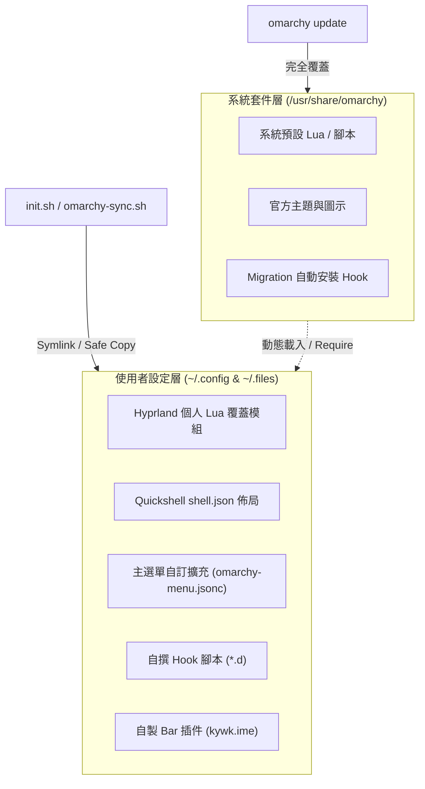
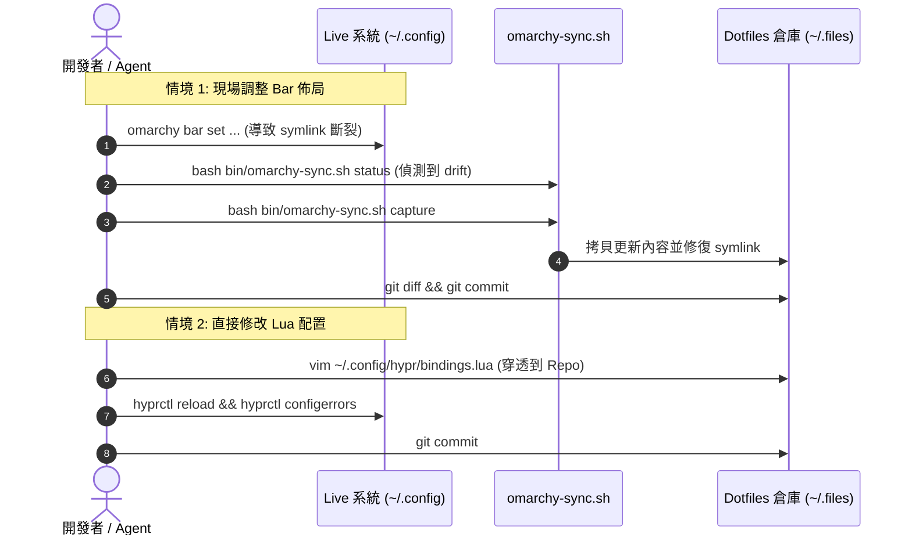

# Omarchy 桌面客製化與設定管理指南

本指南深入探討 **[Omarchy Linux](https://omarchy.org/)**（基於 Arch Linux + Hyprland Wayland 視窗管理員）的內部架構、版本控制設計哲學、動態 Lua 模組化設定、Quickshell 狀態列外掛開發、選單擴充、Hook 事件生命週期，以及如何利用 `omarchy-sync.sh` 解決檔案寫入漂移（Drift）問題。

> 💡 **系列導讀**：
> - 新機建置與快速上手：請參閱 **[[Omarchy Linux Setup Guide|Omarchy Linux 新機建置與快速上手指南]]**
> - 中文輸入法專門配置：請參閱 **[[Omarchy Chinese Input Setup|Omarchy Linux 中文環境與輸入法配置指南]]**

---

## 設定管理哲學與版控架構

在 Omarchy 系統中維護 dotfiles，關鍵在於理解系統套件層與使用者設定層的分界，避免個人設定與系統更新互相污染或覆蓋。

### 四大版控原則



1. **絕不修改 `/usr/share/omarchy/`**：
   此目錄為 pacman 套件管理器所擁有。當執行 `omarchy update` 時，該目錄的所有內容均會被全量更新覆蓋。任何客製化需求都應透過使用者目錄的設定檔或覆蓋機制達成。
2. **只納管使用者層設定 (`~/.config/`)**：
   所有個人化客製化皆放置於 `~/.config/` 或 dotfiles 倉庫內的 `omarchy/config/`，以符號連結（symlink）或安全複製的方式映射到運行環境。
3. **優先使用 Omarchy 原生擴充機制**：
   充分利用 Omarchy 提供的原生擴充點，例如 Hook 機制、選單延伸（menu extensions）、Quickshell 外掛插件以及 `omarchy` CLI，而非另行建立平行的視窗管理或狀態列體系。
4. **系統 Migration Hook 不入版控**：
   系統初次開機或版本升級時自動建立的 Hook（如 `setup-agent.hook`、`install-voxtype.hook`、`omarchy-aarch64-repository`）屬於系統維護範疇，不應收錄進個人 dotfiles 倉庫，否則會造成版本衝突或更新死鎖。

### 版控對照表 (Version Control Mapping Table)

`init.sh` 與 `omarchy-sync.sh` 納管的檔案映射規則如下：

| Dotfiles 倉庫路徑 (`omarchy/config/…`) | 即時環境路徑 (`~/.config/…`) | 管理機制 | 說明與職責 |
|---|---|---|---|
| `hypr/autostart.lua` | `hypr/autostart.lua` | Symlink | 登入後啟動之自訂背景服務與常駐程式 |
| `hypr/bindings.lua` | `hypr/bindings.lua` | Symlink | 自訂鍵盤快捷鍵（含高優先級輸入法切換） |
| `hypr/hyprland.lua` | `hypr/hyprland.lua` | Symlink | 主設定引導檔（載入 Omarchy defaults 與各模組） |
| `hypr/input.lua` | `hypr/input.lua` | Symlink | 鍵盤排列、滑鼠自然滾動、觸控板手勢 |
| `hypr/looknfeel.lua` | `hypr/looknfeel.lua` | Symlink | 視窗邊框、圓角、間距、半透明與動畫效果 |
| `hypr/monitors.lua` | `hypr/monitors.lua` | Symlink | 螢幕解析度、縮放比例與 SPICE 虛擬螢幕動態解析 |
| `omarchy/shell.json` | `omarchy/shell.json` | Symlink | Quickshell Top Bar 佈局結構與閒置鎖定設定 |
| `omarchy/defaults/agent` | `omarchy/defaults/agent` | Symlink | 系統預設 AI Agent CLI 設定（如 `opencode`） |
| `omarchy/extensions/omarchy-menu.jsonc` | `omarchy/extensions/omarchy-menu.jsonc` | Symlink | 主選單自訂項目與備援觸發器擴充 |
| `omarchy/hooks/<event>.d/<script>` | `omarchy/hooks/<event>.d/<script>` | Symlink | **僅限使用者自撰**之系統事件生命週期 Hook |
| `omarchy/plugins/<id>/` | `omarchy/plugins/<id>/` | **安全複製** | 自製 Top Bar QML 外掛插件（禁止使用 Symlink） |

#### 排除納管項目 (Exclusions)
以下目錄或檔案由 Omarchy、主題系統或動態工具管理，嚴格**不納入版控**：
- `themed/`、`branding/`、`themes/`：由主題切換引擎動態生成。
- `~/.config/omarchy/hooks/**/*.sample`：官方提供的 Hook 示範範本。
- Migration 安裝的系統 Hook。
- `hypr/hyprsunset.conf`、`hypr/xdph.conf`：硬體環境特異性配置。

---

## Shell 與環境架構：Bash 核心與 mise-first 設計

### Bash 核心地位與最小注入架構

Omarchy 的底層管理機制（包含預設 rc、系統 Hook、自動更新腳本等）均以 **Bash** 作為核心腳本環境。因此 dotfiles 在設計上採取了「維持 Bash 核心穩定，選用 Zsh 高級功能」的雙軌架構。

```text
~/.bashrc (由 Omarchy 生成，完整保留系統預設)
  ├─ OMARCHY_PATH + PATH bootstrap (mise shims / ~/.local/bin)
  ├─ default bash rc (eza / cd+zoxide / fzf / starship / mise activate)
  └─ # >>> kywk dotfiles >>>          ← init.sh 自動注入的最小區塊
       └─ ~/.files/bash/bashrc
            ├─ ~/.files/kywk.shrc      # 通用共用別名 (相容 bash / zsh)
            └─ ~/.files/bin/load-env.sh # mise / direnv + 專案自動偵測 + secret.sh
```

### 別名不覆蓋原則 (Non-destructive Aliasing)

為了避免個人別名破壞 Omarchy 預設的優質工具整合體驗，在 `kywk.shrc` 中對可能產生衝突的基礎指令（如 `ls`、`ll`、`la`、`h`、`c`）均實施防禦性判斷：**「若別名或函數已存在，則不覆蓋」**。
- Omarchy 預設之 `ls`（映射至 `eza`）、`h`（映射至 `herdr` 管理器）、`c`（映射至 `opencode`）享有最高優先權。
- 個人通用別名作為補充層無縫並存。

### Zsh 選用機制

系統預設登入 Shell 為 Bash。若使用者手動安裝 `zsh`，`init.sh` 建立的 `~/.zshrc` 與 `~/.zprofile` 會自動引導並載入 `zsh/linux.zshrc`（包含 Zinit 外掛管理器與主題），無需重新執行初始化指令即可即時切換。

### mise-first 運行時與 AI Agent 管理

Omarchy 的 `omarchy install dev-env` 命令底層直接整合了現代化的 **mise** 運行時多版本管理器：

```bash
# 透過 Omarchy 快速安裝常用語言運行時
omarchy install dev-env node go python rust java bun

# 查看已受控之 runtime 版本
mise ls
```

- **配置集中化**：所有全域運行時版本統一宣告於 `~/.config/mise/config.toml`。
- **AI Agent 工具管理**：AI 終端輔助工具（`opencode`、`codex` 等）同樣由 mise 納管。系統預設呼叫之 Agent 名稱記錄於 `~/.config/omarchy/defaults/agent`，Top Bar 的 `omarchy.agents` 面板會即時顯示 Token 用量與執行狀態。

---

## Hyprland Lua 模組化設定架構

Omarchy 全面拋棄傳統 Wayland Compositor 冗長且靜態的 `hyprland.conf`，引進了基於 **Lua** 的現代配置體系。

### 為什麼選擇 Lua？

1. **程式化動態判斷**：可根據螢幕數量、主機型號、虛擬機狀態（如 SPICE state）即時計算解析度與佈局。
2. **模組化分層架構**：將鍵盤映射、視窗裝飾、螢幕設定分拆為獨立檔案，結構清晰。
3. **優雅的 API 抽象**：提供 `hl.config()`、`hl.monitor()`、`hl.env()`、`o.bind()` 等高階 API，兼具可讀性與維護性。

### 載入導引與覆蓋機制 (`hyprland.lua`)

主進入點 `~/.config/hypr/hyprland.lua` 的執行流程如下：

```lua
-- 1. 載入 Omarchy 引導程序 (保持路徑乾淨)
dofile((os.getenv("OMARCHY_PATH") or "/usr/share/omarchy") .. "/default/hypr/bootstrap.lua")

-- 2. 載入 Omarchy 系統預設配置
require("default.hypr.omarchy")

-- 3. 載入使用者個人覆蓋模組 (Loaded after defaults)
require("hypr.monitors")    -- 螢幕與縮放
require("hypr.input")       -- 輸入裝置與自然滾動
require("hypr.bindings")    -- 自訂快捷鍵
require("hypr.looknfeel")   -- 外觀、圓角與動畫
require("hypr.autostart")   -- 背景常駐程式

-- 4. 啟用動態切換旗標支援
require("default.hypr.toggles")
```

### 核心 Lua 模組解析

#### 1. 快捷鍵模組 (`bindings.lua`)
自訂快捷鍵必須注意與系統內建選單之優先級衝突：

```lua
-- 切換輸入法 (fcitx5): Ctrl+Shift+Space
-- 描述字串特別加入 "Keybindings" 關鍵字:
-- Omarchy 的 keybindings 選單 (/usr/share/omarchy/bin/omarchy-menu-keybindings)
-- 會對描述進行關鍵字比對排序，"Keybindings" 為 Level 0 最高級別，
-- 確保此切換項目在 Super+K 搜尋選單中永遠排在最前端。
o.bind("CTRL + SHIFT + SPACE", "IME Keybindings (switch input method)", "fcitx5-remote -t")
```

> 💡 **輸入法專題導讀**：關於 Fcitx5 核心架構、環境變數、防覆寫機制與 4 種中英切換途徑的完整指南，請參閱 **[[Omarchy Chinese Input Setup|Omarchy Linux 中文環境與輸入法配置指南]]**。

#### 2. 輸入裝置模組 (`input.lua`)
啟用自然滾動（Natural Scrolling），符合 macOS 與現代觸控板操作邏輯：

```lua
hl.config({
  input = {
    natural_scroll = true,  -- 滾輪向下滑動時內容向下移動，捲軸向上
    -- touchpad = { natural_scroll = true, clickfinger_behavior = true }
  },
})
```

#### 3. 螢幕適配與虛擬機整合 (`monitors.lua`)
針對 macOS Retina 高解析度螢幕及 UTM/SPICE 虛擬機動態狀態進行自適應：

```lua
local omarchy_gdk_scale = 1
local omarchy_monitor_scale = 1.33333

hl.env("GDK_SCALE", tostring(omarchy_gdk_scale))
hl.monitor({ output = "", mode = "preferred", position = "auto", scale = omarchy_monitor_scale })

-- 讀取 ~/.local/state/spice-guest-tools/display.state
-- 當在 SPICE VM 中動態縮放視窗時，自動解析 modeline 並以 1.33333 比例計算視窗邏輯座標
```

#### 4. 外觀與佈局模組 (`looknfeel.lua`)
可自由自訂視窗間距（gaps）、邊框粗細、圓角半徑與動態側向捲動佈局（Scrolling Layout）：

```lua
hl.config({
  decoration = {
    rounding = 8,           -- 視窗圓角
    dim_inactive = true,    -- 非焦點視窗微幅暗化
    dim_strength = 0.15,
  },
  -- scrolling layout 支援
})
```

---

## Top Bar 佈局與 Quickshell QML 插件開發

Omarchy 的頂部狀態列基於 **Quickshell (QtQuick / QML)** 構建，透過 `~/.config/omarchy/shell.json` 宣告結構。

### `shell.json` 佈局宣告

狀態列採用經典的三段式（左、中、右）佈局架構：

```json
{
  "version": 1,
  "idle": { "screensaver": 150, "lock": 300 },
  "bar": {
    "position": "top",
    "transparent": false,
    "centerAnchor": "omarchy.clock",
    "layout": {
      "left": [
        { "id": "omarchy.menu" },
        { "id": "omarchy.workspaces" }
      ],
      "center": [
        { "id": "omarchy.indicators" },
        { "id": "omarchy.clock", "format": "dddd HH:mm" },
        { "id": "omarchy.keyboard-layout" },
        { "id": "omarchy.weather" },
        { "id": "omarchy.system-update" }
      ],
      "right": [
        { "id": "kywk.ime" },        // 自製輸入法 Widget
        { "id": "omarchy.tray" },
        { "id": "omarchy.agents" },  // AI Agent 狀態面板
        { "id": "omarchy.bluetooth" },
        { "id": "omarchy.network" },
        { "id": "omarchy.audio" },
        { "id": "omarchy.monitor" },
        { "id": "omarchy.power" }
      ]
    }
  }
}
```

---

### 自製 QML 插件開發剖析：`kywk.ime`

為了在狀態列直觀顯示當前輸入法（中/英）並提供單鍵切換與設定選單，專案開發了 `kywk.ime` 插件。

> 💡 **輸入法與狀態列整合**：關於注音/拼音標籤映射、非同步輪詢機制與切換途徑的實務應用，請參閱專題指南 **[[Omarchy Chinese Input Setup|Omarchy Linux 中文環境與輸入法配置指南]]**。

#### 1. 插件清單 (`manifest.json`)
外掛目錄必須具備符合規格的清單檔案：

```json
{
  "schemaVersion": 1,
  "id": "kywk.ime",
  "name": "Input method",
  "version": "1.0.0",
  "author": "kywk",
  "description": "fcitx5 current input method, click toggles Chinese/English",
  "kinds": ["bar-widget"],
  "entryPoints": {
    "barWidget": "Ime.qml"
  },
  "barWidget": {
    "displayName": "Input method",
    "description": "Current fcitx5 input method; click toggles Chinese/English, right-click opens fcitx5 settings",
    "category": "Input",
    "allowMultiple": false,
    "defaultSection": "right"
  }
}
```

#### 2. QML 實作核心細節 (`Ime.qml`)

```qml
import QtQuick
import Quickshell
import Quickshell.Io
import qs.Commons
import qs.Ui

BarWidget {
  id: root
  moduleName: "kywk.ime"

  property int imState: 0          // 0: closed, 1: inactive, 2: active (中文)
  property string imName: "keyboard-us"

  // 中文輸入引擎代碼與簡潔標籤映射
  readonly property var imLabels: ({
    "chewing": "注",
    "pinyin": "拼",
    "shuangpin": "双",
    "cangjie5": "倉",
    "quick": "速",
    "array": "行"
  })

  readonly property bool chineseActive: root.imState === 2 && root.imName !== "" && !root.imName.startsWith("keyboard-")
  readonly property string label: root.chineseActive ? (root.imLabels[root.imName] || "中") : "EN"
  readonly property string tooltipText: root.chineseActive
    ? "fcitx5: " + root.imName + " · 左鍵切換中/英 · 右鍵設定"
    : "fcitx5: English (US) · 左鍵切換中/英 · 右鍵設定"

  // 非同步行程：查詢 fcitx5 啟用狀態 (0/1/2)
  Process {
    id: stateProc
    command: ["fcitx5-remote"]
    stdout: StdioCollector {
      waitForEnd: true
      onStreamFinished: {
        var value = parseInt(text.trim())
        if (!isNaN(value)) root.imState = value
      }
    }
  }

  // 非同步行程：查詢當前引擎名稱 (keyboard-us / chewing / etc.)
  Process {
    id: nameProc
    command: ["fcitx5-remote", "-n"]
    stdout: StdioCollector {
      waitForEnd: true
      onStreamFinished: {
        var name = text.trim()
        if (name !== "") root.imName = name
      }
    }
  }

  function refresh() {
    if (!stateProc.running) stateProc.running = true
    if (!nameProc.running) nameProc.running = true
  }

  function toggle() {
    if (root.bar) root.bar.run("fcitx5-remote -t")
    refreshTimer.restart() // 觸發後 250ms 即刻重新取樣一次
  }

  function openConfig() {
    if (root.bar) root.bar.run("omarchy-launch-floating-terminal-with-presentation fcitx5-configtool")
  }

  // 雙重定時機制：精準兼顧即時響應與外部切換監聽
  Timer { id: refreshTimer; interval: 250; onTriggered: root.refresh() }
  Timer { interval: 1500; running: true; repeat: true; onTriggered: root.refresh() }

  WidgetButton {
    id: btn
    anchors.fill: parent
    bar: root.bar
    text: root.label
    fontSize: Style.font.caption
    horizontalMargin: 6
    tooltipText: root.tooltipText
    onPressed: function(mouseButton) {
      if (mouseButton === Qt.RightButton) root.openConfig()
      else root.toggle()
    }
  }
}
```

### 外掛安裝政策：複製而非 Symlink

> [!IMPORTANT]
> **Omarchy 外掛驗證規範**：  
> `omarchy plugin validate` 指令在掃描外掛目錄時，出於安全性考量，**嚴格禁止目錄內存在任何符號連結（symlink）**。若將插件目錄 symlink 到 dotfiles，驗證工具會直接拋出錯誤並拒絕載入。  
> 因此，`init.sh` 採**實體複製**安裝；若需回寫至 Git 倉庫，使用 `omarchy-sync.sh capture` 達成雙向同步。

---

## 主選單擴充與 Hook 生命週期管理

### 選單擴充 (`omarchy-menu.jsonc`)

Omarchy 支援透過 JSONC 擴充主選單（按下 `Super + Space` 彈出的應用程式與系統選單）。擴充檔放置於 `~/.config/omarchy/extensions/omarchy-menu.jsonc`。

#### Dotted ID 階層合併
利用小數點分隔的 ID（如 `trigger.ime`），選單引擎會自動將該項目掛載到預設的 `Trigger` 子選單樹狀目錄下：

```jsonc
{
  // 解決 macOS 虛擬機快捷鍵被宿主機攔截問題
  // 提供圖形化備援切換，並即時反映目前輸入法狀態
  "trigger.ime": {
    "icon": "󰌌",
    "label": "Input method (切換中/英)",
    "action": "fcitx5-remote -t",
    "checked": "[ \"$(fcitx5-remote)\" = 2 ]"  // 返回 exit code 0 時渲染打勾符號 (✓)
  }
}
```

---

### Hook 生命週期政策

Omarchy 具備強大的系統事件 Hook 機制，所有使用者自訂 Hook 均置於 `omarchy/config/omarchy/hooks/<event>.d/`，由 `init.sh` 建立連結並賦予執行權限（`chmod +x`）。

```text
omarchy/config/omarchy/hooks/
  ├── battery-low.d/          # 電量過低觸發 ($1 = 當前百分比)
  ├── font-set.d/             # 系統字體變更觸發 ($1 = 字體名稱)
  ├── post-boot.d/            # 桌面開機引導完成後觸發
  ├── post-update.d/          # omarchy update 系統更新完成後觸發
  ├── pre-refresh-pacman.d/   # omarchy refresh pacman 執行前觸發
  └── theme-set.d/            # 主題風格切換完成後觸發 ($1 = 主題代碼)
```

#### Hook 撰寫原則
1. **腳本頭標註**：必須為可執行檔，開頭為 `#!/bin/bash`。
2. **快速退出**：避免在 Hook 中執行長時間阻塞的指令，建議使用背景執行或通知器（`notify-send`）。
3. **區分邊界**：系統產生的 sample 檔案與 migration hook 嚴禁納入倉庫。

---

## 設定同步與 Drift 漂移維護：omarchy-sync.sh

### 為什麼需要專屬同步工具？

在日常使用中，多數 Omarchy 設定檔可透過一般編輯器直接修改，並由 Symlink 即時穿透回 Git 倉庫。然而，以下情境會造成**連結斷裂（Drift）**：

1. **Atomic Rename (`mv`) 操作**：  
   `omarchy bar set` 指令、螢幕縮放配置工具及部分 GUI 設定視窗，在寫入新設定時會使用「先寫入暫存檔，再原子性覆蓋目標檔」的技術。這會直接**切斷原本的 symlink**，將其替換為獨立的實體檔案。
2. **插件目錄限制**：  
   `plugins/` 目錄無法使用 symlink，在現場測試修改 QML 程式碼後，與 Git 倉庫內的原始碼產生內容分歧。

為了維護設定的一致性，專案開發了 `bin/omarchy-sync.sh` 同步維護工具。

---

### `omarchy-sync.sh` 核心操作

```bash
# 語法：bash bin/omarchy-sync.sh <status|capture|apply>
```

#### 1. 狀態檢測 (`status`)
詳細分析每個納管檔案與插件的健康狀態：
```bash
bash ~/.files/bin/omarchy-sync.sh status
```

**狀態碼判別說明**：
- `✅ linked`：Symlink 完整指向 repo，無漂移。
- `✅ synced`：外掛插件內容與 repo 完全一致。
- `⚠️ drift (內容相同, link 已斷)`：檔案內容一致，但已被 atomic rename 替換為一般檔案。
- `⚠️ drift (內容不同, 需 capture)`：現場環境已發生變更，需執行收回。
- `❌ missing`：目標檔案不存在，需重新執行初始化。

#### 2. 設定收回 (`capture`)
將即時環境的最新修改安全同步回收至 Git 倉庫，並自動重構 Symlink：
```bash
bash ~/.files/bin/omarchy-sync.sh capture
```
- 對於一般設定檔：將實體檔案拷貝回 repo，刪除實體檔案，重新建立指向 repo 的 symlink。
- 對於外掛插件：將 `~/.config/omarchy/plugins/` 完整複製回倉庫對應目錄。

#### 3. 設定套用 (`apply`)
以 Git 倉庫版本為唯一事實來源，強制修復所有連結與覆蓋安裝插件：
```bash
bash ~/.files/bin/omarchy-sync.sh apply
# 等同於執行 bash ~/.files/init.sh
```

---

## 日常維運與推薦工作流



1. **日常變更檢查**：
   在執行系統大幅調整或調整狀態列後，養成習慣執行：
   ```bash
   bash ~/.files/bin/omarchy-sync.sh status
   ```
2. **安全提交**：
   確認 status 正常後，直接於 `~/.files` 進行 Git Commit：
   ```bash
   cd ~/.files
   git status
   git diff
   git commit -m "feat(hypr): customize keybindings and bar plugins"
   ```

---

## 相關文件與延伸閱讀

- [[Omarchy Chinese Input Setup|Omarchy Linux 中文環境與輸入法配置指南]] — fcitx5 核心架構、新酷音注音安裝、關鍵防覆寫技巧與 4 種中英切換途徑
- [[Omarchy Linux Setup Guide|Omarchy Linux 新機建置與快速上手指南]] — 新機從零安裝、Retina 縮放與 fcitx5 輸入法防覆寫指南
- [[Mac Install Omarchy VM with UTM|透過 UTM 在 Apple Silicon Mac 安裝 Omarchy]] — Apple Silicon Mac 上的 UTM 映像檔一鍵安裝與虛擬化配置
- [[Linux System Maintenance|Linux 系統維護最佳實踐]] — 系統更新、快取清理、日誌清理與系統維護
- [[Linux Commands Reference|Linux 基礎指令參考手冊]] — 常用 Linux 命令手冊
- [[Xfce Customization|Xfce 桌面客製化指南]] — 傳統桌面環境美化與客製化對照參考
