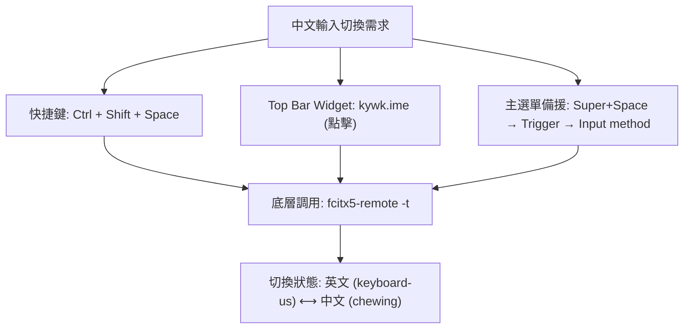

# Omarchy Linux 新機建置與快速上手指南

本指南記錄在全新安裝的 **[Omarchy Linux](https://omarchy.org/)**（無論是實體機或 macOS 上的虛擬機，如 UTM、OrbStack、Parallels Desktop）環境下，從零導入個人化 dotfiles 設定、完成顯示縮放適配、配置中文輸入法，以及環境重載與日常驗證的完整操作手冊。

> 💡 **系列導讀**：
> - 桌面架構與進階客製：請參閱 **[[Omarchy Desktop and System Customization|Omarchy 桌面客製化與設定管理指南]]**
> - 中文環境與輸入法專文：請參閱 **[[Omarchy Chinese Input Setup|Omarchy Linux 中文環境與輸入法配置指南]]**

---

## 系統定位與架構理念

### 系統定位

**Omarchy Linux** 是一套基於 **Arch Linux** 與 **Hyprland (Wayland Compositor)** 的現代化、高整合度滾動發行版/桌面環境：

- **極致輕量與極簡流暢**：捨棄傳統厚重的桌面環境，全面擁抱 Wayland 現代顯示協定與動態平鋪式視窗管理（Tiling Window Management）。
- **Lua 驅動的現代配置**：全面採用 Lua 腳本取代傳統靜態的 `hyprland.conf`，提供程式化設定邏輯、動態條件判斷與清晰的模組化拆分。
- **Quickshell 現代化狀態列**：以 QML / Quickshell 為基底打造高響應度 Top Bar，支援豐富的動態 Widget 與外掛插件。
- **以 mise 為核心的開發工具鏈**：整合現代運行時版本管理系統（mise），一站式配置 Node.js、Python、Go、Rust 等語言環境。
- **原生 AI Agent 工具整合**：原生整合 AI 終端助理（如 opencode、codex 等），支援全域快速叫出與即時狀態監控。

### 核心管理原則

在 Omarchy 環境下維護系統與個人設定時，必須嚴格遵守以下四項核心原則：

1. **絕不修改 `/usr/share/omarchy/`**：該目錄屬於系統套件層，由 Omarchy 官方管理，任何 `omarchy update` 均會直接覆蓋自訂修改。
2. **只納管使用者層設定 (`~/.config/`)**：所有個人化客製化均建立於使用者目錄下，並透過 Git dotfiles 進行符號連結（symlink）或受控同步。
3. **優先使用 Omarchy 原生擴充機制**：善用原生 Hook、選單擴充（menu extension）與 `omarchy` CLI，絕不建立平行的競爭機制。
4. **系統 Migration Hook 不入版控**：系統初次開機或更新時產生的系統級 Hook 由 Omarchy 自行維護，Git 倉庫僅存放使用者自撰 Hook。

---

## 硬體與虛擬機環境支援

Omarchy 支援實體機安裝與虛擬化環境，但在不同平台上具有不同的適配細節：

| 運行平台 | 環境特色 | 重點注意事項 |
|---|---|---|
| **Bare-metal (x86_64 / aarch64)** | 完整硬體加速、原生效能最高 | 需確認顯卡驅動（NVIDIA / AMD / Intel）與 Wayland 相容性。 |
| **macOS UTM (QEMU + SPICE)** | 輕量開源、原生支援 Apple Silicon | 仰賴 `spice-guest-tools` 動態傳遞解析度；需防範 macOS 系統快捷鍵搶佔。 |
| **macOS Parallels Desktop** | 顯示與剪貼簿整合度高 | 建議搭配 Hostshare 掛載共用資料夾導入 dotfiles。 |
| **OrbStack / Headless VM** | 啟動極快、開發環境輕便 | 若搭配 GUI 轉發需注意 Wayland socket 與環境變數傳遞。 |

---

## 快速摘要流程 (TL;DR)

對於熟悉流程的工程師或 AI Agent，可在全新系統中依序執行下列精簡指令：

```bash
# 1. 取得 dotfiles 並建立基準軟連結
ln -sf <dotfiles-repo-path> ~/.files

# 2. 安裝中文輸入引擎與設定工具
omarchy pkg add fcitx5-chewing fcitx5-configtool

# 3. 配置 fcitx5 (⚠️ 修改 profile 前務必先停止服務)
systemctl --user stop omarchy-fcitx5
cat > ~/.config/fcitx5/profile << 'EOF'
[Groups/0]
Name=Default
Default Layout=us
DefaultIM=keyboard-us

[Groups/0/Items/0]
Name=keyboard-us
Layout=

[Groups/0/Items/1]
Name=chewing
Layout=

[GroupOrder]
0=Default
EOF

cat > ~/.config/fcitx5/config << 'EOF'
[Hotkey]
EnumerateWithTriggerKeys=True
SkipFirstProviderWhenEnumerating=True

[Hotkey/TriggerKeys]
0=Control+Shift+space
EOF
systemctl --user start omarchy-fcitx5

# 4. 執行 dotfiles 初始化連結
bash ~/.files/init.sh

# 5. 驗證與重載環境
omarchy plugin validate ~/.config/omarchy/plugins/kywk.ime
hyprctl reload && hyprctl configerrors
omarchy restart shell
bash ~/.files/bin/omarchy-sync.sh status
```

---

## 詳細逐步建置流程

### 步驟 1：取得 Dotfiles 與建立 `~/.files`

本專案所有的自動化腳本、設定檔映射與工具路徑均以 `$KYWK_HOME/.files`（Linux 預設即為 `/home/kywk/.files`）為統一路徑基準。

#### 情境 A：虛擬機掛載 Host 端目錄 (Hostshare)
若在 UTM 或 Parallels 虛擬機中運行，可直接掛載 macOS 主機端的設定目錄：
```bash
ln -sf ~/Hostshare/config/dotfiles ~/.files
```

#### 情境 B：獨立本機 Clone
若為實體機或獨立虛擬機環境，直接從 Git 倉庫 Clone：
```bash
git clone <dotfiles-repo-url> ~/Dropbox/config/dotfiles
ln -sf ~/Dropbox/config/dotfiles ~/.files
```

確認符號連結是否正確建立：
```bash
ls -ld ~/.files
# 輸出應顯示：/home/kywk/.files -> .../dotfiles
```

---

### 步驟 2：螢幕縮放對齊 (Display / Monitor Scaling)

在 macOS 高解析度 Retina 螢幕上運行虛擬機時，預設的 `1.0` 倍無縮放會導致視窗、字體及狀態列元件極為微小，難以閱讀。

1. **查看當前螢幕名稱與支援解析度**：
   ```bash
   hyprctl monitors
   ```
2. **透過 Omarchy CLI 動態調整縮放比例**（推薦設定為 `1.33` 或 `1.33333`）：
   ```bash
   omarchy hyprland monitor scaling 1.33
   ```
3. **檢查並確認設定檔**：
   Omarchy 會將調整後的比例寫入 `~/.config/hypr/monitors.lua` 的 `local omarchy_monitor_scale`：
   ```lua
   local omarchy_gdk_scale = 1
   local omarchy_monitor_scale = 1.33333

   hl.env("GDK_SCALE", tostring(omarchy_gdk_scale))
   hl.monitor({ output = "", mode = "preferred", position = "auto", scale = omarchy_monitor_scale })
   ```
   > ⚠️ **注意**：確認 dotfiles 倉庫中的 `omarchy/config/hypr/monitors.lua` 數值亦為 `1.33333`，避免後續執行 `init.sh` 時被覆蓋回預設值 `1`。

---

### 步驟 3：中文輸入法整備 (fcitx5 + 新酷音 Chewing)

Omarchy 系統層底層已預載 `fcitx5` 核心架構、Wayland/X11 整合環境變數（透過 `environment.d` 設定 `QT_IM_MODULE=fcitx`、`XMODIFIERS=@im=fcitx`、`SDL_IM_MODULE=fcitx`）以及背景服務單元 `omarchy-fcitx5.service`，但**未預載中文輸入引擎**。

> 💡 **專文深入**：關於系統字型（Noto CJK）、Wayland 原生文字輸入協定細節、4 種切換途徑與 Quickshell `kywk.ime` 狀態列外掛之完整架構，請參閱專題指南 **[[Omarchy Chinese Input Setup|Omarchy Linux 中文環境與輸入法配置指南]]**。

#### 1. 安裝注音引擎與圖形設定工具
```bash
omarchy pkg add fcitx5-chewing fcitx5-configtool
```
*(若在無法互動輸入 sudo 密碼的自動化 Agent 環境中，可使用 `pkexec pacman -S --needed fcitx5-chewing fcitx5-configtool`)*

#### 2. 設定檔配置與防覆寫技巧 (重要防坑細節)

> [!CAUTION]
> **關鍵機制警告：修改 profile 前必須先停止服務！**  
> 正在運行的 fcitx5 常駐於記憶體中。fcitx5 在正常結束（或系統重啟）時，會將記憶體內的狀態強制寫回硬碟上的 `~/.config/fcitx5/profile`。若在服務運行時直接編輯該檔案，外部變更將會在下次服務重啟時被舊狀態直接覆蓋！

正確的安全寫入順序如下：

```bash
# 1. 先行停止輸入法使用者服務
systemctl --user stop omarchy-fcitx5

# 2. 寫入輸入法清單群組 (~/.config/fcitx5/profile)
cat > ~/.config/fcitx5/profile << 'EOF'
[Groups/0]
Name=Default
Default Layout=us
DefaultIM=keyboard-us

[Groups/0/Items/0]
Name=keyboard-us
Layout=

[Groups/0/Items/1]
Name=chewing
Layout=

[GroupOrder]
0=Default
EOF

# 3. 寫入觸發快捷鍵設定 (~/.config/fcitx5/config)
cat > ~/.config/fcitx5/config << 'EOF'
[Hotkey]
EnumerateWithTriggerKeys=True
SkipFirstProviderWhenEnumerating=True

[Hotkey/TriggerKeys]
0=Control+Shift+space
EOF

# 4. 重新啟動輸入法服務
systemctl --user start omarchy-fcitx5
```

#### 3. 測試輸入法切換
透過命令列驗證輸入法狀態：
```bash
fcitx5-remote -n   # 應顯示目前輸入法：keyboard-us
fcitx5-remote -t   # 觸發切換
fcitx5-remote -n   # 應切換為：chewing
fcitx5-remote -t   # 再次切換回英文
```

---

### 步驟 4：執行初始化連結 (`init.sh`)

執行 dotfiles 核心初始化腳本，建立系統與使用者設定的符號連結：

```bash
bash ~/.files/init.sh
```

此腳本在 Omarchy 環境下會自動完成：
1. **注入 Bash 載入層**：在 `~/.bashrc` 尾端注入 `# >>> kywk dotfiles >>>` 最小區塊，載入 `~/.files/bash/bashrc`，並維持 Omarchy 原生別名（如 `ls`=eza、`c`=opencode、`h`=herdr）之第一優先級。
2. **建立全域工具設定 Symlink**：連結 `~/.gitconfig`、`~/.gitignore_global`、`atuin`、`bat`、`lazygit`、`gitui`、`yazi`、`zellij`、`ripgrep`、`fd`、`ghostty` 與 `mise`。
3. **連結 Omarchy 使用者配置**：
   - `~/.config/hypr/*.lua`（自訂鍵盤映射、滑鼠滾動、螢幕設定等）
   - `~/.config/omarchy/shell.json`（狀態列佈局與閒置鎖定設定）
   - `~/.config/omarchy/defaults/agent`（預設 AI Agent CLI 設定，如 `opencode`）
   - `~/.config/omarchy/extensions/omarchy-menu.jsonc`（主選單自訂擴充）
   - `~/.config/omarchy/hooks/`（使用者自撰 Hook 腳本）
4. **複製安裝 Top Bar 插件**：將 `omarchy/config/omarchy/plugins/kywk.ime/` 完整**複製**至 `~/.config/omarchy/plugins/kywk.ime/`（Omarchy 規範禁止外掛目錄包含符號連結）。

---

### 步驟 5：桌面環境生效與重載

完成設定連結後，執行以下指令使所有元件立即生效，無需登出或重新開機：

```bash
# 1. 驗證自製 Top Bar 插件語法與清單規格
omarchy plugin validate ~/.config/omarchy/plugins/kywk.ime

# 2. 重載 Hyprland 設定並確認無 Lua 語法錯誤
hyprctl reload && hyprctl configerrors

# 3. 重啟 Omarchy Shell (套用新版 shell.json 並掛載 kywk.ime widget)
omarchy restart shell
```

---

## 驗證清單 (Verification Checklist)

新機建置完成後，請依序執行以下 4 項標準驗證：

### 1. 同步狀態檢查 (`omarchy-sync.sh status`)

```bash
bash ~/.files/bin/omarchy-sync.sh status
```

**預期標準輸出**（應全數為 `✅ linked` 與 `✅ synced`）：
```text
✅ linked   /home/kywk/.config/hypr/autostart.lua
✅ linked   /home/kywk/.config/hypr/bindings.lua
✅ linked   /home/kywk/.config/hypr/hyprland.lua
✅ linked   /home/kywk/.config/hypr/input.lua
✅ linked   /home/kywk/.config/hypr/looknfeel.lua
✅ linked   /home/kywk/.config/hypr/monitors.lua
✅ linked   /home/kywk/.config/omarchy/shell.json
✅ linked   /home/kywk/.config/omarchy/defaults/agent
✅ linked   /home/kywk/.config/omarchy/extensions/omarchy-menu.jsonc
✅ synced   /home/kywk/.config/omarchy/plugins/kywk.ime (plugin)
```

### 2. 系統健康檢查 (`health-check.sh`)

```bash
bash ~/.files/bin/health-check.sh
```
確認基礎工具鏈（git、curl、tmux/zellij）、現代 CLI（rg、fd、bat、eza、yazi、lazygit）及開發環境管理器（mise）均正常識別。

### 3. 中文輸入切換三種管道驗證

系統提供三種等效的切換方式，確保在任何情境下均能流暢切換：



1. **快捷鍵操作**：在任何輸入框按下 `Ctrl + Shift + Space`，確認能切換英文與新酷音注音。
2. **Top Bar Widget 操作**：
   - 觀察 Top Bar 右側第一位圖示：應顯示 `EN` 或 `注`。
   - **滑鼠左鍵點擊**：即時切換中/英。
   - **滑鼠右鍵點擊**：以浮動終端彈出 `fcitx5-configtool` 圖形化設定介面。
3. **主選單備援操作**（針對 macOS Host 鍵盤快捷鍵被攔截時）：
   - 按下 `Super + Space` 開啟 Omarchy 選單。
   - 進入 `Trigger` → 點選 `Input method (切換中/英)`。中文啟用時尾端會顯示 `✓`。

### 4. 滑鼠自然滾動 (Natural Scroll) 驗證

在瀏覽器或終端視窗中滑動滑鼠滾輪：
- 滾輪向下滾動時，頁面內容應向下移動（捲軸向上），符合 macOS 與現代觸控板之自然操作習慣（定義於 `~/.config/hypr/input.lua` 中的 `natural_scroll = true`）。

---

## 常見問題與疑難排解 (Troubleshooting)

### Q1: 為什麼 `omarchy-sync.sh status` 顯示 `drift (內容不同, 需 capture)`？
- **根本原因**：Omarchy 的部分內建指令（如 `omarchy bar set`、螢幕縮放命令或圖形化設定工具）在儲存設定時，採用了 **atomic rename (`mv`)** 機制。此機制會先寫入暫存檔，再將暫存檔 rename 為目標檔案，進而將原本的符號連結（symlink）直接替換為實體一般檔案，導致與 dotfiles repo 的連結中斷。
- **處理方案**：
  - **若確定要保留當前調整並收回版控**：
    ```bash
    bash ~/.files/bin/omarchy-sync.sh capture
    # 檢視 git diff 並提交變更
    git -C ~/.files diff
    git -C ~/.files commit -am "feat(omarchy): update desktop settings"
    ```
  - **若要放棄現場調整，強制以 Git 倉庫版本覆蓋還原**：
    ```bash
    bash ~/.files/bin/omarchy-sync.sh apply
    ```

### Q2: 為什麼修改 `~/.config/fcitx5/profile` 後重啟輸入法，設定被自動還原？
- **根本原因**：修改檔案時 `omarchy-fcitx5` 常駐行程仍處於執行中。fcitx5 在退出或接收重啟信號時，會自動將記憶體中的狀態刷寫回磁碟，將外部編輯覆寫。
- **處理方案**：修改前必須嚴格遵守「先停服務、再改檔、後啟動」之步驟：
  ```bash
  systemctl --user stop omarchy-fcitx5
  # 進行檔案編輯 ...
  systemctl --user start omarchy-fcitx5
  ```

### Q3: 為什麼 Bar 插件目錄（`plugins/`）不使用 Symlink？
- **根本原因**：Omarchy 內建的外掛驗證工具（`omarchy plugin validate`）具備安全性規範，嚴格禁止插件目錄內及其子檔案使用任何符號連結。若使用 symlink，插件將被判定無效而拒絕載入。
- **處理方案**：`init.sh` 採安全複製安裝。若需將本機測試好的 QML 插件變更回存至 Git 倉庫，執行 `bash ~/.files/bin/omarchy-sync.sh capture` 即可自動比對複製回 repo。

### Q4: 在 macOS 虛擬機中，`Ctrl + Shift + Space` 無法切換輸入法？
- **根本原因**：macOS 宿主機可能啟用了全域 Spotlight 快捷鍵、Siri 快捷鍵或輸入法切換鍵，導致鍵盤事件在到達虛擬機前已被 macOS 截斷。
- **處理方案**：
  1. 檢查 macOS 系統設定：`系統設定` → `鍵盤` → `鍵盤快速鍵` → `輸入方式`，關閉與宿主機衝突的組合鍵。
  2. 使用 Omarchy 主選單備援：按下 `Super + Space` → 進入 `Trigger` → 點擊 `Input method (切換中/英)`。
  3. 直接點擊 Top Bar 右側的 `kywk.ime` 元件切換。

### Q5: 螢幕解析度或縮放設定跑掉？
- **根本原因**：在 UTM / SPICE 虛擬機中，SPICE guest daemon 會主動寫入 `~/.local/state/spice-guest-tools/display.state` 動態計算虛擬螢幕 modeline。
- **處理方案**：本 dotfiles 的 `omarchy/config/hypr/monitors.lua` 內建了 SPICE state 解析邏輯，會自動以 `omarchy_monitor_scale` 計算 logical position。若發生顯示異常，執行 `hyprctl reload` 重載即可重新計算對齊。

---

## 相關文件與延伸閱讀

- [[Omarchy Chinese Input Setup|Omarchy Linux 中文環境與輸入法配置指南]] — CJK 字型安裝、fcitx5 核心架構、4 種中英切換途徑與 kywk.ime 狀態列外掛詳解
- [[Omarchy Desktop and System Customization|Omarchy 桌面客製化與設定管理指南]] — 深入解析版控設計理念、Hyprland Lua 架構、QML 插件開發與 Hook 維護
- [[Mac Install Omarchy VM with UTM|透過 UTM 在 Apple Silicon Mac 安裝 Omarchy]] — Apple Silicon Mac 上的 UTM 映像檔一鍵安裝與虛擬化配置
- [[Linux System Maintenance|Linux 系統維護最佳實踐]] — 包含日常更新、磁碟清理、日誌維護與安全檢查
- [[Linux Commands Reference|Linux 基礎指令參考手冊]] — 常用 Linux 命令與導航手冊
- [[Manjaro Package Management|Manjaro 套件管理完整指南]] — Pacman、Pamac 與 AUR 套件庫使用詳解
