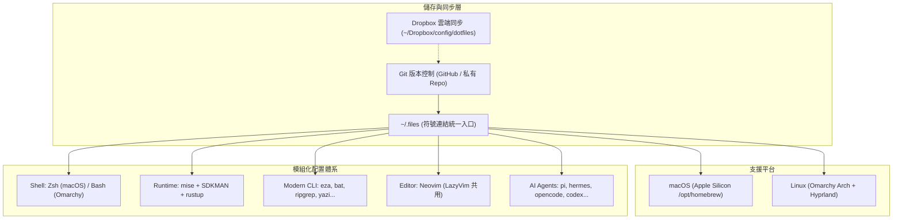

# Dotfiles Management - 跨平台配置管理系統

現代化的 dotfiles 開發環境管理解決方案，支援 **macOS**（Apple Silicon）與 **Linux**（[Omarchy](https://omarchy.org/) / Arch + Hyprland），提供統一的開發環境管理、自動化部署、智能版本切換、防污染架構與 AI Agent 設定跨機同步。



---

## 🚀 核心特色

- 🌍 **跨平台第一級支援**：自動識別 macOS 與 Linux (Omarchy)，Apple Silicon 路徑（`/opt/homebrew`）與 Arch Linux 平滑適配。
- 🔧 **2026 現代化開發環境**：**mise-first** 統一管理 Node.js、Go、Python；SDKMAN 專注 Java/Maven；rustup 負責 Rust。徹底取代舊式 Volta / NVM / 手動管理。
- ⚡ **極速 Shell 體驗**：[[Zinit]] Turbo 延遲載入技術，啟動時間壓制在 300ms 內，兼顧完整補全與語法高亮。
- 🔒 **防污染設計（Anti-Pollution）**：家目錄的 `~/.zshrc` / `~/.zprofile` 僅保留極簡引導，隔離各類第三方 CLI 安裝器（如 Kiro CLI、Antigravity），維持 dotfiles 核心乾淨可版控。
- 🤖 **AI Agent 設定跨機同步**：集中納管多款 Coding Agent（pi, hermes, opencode, codex, claude, crush）之設定與 models 宣告，透過 Dropbox 跨機即時同步，並將執行期 logs/cache/db 保留在本地。
- 🎯 **現代 CLI 工具鏈整合**：預先配置 `btop`, `eza`, `bat`, `ripgrep`, `fd`, `zoxide`, `atuin`, `television`, `yazi`, `zellij`, `uv`, `oha` 等新一代工具。

---

## 📦 專案結構

```text
dotfiles/
├── bin/                    # 自動化與維護腳本
│   ├── init.sh             # 符號連結與基礎環境初始化
│   ├── setup-devenv.sh     # 一鍵安裝開發環境 (mise / SDKMAN / rustup)
│   ├── health-check.sh     # 環境健全檢查 (依平台動態檢測)
│   ├── update.sh           # 一鍵更新所有套件與工具
│   ├── omarchy-sync.sh     # Omarchy 設定同步 (status / capture / apply)
│   ├── load-env.sh         # Runtime 載入器 (mise/SDKMAN/direnv/opencode)
│   ├── agent-link.sh       # AI Agent 設定符號連結修復/建立
│   └── gen-gitignore.sh    # 智能生成 .gitignore
├── config/                 # 集中配置
│   ├── versions.sh         # 軟體版本統一管理
│   └── secret.sh           # 敏感機密變數 (受 gitignore 保護，不進版控)
├── zsh/                    # Zsh 配置模組 (macOS 主力 / Linux 選用)
│   ├── mac.zprofile        # macOS profile (Homebrew, PATH, local.sh)
│   ├── mac.zshrc           # macOS 互動入口 (載入 common.zshrc 與 load-env.sh)
│   ├── common.zshrc        # 通用互動配置 (Zinit, p10k, 工具別名覆蓋)
│   ├── kywk.zshrc          # 基礎 Zsh 設定 (歷史記錄, atuin 整合)
│   └── zinit.zshrc         # Zinit 插件管理器 (Turbo 最佳化)
├── bash/                   # Bash 層 (Linux / Omarchy 預設 Shell)
│   └── bashrc              # 由 ~/.bashrc 尾端注入載入
├── omarchy/                # Linux Omarchy 使用者設定 (Hyprland, shell.json, hooks)
├── nvim/                   # Neovim 配置 (LazyVim 架構，macOS/Linux 共用)
├── agent/                  # AI Agent 設定 (Dropbox 同步、git 忽略)
├── develop/                # 開發輔助工具 (ai-model-sync 模型同步)
├── mac/                    # macOS 專用配置 (Brewfile, Brewfile-CLI)
├── docs/                   # 專案詳細手冊 (devenv, zinit, brewfile, omarchy...)
└── 核心配置檔案 (gitconfig, gitmessage, gitignore, kywk.shrc)
```

---

## 🛠️ 開發環境版本管理架構

在 2026 現代化升級後，環境管理架構由分散的多套工具整合為精簡的方案：

| 語言 / Runtime | 版本管理器 | 預設版本 | 自動檢測 / 描述檔 | 說明 |
|---|---|---|---|---|
| **Node.js** | **mise** | 22 | `package.json`, `.nvmrc`, `.node-version` | 取代 Volta / NVM，全域與專案自動切換 |
| **Go** | **mise** | 1.23 | `go.mod` | 取代手動系統安裝，版本切換即時生效 |
| **Python** | **mise** + **uv** | 3.13 | `pyproject.toml`, `.python-version` | mise 管理 Runtime，[[uv]] 負責極速套件解析 |
| **Java** | **SDKMAN** (macOS) / **mise** (Omarchy) | 21.0.9-zulu | `pom.xml`, `.sdkmanrc` | 保持 JDK Vendor 與生態完整支援，自動配置 Maven |
| **Rust** | **rustup** | stable | `Cargo.toml` | 官方推薦標準工具鏈 |

---

## 🚀 全新電腦安裝流程

### macOS 安裝流程

```bash
# 1. 取得 dotfiles (建議置於 Dropbox 目錄以便跨機同步)
git clone <repo-url> ~/Dropbox/config/dotfiles
ln -sf ~/Dropbox/config/dotfiles ~/.files

# 2. 執行初始化 (建立 gitconfig、~/.config/*、Shell 導引)
bash ~/.files/init.sh

# 3. 安裝 Homebrew 套件 (依需求選擇 CLI 輕量版或完整版)
brew bundle --file=~/.files/mac/Brewfile-CLI

# 4. 安裝開發 Runtime
bash ~/.files/bin/setup-devenv.sh

# 5. 驗證環境
bash ~/.files/bin/health-check.sh
exec zsh
```

### Linux (Omarchy / Arch Linux) 安裝流程

本架構在 Linux 採用 **[Omarchy](https://omarchy.org/)** 作為標準桌面環境，遵循「不改動系統目錄、只納管使用者設定、優先使用 Omarchy 機制」的原則：

```bash
# 1. 取得 dotfiles 並連結 ~/.files
git clone <repo-url> ~/kywk/config/dotfiles
ln -sf ~/kywk/config/dotfiles ~/.files

# 2. 執行 init.sh (自動建立 ~/.config 工具連結、注入 ~/.bashrc 尾端)
bash ~/.files/init.sh

# 3. 安裝開發環境 (優先透過 Omarchy 宣告)
omarchy install dev-env node go python rust java
bash ~/.files/bin/setup-devenv.sh

# 4. 驗證環境與 Omarchy 設定同步狀態
bash ~/.files/bin/health-check.sh
bash ~/.files/bin/omarchy-sync.sh status
```

---

## 🔒 防污染設計（Anti-Pollution）

為避免各類第三方安裝程式（例如 Kiro CLI、Antigravity、各語言安裝 script）隨意在 `~/.zshrc` 或 `~/.zprofile` 尾端追加骯髒代碼破壞環境，本架構採用嚴格的分層隔離：

1. **家目錄 `.zshrc` / `.zprofile` 保持極簡**：
   - 僅保留載入 `~/.files/zsh/mac.zprofile` 與 `~/.files/zsh/mac.zshrc`。
   - 所有具體的 alias、plugins、環境變數都在 `~/.files` 內版控。
2. **機器特定變數獨立**：
   - 本機專屬變數寫入 `~/.config/local.sh`。
   - 敏感金鑰寫入 `~/.files/config/secret.sh`（已納入 `.gitignore`）。
3. **集中 Runtime 初始化**：
   - 由 `bin/load-env.sh` 統一處理 mise、SDKMAN、direnv 與 opencode，不讓外部工具在 shell 入口四處插入重複啟動腳本。

---

## 🤖 AI Agent 設定跨機同步

針對現代開發者日常使用的多款 Coding Agent，dotfiles 提供了集中化同步方案（見 `bin/agent-link.sh`）：

```text
~/.files/agent/pi/models.json       <--- 集中處 (Dropbox 跨機同步，Git 忽略)
~/.pi/agent/models.json ----------> 符號連結至集中處
~/.pi/agent/sessions/               <--- 本地保留，不跨機同步
```

| Agent | 納管同步項目（組態、外掛、憑證） | 本機保留項目（不同步） |
|---|---|---|
| **pi** | `models.json`, `settings.json`, `auth.json`, `extensions/`, `themes/` | `sessions/`, cache, `models-store.json` |
| **hermes** | `config.yaml`, `.env`, `auth.json`, `SOUL.md`, `plugins/`, `skins/` | `sessions/`, `state.db`, `cache/`, `logs/` |
| **opencode** | `opencode.json`, `tui.json`, `plugins/`, `auth.json` | `node_modules/`, `opencode.db*`, `repos/` |
| **codex** | `config.toml`, `hooks.json`, `herdr-agent-state.sh` | `*.sqlite*`, `tmp/` |
| **claude** | `settings.json`, `hooks/` | `skills/`, `projects/`, `history` |
| **crush** | `crush.json` | local share data |

日常執行 `bash ~/.files/bin/agent-link.sh` 即可自動掃描並建立各 Agent 的符號連結。

---

## 🔧 日常維護與常用指令

```bash
# 環境健康檢查 (自動依 macOS / Linux 檢查對應工具)
~/.files/bin/health-check.sh

# 一鍵升級所有工具 (包含 Homebrew, mise, rustup, Zinit 插件, Omarchy)
~/.files/bin/update.sh

# Omarchy 設定同步 (檢查狀態 / 捕捉目前修改 / 套用至系統)
~/.files/bin/omarchy-sync.sh status
~/.files/bin/omarchy-sync.sh capture
~/.files/bin/omarchy-sync.sh apply

# 除錯模式載入環境
LOG_LEVEL=debug source ~/.files/bin/load-env.sh
```

---

## 🔗 相關資源

- [[Zsh config]] - 模組化 Shell 配置詳解與載入順序
- [[Awesome CLI]] - 現代化命令列工具大全與架構
- [[Utilities 2026]] - 2026 年度工具軟體現代化升級記錄
- [[Zinit]] - 高效能 Zsh 插件管理器配置
- [[mise]] - 統一開發環境管理器
- [[yazi]] - 現代終端檔案管理器
