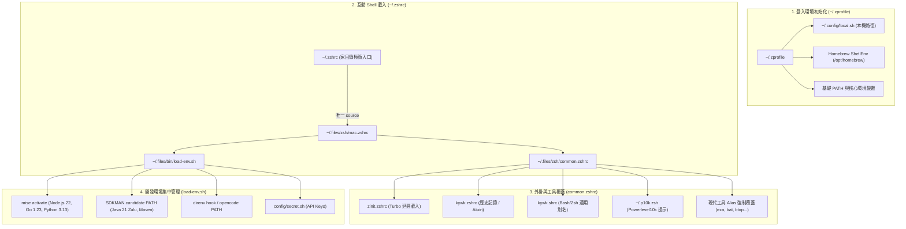

# Zsh Configuration - 模組化 Shell 環境配置

本配置基於 [[Dotfiles Management]] 專案，為日常開發打造一套兼具**毫秒級極速啟動**、**防污染隔離**、**跨平台模組化**與**現代化命令列體驗**的 Zsh 環境。



---

## 🛠️ 設計原則與特色

1. **分層載入（Layered Architecture）**：
   - `~/.zprofile` 專注環境變數、PATH 與系統工具載入。
   - `~/.zshrc` 專注互動功能、終端 UI、快捷鍵與插件管理。
2. **防污染設計（Anti-Pollution）**：
   - 家目錄的 `~/.zshrc` 只負責引入 dotfiles 內的入口腳本，第三方套件安裝程式（如 Kiro CLI、Antigravity、各類 SDK 安裝 script）對 `~/.zshrc` 追加的變更皆無法破壞或污染版控配置。
3. **Zinit Turbo 延遲載入**：
   - 核心 Prompt（Powerlevel10k）與即時補全（fzf-tab、zsh-autosuggestions）即時生效。
   - 較重的高亮與非同步補全透過 `wait lucid` 延遲於背景載入，Shell 啟動時間穩定維持在 ~300ms。
4. **條件式降級啟用（Graceful Degradation）**：
   - 所有現代 CLI 工具均透過 `(( $+commands[tool] ))` 或 `command -v` 檢測，未安裝時安全降級為系統預設指令，杜絕 command not found 雜訊。

---

## 📂 配置檔案詳解

### 1. 家目錄入口：`~/.zshrc`
保持極簡，僅有一行引導至 dotfiles：
```bash
# ~/.zshrc
source "$HOME/.files/zsh/mac.zshrc"
```

### 2. macOS 互動調度：`zsh/mac.zshrc`
```bash
# ~/.files/zsh/mac.zshrc
# 1. 載入通用 Zsh 配置 (外掛、提示符、Alias)
source "$KYWK_HOME/.files/zsh/common.zshrc"

# 2. 載入開發環境 Runtime (mise, SDKMAN, direnv)
source "$KYWK_HOME/.files/bin/load-env.sh"
```

### 3. 外掛管理器：`zsh/zinit.zshrc`
採用 [Zinit](https://github.com/zdharma-continuum/zinit) 管理插件，劃分兩階段載入：

#### 即時載入（關鍵體驗插件）
```zsh
# Powerlevel10k 提示符
zinit ice depth=1; zinit light romkatv/powerlevel10k

# evalcache - 快取各 CLI 工具 eval 結果提升啟動速度
zinit light mroth/evalcache

# fzf-tab - 補全選單即時互動
zinit light Aloxaf/fzf-tab

# zsh-autosuggestions - 歷史輸入自動建議
zinit light zsh-users/zsh-autosuggestions
```

#### Turbo 延遲載入（非阻塞背景載入）
```zsh
# 歷史記錄子字串搜尋 + 24 小時 zcompdump 快取
zinit wait lucid for \
    zsh-users/zsh-history-substring-search \
    atload"autoload -Uz compinit; ZCOMPDUMP=\"\${XDG_CACHE_HOME:-\$HOME/.cache}/zcompdump-\${ZSH_VERSION}\"; if [[ -s \"\$ZCOMPDUMP\" && \$(find \"\$ZCOMPDUMP\" -mtime -1 2>/dev/null) ]]; then compinit -C -d \"\$ZCOMPDUMP\"; else compinit -d \"\$ZCOMPDUMP\"; fi; zicdreplay" \
    zsh-users/zsh-completions

# 終端高亮 (語法高亮必須排在最後)
zinit wait lucid for \
    zdharma-continuum/fast-syntax-highlighting

# Git 整合 (forgit 互動瀏覽)
zinit wait lucid for \
    wfxr/forgit \
    davidde/git

# 無等效 Zinit 替代品的 Oh My Zsh 插件
zinit wait"1" lucid for \
    OMZP::sudo \
    OMZP::aws \
    OMZP::kubectl \
    OMZP::docker
```

### 4. 通用互動設定：`zsh/common.zshrc`
- 載入 `zinit.zshrc`、`kywk.zshrc`、`kywk.shrc` 與 `~/.p10k.zsh`。
- 配置 `fzf` 預設指令（使用 `fd` 排除 `.git`）與預覽樣式。
- 最終覆蓋現代化工具 Alias（先 `unalias` 防止舊有 alias 干擾，再以現代工具替代）。

---

## 🚀 現代化 Aliases 與快捷鍵

整合定義於 `kywk.shrc` 與 `common.zshrc`，提供一致的操作手感：

### 系統與檔案操作增強
| 現代指令 / 別名 | 傳統替代 | 說明 |
|---|---|---|
| `ls` / `ll` / `tree` | `ls` / `tree` | 由 `eza` 提供彩色圖示、git 狀態與樹狀檢視 |
| `cat` / `less` | `cat` / `less` | 由 `bat` 提供語法高亮、行號與分頁檢視 |
| `top` | `top` / `htop` | 由 `btop` 呈現現代化視覺化系統監控 |
| `du` | `du` | 由 `dust` 直觀分析磁碟空間佔用樹狀 |
| `df` | `df` | 由 `duf` 顯示直觀的檔案系統掛載表 |
| `ps` | `ps` | 由 `procs` 顯示進程樹與彩色資源佔用 |
| `grep` | `grep` | 預設以 `rg`（ripgrep）極速全文檢索 |
| `http` / `https` | `curl` | 由 `xh` 提供簡潔美觀的 HTTP 請求 |
| `y` | `yazi` | 啟動 [[yazi]]，退出時**自動 cd** 至最後所在目錄 |
| `z` | `cd` | 由 [[zoxide]] 提供智慧目錄權重跳轉 |
| `lg` | `lazygit` | 啟動 [[lazygit]] TUI 介面 |
| `bench` | `hyperfine` | 命令列效能基準測試 |
| `count` | `tokei` | 程式碼行數與語言統計 |
| `watch` | `watchexec` | 監控檔案變動自動重跑指令 |
| `jv` | `fx` | 互動式 JSON 檢視器 |

### 開發與維運快捷別名
- **Git**：`g`（git）、`gs`（status）、`ga`（add）、`gc`（commit）、`gp`（push）、`gl`（pull）、`gd`（diff）、`gb`（branch）、`gco`（checkout）、`gsw`（switch）
- **Rust / Cargo**：`cr`（run）、`cb`（build）、`ct`（test）、`cck`（check）、`cf`（fmt）、`ccl`（clippy）
- **Docker**：`d`（docker）、`dc`（docker-compose）、`dps`（docker ps）、`di`（docker images）
- **Kubernetes**：`k`（kubectl）、`kgp`（get pods）、`kgs`（get services）、`kgd`（get deployments）

---

## ⚡ 效能指標

透過 `time zsh -i -c exit` 進行 Shell 啟動耗時驗證：

| 指標 | 傳統 OMZ / 手動載入 | Dotfiles 模組化配置 | 改善幅度 |
|---|---|---|---|
| **啟動時間** | ~800ms - 1.2s | **~300ms** | 📈 提升 65%+ |
| **記憶體佔用** | ~45MB | **~28MB** | 📈 節省 38% |
| **補全快取** | 每次重新掃描 | **24hr 快取**（`zcompdump`） | ⚡ 零感知卡頓 |
| **外掛載入模式** | 全同步阻塞 | **Turbo 非同步延遲** | 🚀 即開即打字 |

---

## 🔧 故障排除與除錯

```bash
# 測試啟動時間
time zsh -i -c exit

# 開啟詳細除錯日誌載入環境
LOG_LEVEL=debug source ~/.files/bin/load-env.sh

# 清除 Zsh 補全快取並重新生成
rm -f ~/.cache/zcompdump-* ~/.zcompdump*
exec zsh

# 更新 Zinit 與所有插件
zinit self-update && zinit update --all
```

---

## 🔗 相關資源

- [[Dotfiles Management]] - 跨平台配置管理系統總覽
- [[Awesome CLI]] - 現代化命令列工具全清單
- [[Zinit]] - Zinit 完整配置與進階指南
- [[Zinit vs Oh My Zsh]] - Zinit 與 Oh My Zsh 架構比較心得
- [[yazi]] - 現代終端檔案管理器深度指南
- [[mise]] - 統一開發環境管理器
