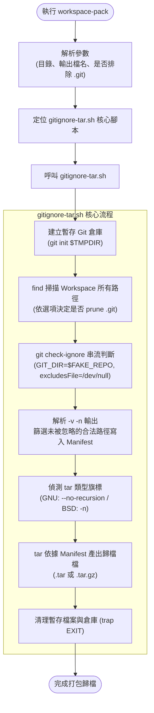
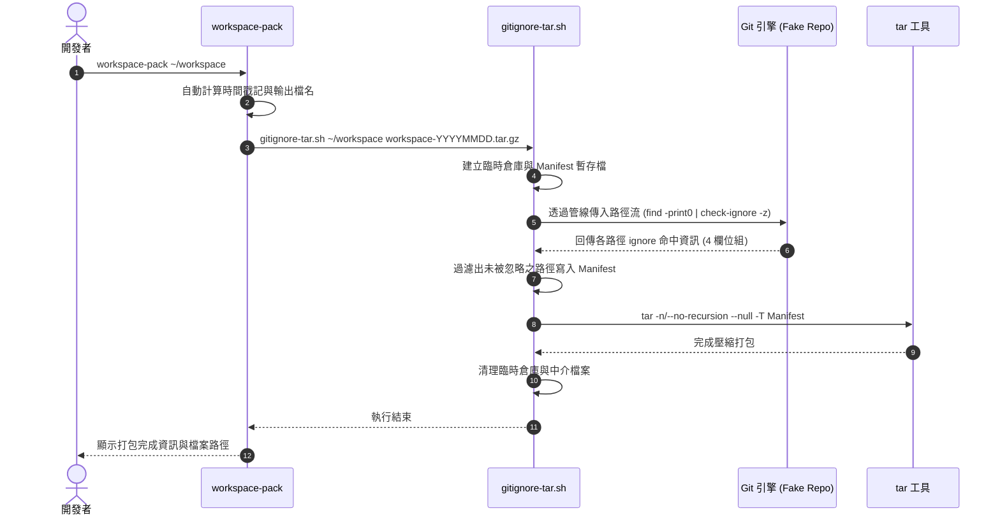
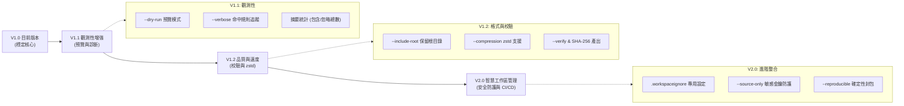

# 用 Git 原生 `.gitignore` 規則打包多專案 Workspace

在現代軟體開發環境中，工程師的工作目錄（Workspace）往往是一個多元技術聚合的複合結構。一個 Workspace 底下可能同時並存 Java 後端服務、Node.js 前端應用、Go 微服務、技術文檔與維運腳本等多個獨立專案。

典型的工作區目錄結構如下：

```text
workspace/
├── backend-project-a/          # Java / Maven 專案
│   ├── .git/
│   ├── .gitignore
│   ├── pom.xml
│   ├── src/
│   └── target/                 # 龐大的編譯產物
├── frontend-project-b/         # Node.js / React 專案
│   ├── .git/
│   ├── .gitignore
│   ├── package.json
│   ├── src/
│   ├── dist/                   # 建置產出
│   └── node_modules/           # 上萬個第三方依賴套件
└── documents/                  # 專案架構文件
    └── architecture.md
```

## 1. 背景與核心挑戰

### 核心痛點：為什麼常規 `tar` 無法勝任？
在這種多專案結構下，若單純執行傳統打包指令：

```bash
tar -czf workspace.tar.gz workspace/
```

其結果往往是一場災難：`target/`、`node_modules/`、`dist/`、各類 `.log` 與快取檔案都會全數被封裝進壓縮檔。這會導致產出的 tarball 動輒數百 MB 甚至數 GB，不僅耗時、浪費磁碟與網路頻寬，也嚴重干擾了後續的備份還原與跨環境傳輸。

### 核心需求整理
為了實現乾淨、自動化且可靠的備份，我們梳理出以下關鍵需求：

1. **多專案與非 Git 根目錄**：Workspace 根目錄本身通常不是 Git 倉庫，但每個子目錄可能是獨立的 Repository。
2. **遵守各層級原生 Ignore 規則**：`.gitignore` 可能出現在專案的任何深度，必須嚴格遵循 Git 原生的語意（包含負向排除、萬用字元與優先級）。
3. **路徑特殊字元安全**：目錄或檔案名稱常包含空格或特殊符號（例如 `backend project a/`），管線處理不可斷裂。
4. **版本庫中繼資料彈性**：預設完整保留各專案的 `.git/`（以便換機或完整保留歷史），同時提供一鍵排除選項（適合將純程式碼交付給 AI/Codex 分析或安全審查）。

為此，我們設計了兩層式的解決方案：
- **`gitignore-tar.sh`**：核心底層工具，負責利用 Git 引擎進行排除判斷並產出標準 tar/tar.gz。
- **`workspace-pack`**：外層 CLI 工具，提供直覺的指令體驗、自動生成時間戳記檔名，並處理常用的 Workspace 打包參數。

---

## 2. 關鍵技術剖析與設計決策

要讓非 Git 倉庫的 Workspace 完美遵守各層級 `.gitignore`，背後有五個核心技術決策：

### 2.1 為什麼不能自行解析 `.gitignore`？
直覺上，`.gitignore` 看似只是一些萬用字元（Glob）：

```gitignore
target/
node_modules/
*.log
.env
```

但實際上，Git 的忽略語法遠比文字比對複雜：
- **負向排除（Negation）**：例如 `dist/*` 搭配 `!dist/keep.txt`，順序與規則覆蓋極為嚴格。
- **目錄相對範圍（Scope）**：子目錄中的 `.gitignore` 規則僅相對於該目錄生效，不能與頂層規則混淆。
- **路徑限定符號**：開頭斜線 `/build` 代表僅限根目錄，而 `**/build/` 代表任意層級。
- **目錄型 Pattern 與一般檔案的語義差異**。

如果透過 `grep`、`sed`、`find` 或 `tar --exclude-from` 自行解析，極易產生與 Git 行為不一致的誤判。

> [!IMPORTANT]
> **核心設計原則：不重新發明輪子去解析 `.gitignore`**。  
> 我們直接利用 Git 原生指令 `git check-ignore`，由 Git 官方引擎親自裁決路徑是否應被排除。

### 2.2 巧妙解法：幽靈 Git 倉庫（Temporary Repository）
`git check-ignore` 是最理想的裁決工具，但它要求必須在 Git 倉庫的脈絡下運行。然而，Workspace 根目錄通常沒有 `.git`。

為了解決這個矛盾，我們採用「幽靈倉庫」技巧：
1. 在系統暫存目錄（`$TMPDIR`）建立一個乾淨、極小的臨時 Git 倉庫：
   ```bash
   git init -q "$FAKE_REPO"
   ```
2. 透過環境變數將此臨時倉庫與目標 Workspace 綁定：
   ```bash
   GIT_DIR="$FAKE_REPO/.git" GIT_WORK_TREE="$SOURCE_DIR" git check-ignore ...
   ```
這樣一來，Git 就會將整個 Workspace 視為其工作目錄（Work Tree），自動由淺入深載入各層級出現的 `.gitignore` 檔案，而**完全不需要在原 Workspace 根目錄建立任何檔案或修改專案內容**。

### 2.3 防禦性管線：全流程 NUL 分隔符號（`\0`）
Unix 檔案系統中，路徑名稱允許包含空格甚至換行。若使用常規的文字管線傳遞（如 `find | while read line`），檔名會在傳遞過程中被截斷。

本工具全流程採用以 NUL 字元（`\0`）作為分隔符號的防護管線：
```text
find . -print0  ──(NUL)──>  git check-ignore -z  ──(NUL)──>  tar --null -T
```
- `find . -print0`：以 `\0` 輸出所有實體路徑。
- `git check-ignore -z -v -n`：以 `\0` 串流接收路徑，並以 `\0` 回傳判斷結果。
- `tar --null -T "$MANIFEST"`：以 `\0` 解析最終打包清單。

這確保了無論專案目錄名如何包含空白，皆能完整傳遞。

### 2.4 阻斷目錄自動展開：`tar` 的遞迴陷阱
這是一個非常隱蔽但致命的細節。  
假設目錄結構中有 `frontend/`，底下包含 `src/` 與 `node_modules/`。經過 `git check-ignore` 篩選後，清單（Manifest）中記錄了：
```text
./frontend
./frontend/src
./frontend/src/index.js
```
注意，清單中**並未列入** `node_modules`。  
然而，許多 `tar` 實作在讀取清單時，如果看到 `./frontend` 是一個目錄，預設會**自動遞迴遍歷該目錄下的所有子實體**！這會導致剛被過濾掉的 `node_modules/` 又被 `tar` 重新抓進壓縮檔中。

為了解決此問題，必須強制關閉 `tar` 的內部遞迴行為：
- **GNU tar（Linux 環境）**：使用 `--no-recursion`
- **BSD tar / libarchive（macOS 環境）**：使用 `-n`

```bash
if tar --version 2>/dev/null | grep -q 'GNU tar'; then
  NO_RECURSION="--no-recursion"
else
  NO_RECURSION="-n"
fi
```
這確保了：**tar 只打包清單中明確指定的檔案與目錄節點，絕不向下蔓延展開**。

### 2.5 確保結果確定性：隔離使用者的全域 Git 設定
開發者的個人環境常配置有全域忽略檔（例如 `~/.config/git/ignore` 或 `~/.gitignore_global`），其中可能排除了 `.DS_Store`、`*.swp` 或特定 IDE 配置。

然而，團隊共用的 Workspace 打包成果應該具備確定性（Deterministic），不該因執行者本機設定不同而產生歧異。因此，執行判定時強制覆寫全域排除檔：
```bash
git -c core.excludesFile=/dev/null check-ignore ...
```
這確保打包規則只純粹取決於 Workspace 各專案本身的 `.gitignore`。

---

## 3. 架構設計與運作流程

### 雙層工具架構
我們將工具拆分為兩層，落實關注點分離（Separation of Concerns）：

```text
┌────────────────────────────────────────────────────────┐
│                   workspace-pack                       │  <-- 使用者互動層 (UX Wrapper)
│  - 處理 CLI 參數 (-o, --exclude-git)                   │
│  - 自動生成帶時間戳記的歸檔檔名                         │
│  - 預設包含 .git/，按需排除                            │
└──────────────────────────┬─────────────────────────────┘
                           │ 呼叫
┌──────────────────────────▼─────────────────────────────┐
│                  gitignore-tar.sh                      │  <-- 核心引擎層 (Core Engine)
│  - 建立 Temporary Git Repo                             │
│  - find + git check-ignore 產生 Manifest 清單          │
│  - 跨平台偵測並以防遞迴模式執行 tar 打包               │
└────────────────────────────────────────────────────────┘
```

### 系統執行流程 (Flowchart)



### 核心資料流時序 (Sequence Diagram)



---

## 4. 腳本完整實作

### 4.1 核心腳本：`gitignore-tar.sh`
負責所有的 Git 規則評估與 tar 封裝，可獨立調用。

```bash
#!/usr/bin/env bash
# ==============================================================================
# gitignore-tar.sh
# 核心打包工具：基於 Git 原生 .gitignore 規則與 tar 打包目錄
# ==============================================================================

set -euo pipefail

usage() {
  cat <<'EOF'
Usage:
  gitignore-tar.sh [options] <source-directory> <output-file>

Options:
  --exclude-git    Exclude all .git directories/files
  -h, --help       Show this help

Supported output:
  .tar
  .tar.gz
  .tgz

Examples:
  gitignore-tar.sh ./workspace ./workspace.tar
  gitignore-tar.sh ./workspace ./workspace.tar.gz
  gitignore-tar.sh --exclude-git ./workspace ./workspace.tar.gz
EOF
}

EXCLUDE_GIT=false

while [[ $# -gt 0 ]]; do
  case "$1" in
    --exclude-git)
      EXCLUDE_GIT=true
      shift
      ;;
    -h|--help)
      usage
      exit 0
      ;;
    --)
      shift
      break
      ;;
    -*)
      echo "ERROR: unknown option: $1" >&2
      usage >&2
      exit 1
      ;;
    *)
      break
      ;;
  esac
done

if [[ $# -ne 2 ]]; then
  usage >&2
  exit 1
fi

SOURCE_DIR="$1"
OUTPUT_FILE="$2"

if [[ ! -d "$SOURCE_DIR" ]]; then
  echo "ERROR: source directory does not exist: $SOURCE_DIR" >&2
  exit 1
fi

# 檢查必要命令工具
for cmd in git tar find; do
  if ! command -v "$cmd" >/dev/null 2>&1; then
    echo "ERROR: required command not found: $cmd" >&2
    exit 1
  fi
done

SOURCE_DIR="$(cd "$SOURCE_DIR" && pwd -P)"

OUTPUT_DIR="$(dirname "$OUTPUT_FILE")"
OUTPUT_NAME="$(basename "$OUTPUT_FILE")"

mkdir -p "$OUTPUT_DIR"
OUTPUT_DIR="$(cd "$OUTPUT_DIR" && pwd -P)"
OUTPUT_FILE="${OUTPUT_DIR}/${OUTPUT_NAME}"

case "$OUTPUT_FILE" in
  *.tar)
    TAR_MODE="tar"
    ;;
  *.tar.gz|*.tgz)
    TAR_MODE="gzip"
    ;;
  *)
    echo "ERROR: output must end with .tar, .tar.gz, or .tgz" >&2
    exit 1
    ;;
esac

rm -f "$OUTPUT_FILE"

# 建立隔離的臨時倉庫與 Manifest
TMP_DIR="$(mktemp -d "${TMPDIR:-/tmp}/gitignore-tar.XXXXXX")"
FAKE_REPO="${TMP_DIR}/repo"
CHECK_RESULT="${TMP_DIR}/check-ignore"
MANIFEST="${TMP_DIR}/manifest"

cleanup() {
  rm -rf "$TMP_DIR"
}
trap cleanup EXIT INT TERM

git init -q "$FAKE_REPO"

echo "Scanning:"
echo "  $SOURCE_DIR"

generate_paths() {
  if [[ "$EXCLUDE_GIT" == true ]]; then
    find . -name '.git' -prune -o -mindepth 1 -print0
  else
    find . -mindepth 1 -print0
  fi
}

# 進入來源目錄執行 check-ignore 判斷
(
  cd "$SOURCE_DIR"

  generate_paths |
    GIT_DIR="${FAKE_REPO}/.git" \
    GIT_WORK_TREE="$SOURCE_DIR" \
    git \
      -c core.excludesFile=/dev/null \
      check-ignore \
      --no-index \
      --stdin \
      -z \
      -v \
      -n
) > "$CHECK_RESULT" || true

: > "$MANIFEST"

# 解析 check-ignore 的四組 NUL 輸出
# 格式為：<source>\0<lineno>\0<pattern>\0<pathname>\0
# 若 <source> 為空，表示未命中任何排除規則（Non-matching，應保留打包）
while \
  IFS= read -r -d '' ignore_source && \
  IFS= read -r -d '' ignore_line && \
  IFS= read -r -d '' ignore_pattern && \
  IFS= read -r -d '' pathname
do
  if [[ -z "$ignore_source" ]]; then
    printf '%s\0' "$pathname" >> "$MANIFEST"
  fi
done < "$CHECK_RESULT"

# 跨平台相容性：處理 tar 避免目錄自動遞迴展開
if tar --version 2>/dev/null | grep -q 'GNU tar'; then
  NO_RECURSION="--no-recursion"
else
  NO_RECURSION="-n"
fi

echo "Creating:"
echo "  $OUTPUT_FILE"

(
  cd "$SOURCE_DIR"

  case "$TAR_MODE" in
    tar)
      tar \
        "$NO_RECURSION" \
        --null \
        -T "$MANIFEST" \
        -cf "$OUTPUT_FILE"
      ;;

    gzip)
      tar \
        "$NO_RECURSION" \
        --null \
        -T "$MANIFEST" \
        -czf "$OUTPUT_FILE"
      ;;
  esac
)

echo
echo "Done:"
echo "  $OUTPUT_FILE"
```

### 4.2 封裝腳本：`workspace-pack`
專為終端機操作打造的便利外層腳本。

```bash
#!/usr/bin/env bash
# ==============================================================================
# workspace-pack
# Workspace 打包封裝指令：提供易用的 CLI 操作與預設值
# ==============================================================================

set -euo pipefail

usage() {
  cat <<'EOF'
Usage:
  workspace-pack [options] [workspace-directory]

Options:
  --exclude-git       Exclude .git directories
  -o, --output FILE   Specify output archive
  -h, --help          Show this help

Default:
  workspace-directory = current directory
  .git directories    = INCLUDED by default

Output filename:
  <workspace-name>-YYYYMMDD-HHMMSS.tar.gz

Examples:
  workspace-pack ./workspace
  workspace-pack --exclude-git ./workspace
  workspace-pack --output ~/backup/workspace.tar.gz ./workspace
EOF
}

EXCLUDE_GIT=false
OUTPUT_FILE=""
SOURCE_DIR=""

while [[ $# -gt 0 ]]; do
  case "$1" in
    --exclude-git)
      EXCLUDE_GIT=true
      shift
      ;;

    -o|--output)
      if [[ $# -lt 2 ]]; then
        echo "ERROR: $1 requires a filename" >&2
        exit 1
      fi
      OUTPUT_FILE="$2"
      shift 2
      ;;

    -h|--help)
      usage
      exit 0
      ;;

    --)
      shift
      break
      ;;

    -*)
      echo "ERROR: unknown option: $1" >&2
      usage >&2
      exit 1
      ;;

    *)
      if [[ -n "$SOURCE_DIR" ]]; then
        echo "ERROR: multiple workspace directories specified" >&2
        exit 1
      fi
      SOURCE_DIR="$1"
      shift
      ;;
  esac
done

if [[ -z "$SOURCE_DIR" ]]; then
  SOURCE_DIR="."
fi

if [[ ! -d "$SOURCE_DIR" ]]; then
  echo "ERROR: workspace does not exist: $SOURCE_DIR" >&2
  exit 1
fi

SOURCE_DIR="$(cd "$SOURCE_DIR" && pwd -P)"
WORKSPACE_NAME="$(basename "$SOURCE_DIR")"

# 尋找同目錄或 PATH 中的 gitignore-tar.sh
SCRIPT_DIR="$(
  cd "$(dirname "${BASH_SOURCE[0]}")" &&
  pwd -P
)"

if [[ -x "${SCRIPT_DIR}/gitignore-tar.sh" ]]; then
  PACK_SCRIPT="${SCRIPT_DIR}/gitignore-tar.sh"
elif command -v gitignore-tar.sh >/dev/null 2>&1; then
  PACK_SCRIPT="$(command -v gitignore-tar.sh)"
else
  echo "ERROR: gitignore-tar.sh not found." >&2
  echo >&2
  echo "Put gitignore-tar.sh beside workspace-pack" >&2
  echo "or install it somewhere in PATH." >&2
  exit 1
fi

if [[ -z "$OUTPUT_FILE" ]]; then
  TIMESTAMP="$(date '+%Y%m%d-%H%M%S')"
  OUTPUT_FILE="${PWD}/${WORKSPACE_NAME}-${TIMESTAMP}.tar.gz"
fi

echo "Workspace pack"
echo
echo "  Workspace : $SOURCE_DIR"
echo "  Output    : $OUTPUT_FILE"
echo "  .git      : $([[ "$EXCLUDE_GIT" == true ]] && echo "excluded" || echo "included")"
echo

if [[ "$EXCLUDE_GIT" == true ]]; then
  exec "$PACK_SCRIPT" \
    --exclude-git \
    "$SOURCE_DIR" \
    "$OUTPUT_FILE"
else
  exec "$PACK_SCRIPT" \
    "$SOURCE_DIR" \
    "$OUTPUT_FILE"
fi
```

---

## 5. 安裝與使用指南

### 5.1 安裝部署
建議將腳本放置於個人的 CLI 工具目錄（例如 `~/bin` 或 `~/.local/bin`）：

```bash
# 建立存放目錄
mkdir -p ~/bin

# 將腳本置入 ~/bin 後賦予執行權限
chmod +x ~/bin/gitignore-tar.sh
chmod +x ~/bin/workspace-pack
```

確保 `~/bin` 位於環境變數 `$PATH` 中。測試是否可正常調用：
```bash
workspace-pack --help
```

---

### 5.2 核心使用情境

#### 情境 A：全工作區完整備份（預設保留 `.git`）
直接指定工作區目錄：
```bash
workspace-pack ~/workspace
```
- **產出檔名**：`workspace-20260910-134500.tar.gz`
- **行為特性**：完整保留所有子專案的 `.git/` 目錄、分支歷史、stash 與 tags。
- **適用場景**：更換開發機、災難復原備份、定期冷儲存。

#### 情境 B：純原始碼輕量打包（排除 `.git`）
加上 `--exclude-git` 參數：
```bash
workspace-pack --exclude-git ~/workspace
```
- **行為特性**：排除所有專案的 `.git/`，但**完整保留**各層級的 `.gitignore` 檔案。
- **適用場景**：提供原始碼給 AI / Codex 模型進行大脈絡分析、程式碼安全審查、跨組織交付。

#### 情境 C：指定自訂輸出路徑
使用 `-o` 或 `--output`：
```bash
workspace-pack \
  --exclude-git \
  --output ~/backups/dev-workspace-source.tar.gz \
  ~/workspace
```

---

### 5.3 實例驗證：打包前後效果對比

以一個結合 Maven 與 Node.js 的真實工作區為例：

```text
workspace/
├── backend project a/          # .gitignore: /target/, *.log
│   ├── .git/
│   ├── .gitignore
│   ├── pom.xml
│   ├── src/App.java
│   ├── app.log                 <-- 應排除
│   └── target/app.jar          <-- 應排除
│
└── frontend project b/         # .gitignore: /node_modules/, /dist/, .env
    ├── .git/
    ├── .gitignore
    ├── package.json
    ├── src/index.js
    ├── .env                    <-- 應排除
    ├── dist/bundle.js          <-- 應排除
    └── node_modules/           <-- 應排除
```

執行打包後，各項目的收錄狀態對比如下：

| 目錄 / 檔案項目 | 預設模式 (`workspace-pack`) | 排除 Git (`--exclude-git`) | 判定原因說明 |
| :--- | :---: | :---: | :--- |
| `pom.xml`, `package.json` | ✅ 收錄 | ✅ 收錄 | 正常專案配置原始檔 |
| `src/` 目錄及源碼 | ✅ 收錄 | ✅ 收錄 | 專案核心原始碼 |
| `.gitignore` | ✅ 收錄 | ✅ 收錄 | 專案設定檔，必定保留 |
| 各專案 `.git/` 目錄 | ✅ **收錄** | ❌ **排除** | 受 `--exclude-git` 參數控制 |
| `target/`, `node_modules/` | ❌ **排除** | ❌ **排除** | 命中專案 `.gitignore` 目錄規則 |
| `dist/`, `.env`, `*.log` | ❌ **排除** | ❌ **排除** | 命中專案 `.gitignore` 模式規則 |

---

## 6. 當前限制與演進藍圖 (Roadmap)

雖然目前的雙層實作已能滿足絕大多數日常備份需求，但在軟體工程的完整性上，仍有進一步強化的空間。

### 6.1 特性盤點與改進方案

| 當前狀態 / 限制 | 潛在影響 | 規劃解決方案 |
| :--- | :--- | :--- |
| **未包含頂層根目錄** | 解壓縮時檔案會直接散落在目前目錄 | 新增 `--include-root` 參數，解壓縮時維持 `workspace/` 頂層資料夾包覆 |
| **缺少預覽與明細機制** | 壓縮前無法預知會包入或排除哪些檔案 | 新增 `--dry-run`（統計檔案數與預估大小）與 `--verbose`（顯示命中規則） |
| **無歸檔完整性驗證** | 若打包中斷或磁碟損毀無法第一時間得知 | 新增 `--verify` 自動測試解封，並主動產生 `.sha256` 校驗碼 |
| **僅支援 gzip / tar** | 面對數十 GB 的大型工作區時壓縮耗時較長 | 引入現代高效壓縮演算法 `--compression zstd`，大幅加快處理時間 |
| **敏感檔案防護機制** | 開發者可能忘記在 `.gitignore` 排除金鑰 | 規劃 `--source-only` 模式，自動防禦金鑰（如 `.pem`, `id_rsa`, `.env`） |
| **非 Git 專屬排除規則** | 某些大檔案 Git 想追蹤但備份時不想收錄 | 支援 `.workspaceignore` 檔案，具備專屬的排除優先級順序 |

### 6.2 次世代 CLI 規格預覽 (V2 概念)
未來版本將整合為更具彈性的命令列介面：

```text
Usage:
  workspace-pack [options] [workspace-directory]

Options:
  # 基礎設定
  -o, --output FILE            指定輸出路徑與檔名
  --include-root               歸檔內保留 Workspace 頂層目錄層級
  --exclude-git                排除所有專案的 .git/ 目錄

  # 檢視與觀測性 (Observability)
  --dry-run                    僅建立清單與統計摘要，不實際建立封包
  --verbose                    詳細列出各路徑排除原因與命中之 .gitignore 規則

  # 壓縮與安全驗證
  --compression gzip|zstd|none 選擇壓縮格式 (預設: gzip)
  --verify                     歸檔完成後自動驗證 tarball 結構並輸出 SHA-256
  --source-only                敏感檔案過濾保護模式 (自動排除 .env, .pem, 金鑰等)
  --exclude PATTERN            額外手動排除之特定模式 (支援多次指定)
  --reproducible               產出時間戳記確定性歸檔 (適用於 CI/CD Pipeline)

  -h, --help                   顯示說明資訊
```

### 6.3 三階段演進藍圖



---

## 7. 結語

在多專案工作區的打包實務中，「如何確保 ignore 行為與 Git 完全一致」始終是最大挑戰。自行撰寫 parser 往往會被巢狀規則、負向匹配與目錄作用域弄得捉襟見肘。

透過本文的架構，我們實踐了經典的 Unix 哲學：
1. **不重複發明輪子**：借力 `git check-ignore` 作為判斷大腦，以極小的臨時倉庫解決 Workspace 非 Git 專案的限制。
2. **無縫組合工具鏈**：以全流程 NUL（`\0`）串起 `find ➔ git ➔ tar` 的防護通道，並利用 `--no-recursion` / `-n` 阻絕目錄自動展開陷阱。
3. **關注點分離**：底層腳本 `gitignore-tar.sh` 確保機制純粹與可移植性，外層 `workspace-pack` 則提供最舒適流暢的日常操作體驗。

無論是用於開發機更換時的完整工作區冷備份，或是萃取純淨原始碼交付給 AI 工具分析，這套方案都能提供精確、安全且穩定的表現。
